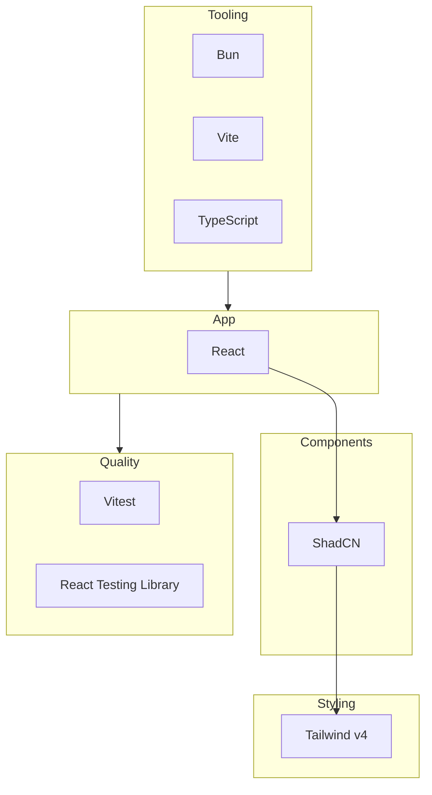

# Design Document: React Template Repo Setup

## 1. Purpose and Scope

- **Purpose**: Single source of truth for the template repo's setup scope and agile breakdown.
- **Scope**: Bootstrap a production-ready React + Vite + Bun + Tailwind v4 + ShadCN + TypeScript + Vitest template; modular and SOLID-aligned so each area (tooling, UI, tests) can be owned and extended independently.

## 2. Design Principles

- **Modular design**: Separate concerns by layer (tooling, app shell, styling, components, testing). Each module has a clear boundary and dependency direction (e.g. app depends on components, not the reverse).
- **SOLID** (applied to structure and future code):
  - **S**ingle Responsibility: One Epic for "template setup"; user stories each address one capability (e.g. "run tests", "use Tailwind").
  - **O**pen/Closed: Choices (e.g. Tailwind v4, ShadCN) allow extension via config and components without modifying core scaffold.
  - **L**iskov: N/A at template level; will apply when defining component contracts.
  - **I**nterface Segregation: Clear contracts at boundaries (e.g. test runner interface, build interface).
  - **D**ependency Inversion: Depend on abstractions (e.g. Vitest as test runner interface); concrete tooling (Bun, Vite) as implementations.
- **Agile breakdown**: One Epic to multiple User Stories; stories are small, testable, and value-focused. Features will be extracted later from these stories.

## 3. Epic

**Epic (single)**: **React Template Stack Setup**

- **Goal**: A developer can clone the repo and have a working React app with Vite, Bun, Tailwind v4, ShadCN, TypeScript, and Vitest, with minimal manual steps.
- **Outcome**: Repo is a reusable template that enforces the chosen stack and supports modular, SOLID-aligned structure.

## 4. User Stories (by concern)

Stories are grouped by technical concern. Each is a single, testable unit of value.

### 4.1 Project and tooling (Bun, Vite, TypeScript)

| ID   | User Story                                                                                                              | Acceptance (high level)                                                                |
| ---- | ----------------------------------------------------------------------------------------------------------------------- | -------------------------------------------------------------------------------------- |
| US-1 | As a developer, I want the project to use **Bun** as runtime and package manager so that installs and scripts are fast. | `bun install` and `bun run` work; `package.json` scripts use Bun.                      |
| US-2 | As a developer, I want the app built with **Vite** so that dev and production builds are fast and HMR works.            | `bun run dev` starts dev server with HMR; `bun run build` produces an optimized build. |
| US-3 | As a developer, I want **TypeScript** for the whole project so that types are enforced at build time.                   | TS is the default; `tsconfig.json` exists; `bun run build` type-checks.                 |

### 4.2 React

| ID   | User Story                                                                                                            | Acceptance (high level)                                                                   |
| ---- | --------------------------------------------------------------------------------------------------------------------- | ----------------------------------------------------------------------------------------- |
| US-4 | As a developer, I want **React** as the UI framework so that I can build components with hooks and standard patterns. | React 19 (or project-chosen version) is used; entry point renders a root React component. |

### 4.3 Styling (Tailwind v4)

| ID   | User Story                                                                                                             | Acceptance (high level)                                                                         |
| ---- | ---------------------------------------------------------------------------------------------------------------------- | ----------------------------------------------------------------------------------------------- |
| US-5 | As a developer, I want **Tailwind CSS v4** for utility-first styling so that I can style without leaving the template. | Tailwind v4 is configured; utility classes work in the app; design tokens/theme are extendable. |

### 4.4 Component library (ShadCN)

| ID   | User Story                                                                                        | Acceptance (high level)                                                                                                    |
| ---- | ------------------------------------------------------------------------------------------------- | -------------------------------------------------------------------------------------------------------------------------- |
| US-6 | As a developer, I want **ShadCN (latest)** so that I have accessible, customizable UI primitives. | ShadCN is installed and wired (e.g. `components.json`); at least one example component runs; theming aligns with Tailwind. |

### 4.5 Testing (Vitest)

| ID   | User Story                                                                                                                | Acceptance (high level)                                                                                                                       |
| ---- | ------------------------------------------------------------------------------------------------------------------------- | --------------------------------------------------------------------------------------------------------------------------------------------- |
| US-7 | As a developer, I want **Vitest** for unit and component tests so that I can run tests from the command line and in CI.   | Vitest is configured for the project; a sample test runs with `bun run test` (or equivalent); React Testing Library available for components. |

## 5. Dependency Order (for implementation)

Stories have a natural order to avoid rework; use the following as guidance (not new stories):

1. **US-1, US-2, US-3** (Bun, Vite, TypeScript) — project shell.
2. **US-4** (React) — depends on shell.
3. **US-5** (Tailwind v4) — styling layer; can parallelize with US-6 after US-4.
4. **US-6** (ShadCN) — depends on Tailwind and React.
5. **US-7** (Vitest) — can be done after US-4; RTL after React is in place.

## 6. Out of Scope for This Document

- Feature-level breakdown (stories only).
- CI/CD pipeline definition (can be a future Epic).
- Deployment or hosting (future Epic).
- Detailed task lists (to be derived from user stories when implementing).

## 7. High-Level Architecture

- **Tooling**: Bun, Vite, TypeScript.
- **App**: React.
- **Styling**: Tailwind v4.
- **Components**: ShadCN.
- **Quality**: Vitest and React Testing Library.

Direction: App uses Components and Styling; Tooling and Quality surround the app. This aligns with the modular/SOLID narrative.
