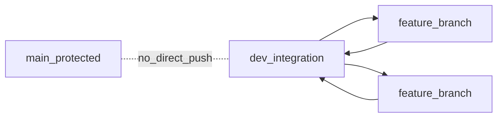
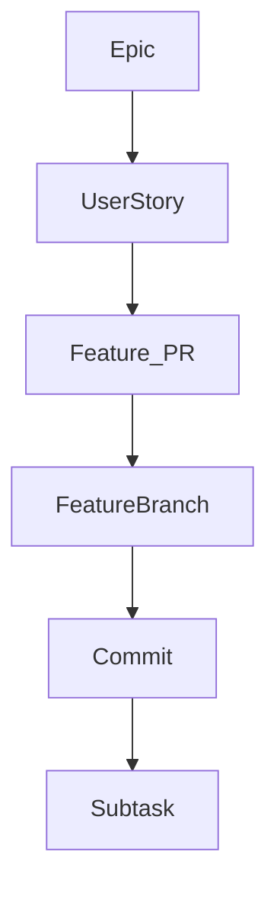
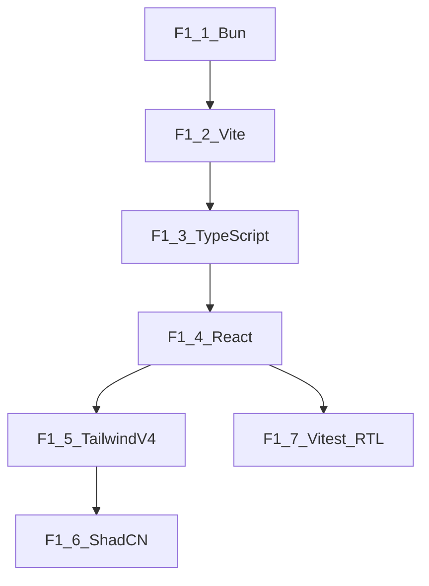
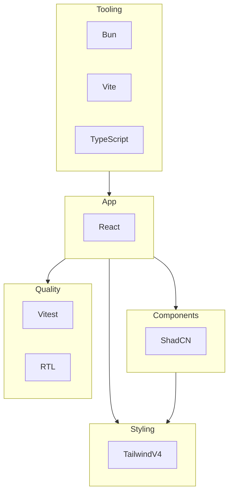

## Product Requirements Document (PRD)

### Document metadata

| Field | Value |
| --- | --- |
| **Product** | AI React Starter Repo (React + Vite + Bun + Tailwind v4 + ShadCN + TypeScript + Vitest) |
| **Status** | Draft |
| **Version** | 0.1 |
| **Last updated** | 2026-02-10 |
| **Primary docs** | `DESIGN-DOC.md` (source of truth for Epic 1 and US-1..US-7) |

### Purpose and scope

This PRD is the execution guide for turning this repo into a **production-ready React template** (tooling, UI foundation, styling, component primitives, and testing) with a **modular, SOLID-aligned** structure. It defines Epics → User Stories → Features (PRs) → Feature Branches → Commits → Subtasks, plus the git workflow and quality gates.

### References

- **Design**: `DESIGN-DOC.md`
- **Workflow rules**: `.cursor/rules/lbi-workflow.mdc`
- **LBI command reference**: `.cursor/commands/lbi.lbi.md`
- **Governance**: `.lbi/memory/constitution.md` (quality gates + SOLID intent; stack-specific rules are captured in Epic 0)
- **Glossary**: `docs/GLOSSARY.md`

---

## Working agreements

### Engineering principles (SOLID + modular)

- **Single responsibility**: one feature branch = one feature; one commit = one cohesive change.
- **Open/closed**: prefer config-driven extension (Tailwind tokens, ShadCN theming) over modifying core scaffolding repeatedly.
- **Interface segregation**: small, purpose-fit module APIs (e.g. a testing helper module should not also own build config).
- **Dependency inversion**: app code depends on local abstractions/utilities; external tools (Vitest/Vite/Bun) are implementations behind scripts/config.

### Repository conventions

- **Branching**:
  - We work on a long-lived **`dev`** branch for integration.
  - We **never** push directly to **`main`**.
  - All feature branches branch **from `dev`** and merge **back into `dev`** after tests pass.
- **Feature branch naming**: `feature/<slug>` (kebab-case slug).
- **No Husky**: do not add Husky or git hooks tooling to this repo.
- **No console logs**: do not leave `console.*` in code.

### Commit and PR conventions

- **Commit granularity**: aim for 3–8 commits per feature branch; each commit should be reviewable in isolation.
- **Commit message style**: use clear, action-oriented messages (Conventional Commits-style prefixes are recommended but not required).
- **PR expectation**: each Feature in this PRD corresponds to one PR into `dev`.

### Documentation lookup rule (Context7)

For any setup/config/library-API work, we will use **Context7 MCP** (when available in the environment) to fetch **latest stable docs** for: React, TypeScript, Vite, Bun, Tailwind v4, ShadCN, Vitest, and React Testing Library.

---

## Git workflow (dev → feature → merge to dev)

### One-time repository setup (before Epic work)

- [x] Create `dev` branch from `main` (initial integration branch)
- [x] Ensure `main` is protected (no direct pushes)
- [x] Ensure the team workflow is: PRs target `dev` (feature work) and `dev` → `main` only for curated releases

### Required workflow (repeat per feature)

- **Start**:
  - Create/update `dev` branch (integration branch).
  - Create a feature branch from `dev`: `feature/<feature-slug>`.
- **Implement**:
  - Implement feature over **several small commits**.
- **Test**:
  - Write tests or scripted smoke checks for the feature.
  - Run tests.
  - If failing, fix and rerun until green.
- **Merge**:
  - Merge feature branch into `dev`.
  - Move to next feature.

### Command line scripts

Prefer scripted, repeatable checks (command-line) over ad-hoc/manual steps. When useful, use existing scripts under `.lbi/scripts/powershell/` (or add project scripts under `package.json`) so verification is consistent across machines.

### Mermaid: branch flow (conceptual)

---

## Delivery hierarchy (how we track work)

### Hierarchy

EPICs → User Stories → Features (PRs) → Feature Branch → Commits → Subtasks

### Checkbox convention

- **Everything in this PRD is trackable** via checkboxes.
- **Do not check boxes until completed** (implementation + verification + merge back to `dev`).

---

## Epic 0: Engineering governance and Cursor rules

### Epic goal

Establish a high-signal, stack-specific rule set under `.cursor/rules/` to enforce:

- Tech stack: React 19 + TypeScript + Vite + Bun + Tailwind v4 + ShadCN + Vitest + RTL
- SOLID principles and modular design expectations
- Git workflow: `dev` integration branch and `feature/*` branches; never push directly to `main`
- Doc lookup: always use Context7 MCP when doing setup/config/docs-driven work

### Definition of done (Epic 0)

- [x] Epic 0 complete (all features below merged to `dev`)

---

### Feature F0.1: Cursor rules — tech stack and quality

- **PR**: `Epic0: add tech stack and quality Cursor rules`
- **Feature branch**: `feature/epic0-tech-stack-and-quality-rules`
- **User value**: consistent stack + quality enforcement across all future work
- [x] Feature F0.1 complete (merged to `dev`)

#### Acceptance criteria

- [x] `.cursor/rules/` contains stack + quality rules (React/TS/Bun/Vite/Tailwind/ShadCN/Vitest/RTL)
- [x] Rules encode the project’s SOLID + modular design expectations
- [x] Rules encode naming conventions and TypeScript/React patterns (no default export, no React.FC, typed `useState`/`useRef`, etc.)
- [x] Rules explicitly prohibit Husky

#### Implementation checklist

- [x] Branch created from `dev`

##### Commit 1: Add base tech stack rules file

- [x] Commit message: `docs(cursor-rules): add tech stack baseline rules`
- [x] Subtasks:
  - [x] Create `TechStack.mdc` (or equivalent) under `.cursor/rules/`
  - [x] Encode: React 19, TypeScript, Vite, Bun, Tailwind v4, ShadCN, Vitest, RTL
  - [x] Encode: "no default exports" and "no React.FC"

##### Commit 2: Add quality + naming rules

- [x] Commit message: `docs(cursor-rules): add quality and naming conventions`
- [x] Subtasks:
  - [x] Encode SOLID principles and modular design guidance
  - [x] Encode naming conventions (camelCase/PascalCase/IPascalCase/snake_case/CAPITAL_CASE)
  - [x] Encode: no `any`, no `console.*`, prefer `type` imports

##### Commit 3: Add React hooks best-practices rules

- [x] Commit message: `docs(cursor-rules): add React hooks best practices`
- [x] Subtasks:
  - [x] Encode: typed `useState<T>()`, typed `useRef<T>()`
  - [x] Encode: avoid `setState` inside `useEffect` (or require callback form)
  - [x] Encode: ≤2 `useEffect` per file; extract hooks when needed

##### Commit 4: Verification + merge

- [x] Commit message: `chore: verify cursor rules load and merge`
- [x] Subtasks:
  - [x] Verify files exist under `.cursor/rules/` and are referenced/active
  - [x] Run any available conventions validation script (if used in your workflow)
  - [x] Merge feature branch into `dev`

---

### Feature F0.2: Cursor rules — git workflow

- **PR**: `Epic0: add git workflow Cursor rules (dev + feature branches)`
- **Feature branch**: `feature/epic0-git-workflow-rules`
- **User value**: consistent branching + merge gates (tests green before merge)
- [x] Feature F0.2 complete (merged to `dev`)

#### Acceptance criteria

- [x] Cursor rules explicitly enforce:
  - [x] work happens on `dev`
  - [x] feature branches branch from `dev`
  - [x] no direct pushes to `main`
  - [x] implement → tests → run → fix → green → merge to `dev`
- [x] Cursor rules reference `.cursor/rules/lbi-workflow.mdc` and when to use `/lbi.*`

#### Implementation checklist

- [x] Branch created from `dev`

##### Commit 1: Add git workflow rule file

- [x] Commit message: `docs(cursor-rules): add git workflow rules`
- [x] Subtasks:
  - [x] Create `GitWorkflow.mdc` (or equivalent) under `.cursor/rules/`
  - [x] Encode `dev` + `feature/*` branching model and merge requirements
  - [x] Add feature branch naming guidance: `feature/<slug>`

##### Commit 2: Add LBI workflow reference

- [x] Commit message: `docs(cursor-rules): reference LBI workflow usage`
- [x] Subtasks:
  - [x] Reference `.cursor/rules/lbi-workflow.mdc`
  - [x] Reference `.cursor/commands/lbi.lbi.md`
  - [x] Specify when to use `/lbi.request`, `/lbi.specify`, `/lbi.plan`, `/lbi.implement`, `/lbi.tests`, `/lbi.review`, `/lbi.push`

##### Commit 3: Verification + merge

- [x] Commit message: `chore: verify git workflow rules and merge`
- [x] Subtasks:
  - [x] Sanity-check the rule text matches the repo’s intended workflow
  - [x] Merge feature branch into `dev`

---

### Feature F0.3: Cursor rules — Context7 MCP required for docs/setup

- **PR**: `Epic0: add Context7 requirement to Cursor rules`
- **Feature branch**: `feature/epic0-context7-mcp-rules`
- **User value**: stable, up-to-date setup/config guidance for the stack
- [x] Feature F0.3 complete (merged to `dev`)

#### Acceptance criteria

- [x] Cursor rules state: use Context7 MCP for latest stable docs when doing setup/config/library API steps
- [x] Covered libraries: React, TypeScript, Vite, Bun, Tailwind v4, ShadCN, Vitest, RTL

#### Implementation checklist

- [x] Branch created from `dev`

##### Commit 1: Add Context7 rule file

- [x] Commit message: `docs(cursor-rules): require Context7 for docs and setup`
- [x] Subtasks:
  - [x] Create `Context7.mdc` (or equivalent) under `.cursor/rules/`
  - [x] Enumerate stack libraries requiring Context7 lookups
  - [x] Define “when” it must be used (setup/config/docs-driven code generation)

##### Commit 2: Verification + merge

- [x] Commit message: `chore: verify Context7 rule and merge`
- [x] Subtasks:
  - [x] Confirm rule file is active and discoverable
  - [x] Merge feature branch into `dev`

---

## Epic 1: React Template Stack Setup (tooling, UI base, styling, components, tests)

### Epic goal

Clone the repo and get a working React app with Vite, Bun, Tailwind v4, ShadCN, TypeScript, and Vitest—modular and SOLID-aligned.

### Definition of done (Epic 1)

- [x] Epic 1 complete (all features below merged to `dev`)

### Dependency order (implementation guidance)

### Feature map (from Design Doc user stories)

| Feature ID | User Story | Feature branch | Summary |
| --- | --- | --- | --- |
| **F1.1** | US-1 | `feature/bun-runtime-and-package-manager` | Bun as runtime and package manager |
| **F1.2** | US-2 | `feature/vite-build-and-dev-server` | Vite dev server (HMR) and production build |
| **F1.3** | US-3 | `feature/typescript-project-config` | TypeScript project defaults and type-checking |
| **F1.4** | US-4 | `feature/react-app-shell` | React app shell and entry point |
| **F1.5** | US-5 | `feature/tailwind-v4-styling` | Tailwind v4 config + extendable theme |
| **F1.6** | US-6 | `feature/shadcn-component-library` | ShadCN primitives + example component |
| **F1.7** | US-7 | `feature/jest-and-rtl-testing` | Vitest + React Testing Library + sample test |

---

### Feature F1.1: Bun runtime and package manager (US-1)

- **PR**: `Tooling: Bun runtime and package manager`
- **Feature branch**: `feature/bun-runtime-and-package-manager`
- [x] Feature F1.1 complete (merged to `dev`)

#### Acceptance criteria

- [x] `bun install` works
- [x] `bun run <script>` works for project scripts
- [x] `package.json` scripts are runnable via Bun

#### Implementation checklist

- [x] Branch created from `dev`

##### Commit 1: Initialize Bun project metadata

- [x] Commit message: `chore(tooling): initialize bun project metadata`
- [x] Subtasks:
  - [x] Create/update `package.json` with Bun as package manager
  - [x] Add baseline scripts placeholders (`dev`, `build`, `test`, `typecheck`)
  - [x] Document minimum runtime expectations (Bun version) in README

##### Commit 2: Add install + script conventions

- [x] Commit message: `chore(tooling): add bun script conventions`
- [x] Subtasks:
  - [x] Ensure scripts use Bun idioms (`bun run ...`)
  - [x] Add a `verify:tooling` script that exits non-zero on missing prerequisites

##### Commit 3: Smoke checks + merge

- [x] Commit message: `test(tooling): add bun smoke checks and merge`
- [x] Subtasks:
  - [x] Add a lightweight smoke-check command (scripted) for Bun
  - [x] Run smoke checks (green)
  - [x] Merge feature branch into `dev`

---

### Feature F1.2: Vite build and dev server (US-2)

- **PR**: `Tooling: Vite dev server and production build`
- **Feature branch**: `feature/vite-build-and-dev-server`
- [x] Feature F1.2 complete (merged to `dev`)

#### Acceptance criteria

- [x] `bun run dev` starts Vite dev server with HMR
- [x] `bun run build` produces an optimized production build

#### Implementation checklist

- [x] Branch created from `dev`

##### Commit 1: Add Vite scaffold and scripts

- [x] Commit message: `chore(vite): scaffold vite and scripts`
- [x] Subtasks:
  - [x] Add Vite dependencies and base config
  - [x] Implement `dev` and `build` scripts

##### Commit 2: Verify HMR and build output

- [x] Commit message: `chore(vite): validate hmr and build output`
- [x] Subtasks:
  - [x] Add a `verify:vite` scripted smoke check
  - [x] Manually verify HMR behavior during development

##### Commit 3: Smoke checks + merge

- [x] Commit message: `test(vite): add smoke checks and merge`
- [x] Subtasks:
  - [x] Run `verify:vite` (green)
  - [x] Merge feature branch into `dev`

---

### Feature F1.3: TypeScript project configuration (US-3)

- **PR**: `Tooling: TypeScript defaults and type checks`
- **Feature branch**: `feature/typescript-project-config`
- [x] Feature F1.3 complete (merged to `dev`)

#### Acceptance criteria

- [x] TypeScript is default for the project
- [x] `tsconfig.json` exists and enforces strict typing
- [x] `bun run build` (or `bun run typecheck`) type-checks successfully

#### Implementation checklist

- [x] Branch created from `dev`

##### Commit 1: Add strict TypeScript configuration

- [x] Commit message: `chore(ts): add strict tsconfig`
- [x] Subtasks:
  - [x] Add `tsconfig.json` with strict options
  - [x] Add `typecheck` script

##### Commit 2: Establish type import conventions

- [x] Commit message: `docs(ts): define type-only import conventions`
- [x] Subtasks:
  - [x] Document `import type { ... }` preference
  - [ ] Document “no any” and `unknown` guidance

##### Commit 3: Typecheck smoke tests + merge

- [x] Commit message: `test(ts): add typecheck smoke and merge`
- [x] Subtasks:
  - [x] Add `verify:types` scripted smoke check (runs typecheck)
  - [x] Run `verify:types` (green)
  - [x] Merge feature branch into `dev`

---

### Feature F1.4: React app shell (US-4)

- **PR**: `App: React 19 shell and entry point`
- **Feature branch**: `feature/react-app-shell`
- [x] Feature F1.4 complete (merged to `dev`)

#### Acceptance criteria

- [x] React is used as the UI framework
- [x] Entry point renders a root React component
- [x] Hooks-based function component patterns are used

#### Implementation checklist

- [x] Branch created from `dev`

##### Commit 1: Add React dependencies and root render

- [x] Commit message: `feat(app): add react root and entry point`
- [x] Subtasks:
  - [x] Add React 19 dependencies
  - [x] Create minimal app shell component
  - [x] Wire Vite entry to render React root

##### Commit 2: Establish modular folder boundaries

- [x] Commit message: `chore(app): establish modular folder boundaries`
- [x] Subtasks:
  - [x] Define `src/` layout (app shell, shared UI, utilities)
  - [x] Ensure dependency direction: app → components → styling

##### Commit 3: React smoke test + merge

- [x] Commit message: `test(app): add react smoke check and merge`
- [x] Subtasks:
  - [x] Add `verify:react` scripted smoke check
  - [x] Run `verify:react` (green)
  - [x] Merge feature branch into `dev`

---

### Feature F1.5: Tailwind CSS v4 styling (US-5)

- **PR**: `Styling: Tailwind v4 configuration`
- **Feature branch**: `feature/tailwind-v4-styling`
- [x] Feature F1.5 complete (merged to `dev`)

#### Acceptance criteria

- [x] Tailwind v4 is configured
- [x] Utility classes work in the app
- [x] Theme/tokens are extendable

#### Implementation checklist

- [x] Branch created from `dev`

##### Commit 1: Add Tailwind v4 setup

- [x] Commit message: `feat(styling): add tailwind v4 setup`
- [x] Subtasks:
  - [x] Add Tailwind v4 dependencies and config
  - [x] Ensure styles are imported by app shell

##### Commit 2: Add baseline design tokens / theme extension points

- [x] Commit message: `chore(styling): add theme extension points`
- [x] Subtasks:
  - [x] Define extendable tokens and document how to add more
  - [x] Add a small demo view that proves utilities apply

##### Commit 3: Styling smoke checks + merge

- [x] Commit message: `test(styling): add tailwind smoke and merge`
- [x] Subtasks:
  - [x] Add `verify:tailwind` scripted smoke check
  - [x] Run `verify:tailwind` (green)
  - [x] Merge feature branch into `dev`

---

### Feature F1.6: ShadCN component library (US-6)

- **PR**: `UI: ShadCN primitives and example component`
- **Feature branch**: `feature/shadcn-component-library`
- [x] Feature F1.6 complete (merged to `dev`)

#### Acceptance criteria

- [x] ShadCN is installed and wired (e.g. `components.json`)
- [x] At least one ShadCN component renders in the app
- [x] Theming aligns with Tailwind

#### Implementation checklist

- [x] Branch created from `dev`

##### Commit 1: Add ShadCN initialization and config

- [x] Commit message: `feat(ui): initialize shadcn config`
- [x] Subtasks:
  - [x] Add ShadCN config (e.g. `components.json`)
  - [x] Ensure Tailwind integration is aligned

##### Commit 2: Add example component and usage

- [x] Commit message: `feat(ui): add example shadcn component usage`
- [x] Subtasks:
  - [x] Add one ShadCN component (e.g. button) and render in app shell
  - [x] Verify accessibility defaults and theme compatibility

##### Commit 3: UI smoke checks + merge

- [x] Commit message: `test(ui): add shadcn smoke and merge`
- [x] Subtasks:
  - [x] Add `verify:ui` scripted smoke check
  - [x] Run `verify:ui` (green)
  - [x] Merge feature branch into `dev`

---

### Feature F1.7: Vitest and React Testing Library (US-7)

- **PR**: `Quality: Vitest + React Testing Library`
- **Feature branch**: `feature/jest-and-rtl-testing`
- [x] Feature F1.7 complete (merged to `dev`)

#### Acceptance criteria

- [x] Vitest is configured for the project
- [x] React Testing Library is available for component tests
- [x] A sample test runs with `bun run test` (or equivalent)

#### Implementation checklist

- [x] Branch created from `dev`

##### Commit 1: Add Vitest baseline configuration

- [x] Commit message: `chore(test): add vitest baseline config`
- [x] Subtasks:
  - [x] Add Vitest config suitable for React + TS
  - [x] Add `test` script to run Vitest via Bun

##### Commit 2: Add React Testing Library and test utilities

- [x] Commit message: `chore(test): add rtl and test utilities`
- [x] Subtasks:
  - [x] Add RTL dependencies
  - [x] Add a shared test utilities module for rendering providers

##### Commit 3: Add sample component test

- [x] Commit message: `test(app): add sample component test`
- [x] Subtasks:
  - [x] Add one passing RTL test for a simple component
  - [x] Ensure it runs in CI-like mode (headless)

##### Commit 4: Run tests, fix failures, merge

- [x] Commit message: `chore(test): run tests and merge`
- [x] Subtasks:
  - [x] Run `bun run test` (green)
  - [x] Fix any flakes/config issues; rerun until green
  - [x] Merge feature branch into `dev`

---

## Appendix: high-level stack architecture (from Design Doc)

