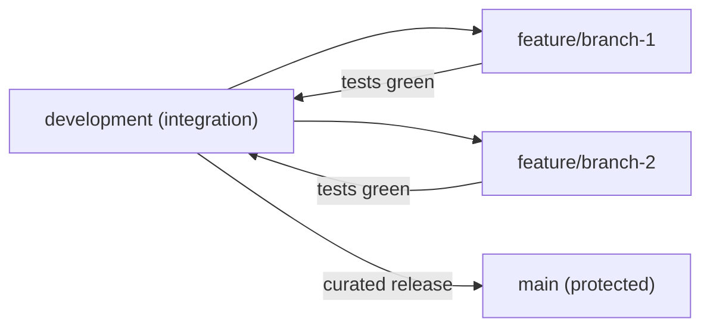
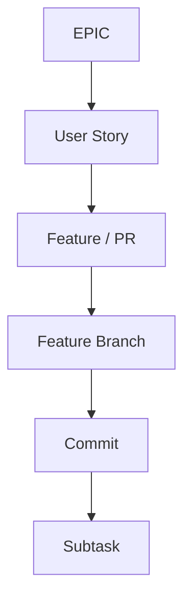
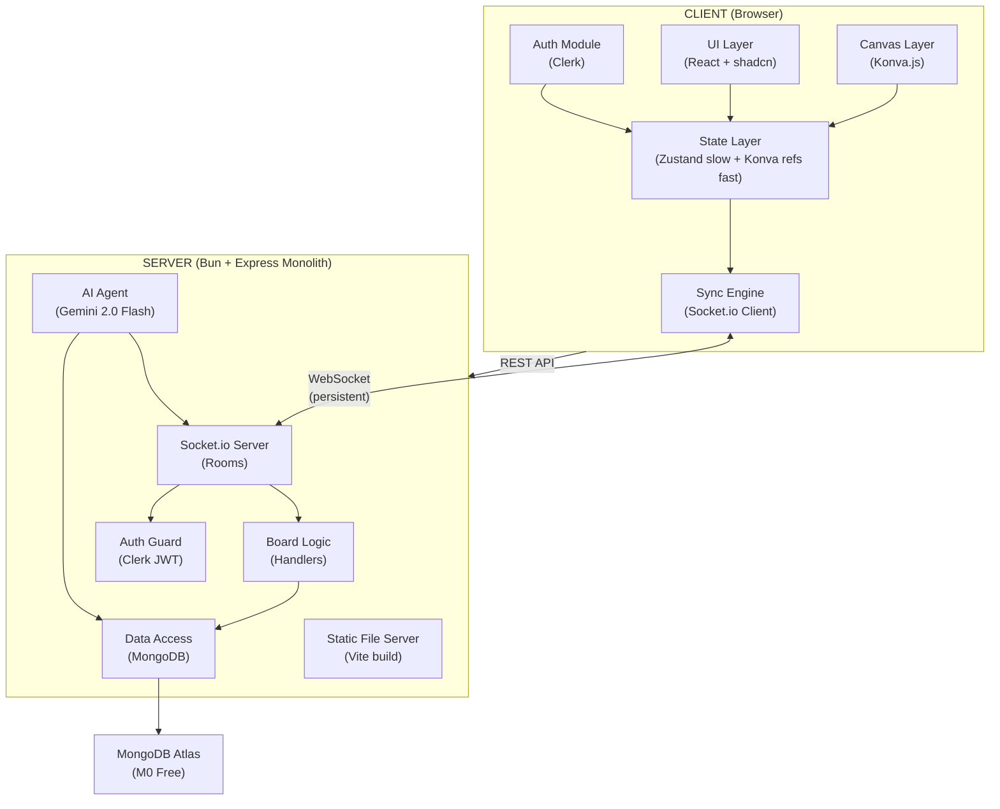
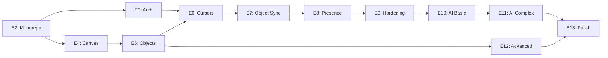

# Product Requirements Document (PRD) — Final

## 1. Document Metadata

| Field | Value |
| --- | --- |
| **Product** | Collab-Board — Real-Time Collaborative Whiteboard with AI Agent |
| **Status** | Final |
| **Version** | 1.0 |
| **Date** | February 16, 2026 |
| **Primary Design Doc** | [docs/research/5-BASIC-DESIGN-DOCUMENT.md](research/5-BASIC-DESIGN-DOCUMENT.md) |

This document is the **single source of truth** for Collab-Board. All checklists, acceptance criteria, and implementation tasks are in this document. [research/6-PRD-V1.md](research/6-PRD-V1.md) and [research/7-PRD-V2.md](research/7-PRD-V2.md) are **superseded (sunset)**; their content has been consolidated here.

---

## 2. How to Use This PRD

1. **Pick the next feature** whose "Feature Fx.y complete (merged to `development`)" checkbox is unchecked. Use the Feature Map tables under each epic to find the branch name.
2. **Create branch** `feature/<slug>` from `development` (e.g. `feature/monorepo-workspace-setup`). The slug is in the feature table.
3. **Work through the Implementation Checklist** for that feature in order:
   - Check "Branch created from `development`" when done.
   - For each **Commit** in order: do the work, then check the commit checkbox and every **Subtask** under it.
   - When all commits and subtasks are done, all #### Acceptance Criteria for that feature should be met.
4. **Run** `bun run validate` (format, typecheck, lint, test). Fix any failures.
5. **Merge** the feature branch into `development`.
6. **Check the box** "Feature Fx.y complete (merged to `development`)". Move to the next feature.
7. **Do not check any box** until the work is done and merged. Checkboxes are for tracking completion only.

---

## 3. References

| Document | Path | Contents |
| --- | --- | --- |
| Foundation PRD (root) | [../PRD.md](../PRD.md) | Epic 0 + Epic 1 (complete) at repo root |
| **Superseded** | [research/6-PRD-V1.md](research/6-PRD-V1.md) | Archived; content consolidated into this PRD |
| **Superseded** | [research/7-PRD-V2.md](research/7-PRD-V2.md) | Archived; content consolidated into this PRD |
| Design Document | [research/5-BASIC-DESIGN-DOCUMENT.md](research/5-BASIC-DESIGN-DOCUMENT.md) | Architecture, modules, data model, epics, user stories |
| Pre-Search Checklist | [research/1-PRE-SEARCH-CHECKLIST.md](research/1-PRE-SEARCH-CHECKLIST.md) | Constraints, architecture discovery, cost analysis |
| Tech Stack Options | [research/2-TECH-STACK-OPTIONS.md](research/2-TECH-STACK-OPTIONS.md) | Per-layer technology rationale |
| Identify Tradeoffs | [research/3-IDENTIFY-TRADEOFFS.md](research/3-IDENTIFY-TRADEOFFS.md) | Benefits, costs, mitigations |
| Architecture Decisions | [research/4-RECORD-ARCHITECTURE-DECISIONS.md](research/4-RECORD-ARCHITECTURE-DECISIONS.md) | 12 ADRs |
| Project Requirements | [G4 Week 1 - CollabBoard (1).pdf](G4%20Week%201%20-%20CollabBoard%20(1).pdf) | MVP gate, features, submission |
| **Guides** | | |
| API Reference | [guides/API-REFERENCE.md](guides/API-REFERENCE.md) | REST surface, Swagger at `/api-docs` |
| Developer Setup | [guides/DEVELOPER-SETUP.md](guides/DEVELOPER-SETUP.md) | Prerequisites, env vars, run/tests, validate, debugging |
| Glossary | [guides/GLOSSARY.md](guides/GLOSSARY.md) | BoardObject, board:join, cursor layer, fast/slow state, presence, room, etc. |
| Socket Events Reference | [guides/SOCKET-EVENTS-REFERENCE.md](guides/SOCKET-EVENTS-REFERENCE.md) | Event catalog: cursor, object, presence, board, AI, auth |
| Tech Stack Guide | [guides/TECH-STACK-GUIDE.md](guides/TECH-STACK-GUIDE.md) | Per-technology rationale and usage |
| Pre-Search Conversation | [guides/pre-search-ai-conversation.md](guides/pre-search-ai-conversation.md) | Pre-search AI conversation log |
| Docs Index | [README.md](README.md) | Documentation index and entry points |

---

## 4. Executive Summary

Collab-Board is a production-scale, real-time collaborative whiteboard (Miro-like) with an AI agent that manipulates board state via natural language. This PRD covers the full build-out from monorepo restructure through multiplayer collaboration to AI-powered board manipulation.

**Core Philosophy:** A simple, solid, multiplayer whiteboard with a working AI agent beats any feature-rich board with broken collaboration.

### Timeline

| Checkpoint | Deadline | Scope |
| --- | --- | --- |
| Pre-Search | Monday (1h) | Architecture, planning |
| **MVP** | **Tuesday (24h — hard gate)** | **Collaborative whiteboard: canvas, objects, sync, auth, deployed** |
| Early Submission | Friday (4 days) | Full feature set including AI |
| Final | Sunday (7 days) | Polish, documentation, deployment |

### MVP Hard Gate Requirements

All of the following must be functional at the 24-hour mark:

- Infinite board with pan/zoom
- Sticky notes with editable text
- At least one shape type (rectangle, circle, or line)
- Create, move, and edit objects
- Real-time sync between 2+ users
- Multiplayer cursors with name labels
- Presence awareness (who is online)
- User authentication
- Deployed and publicly accessible

### Performance Targets

| Metric | Target |
| --- | --- |
| Frame rate | 60 FPS |
| Object sync latency | <100ms |
| Cursor sync latency | <50ms |
| Object capacity | 500+ objects |
| Concurrent users | 5+ |

---

## 5. Working Agreements

### Engineering Principles (SOLID + Modular)

- **Single Responsibility (SRP):** One feature branch = one feature. One commit = one cohesive change. Server handlers separated by concern (CursorHandler, ObjectHandler, PresenceHandler). AI parsing separate from AI execution.
- **Open/Closed (OCP):** New board object types added by implementing `BoardObject` interface. New AI commands added by registering tool definitions — no changes to the execution pipeline.
- **Liskov Substitution (LSP):** All board objects (StickyNote, Shape, Frame, Connector, Text) implement the `BoardObject` interface and are interchangeable in rendering, syncing, persistence, and selection.
- **Interface Segregation (ISP):** Canvas depends on `Renderable`. Sync depends on `Syncable`. AI depends on `AIManipulable`. No module depends on methods it does not use.
- **Dependency Inversion (DIP):** `SyncEngine` depends on `TransportAdapter` (not Socket.io directly). `AIAgent` depends on `LLMAdapter` (not Gemini directly). `BoardRepository` depends on `StorageAdapter` (not MongoDB directly).

### Repository Conventions

- **Bun only** — never npm, yarn, or npx. Use `bunx` instead of `npx`.
- **No default exports** — named exports everywhere.
- **No `React.FC`** — use `(): ReactElement` return type.
- **No `any`** — use proper types or `unknown` with type guards.
- **No `console.log`** — ESLint enforces `no-console: "error"`.
- **Always use braces** for if/else blocks.
- **Max 2 `useEffect`** per file — extract to custom hooks.
- **`data-testid` values must be globally unique** across the project.
- **`import type { ... }`** for type-only imports.
- **Context7 MCP** — use for latest stable docs when doing setup/config/library API work (React, TypeScript, Vite, Bun, Tailwind v4, shadcn, Vitest, RTL, Socket.io, Konva, Clerk, Zustand, Mongoose, Zod).

### Commit and PR Conventions

- **Commit granularity:** 3–8 commits per feature branch; each commit reviewable in isolation.
- **Commit prefixes:** `feat:`, `fix:`, `chore:`, `test:`, `docs:`, `refactor:`, `perf:`
- **PR expectation:** Each Feature in this PRD corresponds to one PR into `development`.
- **No Cursor co-authorship trailers** in git commits. Do not add, suggest, or keep any line such as `Co-authored-by: Cursor <...>` in commit messages.

---

## 6. Git Workflow

### Branch Model

- **`main`** — protected, no direct pushes. Curated releases only.
- **`development`** — long-lived integration branch. All feature work merges here.
- **`feature/<slug>`** — short-lived, branches from `development`, merges back to `development`.

### Required Workflow (repeat per feature)

1. **Branch:** Create `feature/<slug>` from `development`
2. **Implement:** Build the feature over several small commits
3. **Test:** Write tests for the feature
4. **Run:** Execute tests (`bun run test:run`)
5. **Fix:** If tests fail, fix and rerun until green
6. **Verify:** Run `bun run validate` (format + typecheck + lint + test)
7. **Merge:** Merge feature branch into `development`
8. **Next:** Move to the next feature



---

## 7. Delivery Hierarchy

```text
EPICs → User Stories → Features (PRs) → Feature Branch → Commits → Subtasks
```



### Checkbox Convention

- Do **not** check any box until implementation is complete, verified, and merged to `development`. Checkboxes in this document track completion only.

---

## 8. Architecture Reference

### System Overview



### Locked Tech Stack

| Layer | Technology |
| --- | --- |
| Runtime | Bun 1.2+ |
| Language | TypeScript 5.x (strict) |
| Frontend | React 19, Vite 7, Konva.js 10, react-konva 19 |
| Styling | Tailwind CSS v4, shadcn/ui, Lucide icons |
| State | Zustand 5 (slow) + direct Konva refs (fast) |
| Backend | Express 4, Socket.io 4 |
| Database | MongoDB Atlas M0, Mongoose 8 |
| Auth | Clerk (React + Node SDK) |
| AI | Google Gemini 2.0 Flash |
| Validation | Zod 3 |
| Testing | Vitest, Playwright, MSW, mongodb-memory-server |
| Hosting | Render (free web service) |
| API Docs | Swagger/OpenAPI |

### Guides as Required Reading

Implementation must align with: [guides/API-REFERENCE.md](guides/API-REFERENCE.md), [guides/DEVELOPER-SETUP.md](guides/DEVELOPER-SETUP.md), [guides/GLOSSARY.md](guides/GLOSSARY.md), [guides/SOCKET-EVENTS-REFERENCE.md](guides/SOCKET-EVENTS-REFERENCE.md), [guides/TECH-STACK-GUIDE.md](guides/TECH-STACK-GUIDE.md).

### Data Model Summary

- **Entities:** Board (title, ownerId, collaborators); BoardObject (boardId, type, x, y, width, height, content, color, etc.; type = sticky_note | rectangle | circle | line | frame | connector | text); User (Clerk: clerkId, name, avatar, email).
- **Indexes:** `objects.boardId`, `boards.ownerId`, `boards.collaborators`.
- **Rules:** Cursor positions never persisted; object mutations throttled (100ms); board state loaded on connection, then updates via Socket.io.

### Module Dependencies

- **Client:** auth, board (Konva, Zustand), collaboration (Socket.io), ai (REST), toolbar, shared. Dependencies: auth→shared; board→shared; collab→board, shared; ai→collab, board; toolbar→board, shared.
- **Server:** auth (Clerk Node SDK), board (Mongoose, Repository), collaboration (Socket.io handlers), ai (Gemini, tools), shared. Dependencies: auth→shared; board→shared; collab→board, shared; ai→board, collab, shared.
- **Monorepo:** `apps/client`, `apps/server`, `packages/shared-types`. Client and server import from shared-types only.

### Testing and Deployment

- **Testing:** Vitest (unit/integration), Playwright (E2E), MSW (Clerk), mongodb-memory-server. Coverage target 60% for MVP.
- **Deployment:** Render monolith; static files, WebSocket, REST, `/api-docs` from one service. Env: CLERK_*, MONGODB_URI, GEMINI_API_KEY, PORT, NODE_ENV.

---

## 9. Epic Roadmap

### MVP Boundary

- **Completed (Foundation):** Epic 0 (Cursor rules), Epic 1 (Template setup)
- **MVP scope (24h hard gate):** Epics 2–8 (Monorepo & backend, Auth, Infinite canvas, Board objects CRUD, Cursor sync, Object sync, Presence & resilience)
- **MVP hardening:** Epic 9 (Quality gate)
- **Post-MVP:** Epics 10–13 (AI basic, AI complex, Advanced features, Final polish)

### Epic Dependency Graph



### Parallel Execution

The following epics have no dependency on each other and can be implemented in parallel (on separate feature branches from `development`). Merge order still matters: integrate dependencies before dependents.

- **E3 (Auth) and E4 (Canvas)** — After E2 is complete, these two can be worked in parallel. Two developers (or two agents) can each take one epic; both must be merged before E6 (which needs E3 and E5; E5 needs E4).
- **E11 (AI Complex) and E12 (Advanced features)** — After E10 is complete, E11 and E12 are independent (E11 depends on E10, E12 on E5). Can be done in parallel; both must be merged before E13.
- By dependency alone, E12 only depends on E5 and could start after E5; this PRD defers all post-MVP work until after Epic 9 (MVP Hardening) is complete, so E12 is started after E9, in parallel with E10/E11 as above.

---

## 10. Completed Epics

### Epic 0 — Engineering Governance & Cursor Rules

- **Summary:** Tech stack and quality Cursor rules, Git workflow Cursor rules, Context7 MCP requirement.
- [x] F0.1: Tech stack and quality Cursor rules
- [x] F0.2: Git workflow Cursor rules
- [x] F0.3: Context7 MCP requirement

### Epic 1 — React Template Stack Setup

- **Summary:** Bun runtime and package manager, Vite build and dev server, TypeScript config, React app shell, Tailwind CSS v4, ShadCN, Vitest and React Testing Library.
- [x] F1.1: Bun runtime and package manager (US-1)
- [x] F1.2: Vite build and dev server (US-2)
- [x] F1.3: TypeScript project configuration (US-3)
- [x] F1.4: React app shell (US-4)
- [x] F1.5: Tailwind CSS v4 styling (US-5)
- [x] F1.6: ShadCN component library (US-6)
- [x] F1.7: Vitest and React Testing Library (US-7)

---

## 11. MVP Scope (Epics 2–8)

Everything below through Epic 8 must be functional at the 24-hour MVP gate.

---

### Epic 2: Monorepo Restructure & Backend Foundation

**Goal:** Transform the single-app React template into a Bun monorepo with `apps/client`, `apps/server`, and `packages/shared-types`. Establish MongoDB connection and deploy the skeleton to Render.

**ADR references:** ADR-004 (Express monolith), ADR-005 (MongoDB Atlas), ADR-007 (Bun). Bun workspaces; shared-types as sole abstraction boundary; Express middleware order: CORS → JSON → Auth Guard → Route Handler → Error Handler; MongoDB connection at startup with graceful retry.

**User stories:** US-1.1 (Initialize monorepo), US-1.2 (Deploy skeleton to Render).

- [x] Epic 2 complete (all features below merged to `development`)

#### Feature Map

| Feature | User Story | Branch | Summary |
| --- | --- | --- | --- |
| F2.1 | US-1.1 | `feature/monorepo-workspace-setup` | Bun workspaces with client + server + shared-types |
| F2.2 | US-1.1 | `feature/express-server-skeleton` | Express app with health check and static serving |
| F2.3 | US-1.1 | `feature/mongodb-connection-and-models` | MongoDB Atlas connection, Mongoose schemas |
| F2.4 | US-1.1 | `feature/shared-types-package` | BoardObject, socket event, AI command types |
| F2.5 | US-1.2 | `feature/render-deployment-pipeline` | Render deploy with build script and env vars |

#### Feature F2.1: Bun Monorepo Workspace Setup

- **PR:** `Infra: Bun monorepo with client/server workspaces`
- **Branch:** `feature/monorepo-workspace-setup`
- **SOLID:** SRP — separate workspaces per concern; DIP — shared-types as abstraction boundary
- [x] Feature F2.1 complete (merged to `development`)

#### Acceptance Criteria

- [x] `bun install` succeeds at root
- [x] `apps/client/` contains the existing React + Vite app (migrated from `src/`)
- [x] `apps/server/` contains a new Express project stub
- [x] `packages/shared-types/` is importable from both client and server
- [x] Root `package.json` defines Bun workspaces
- [x] TypeScript strict mode enabled across all workspaces

#### Implementation Checklist

- [x] Branch created from `development`

**Commit 1: Create workspace structure and root config**

- [x] `chore(infra): create bun monorepo workspace structure`
- [x] Subtasks:
  - [x] Create `apps/client/`, `apps/server/`, `packages/shared-types/` directories
  - [x] Add root `package.json` with `workspaces: ["apps/*", "packages/*"]`
  - [x] Add root `tsconfig.json` with project references
  - [x] Configure root ESLint flat config extending to workspaces

**Commit 2: Migrate existing app to apps/client**

- [x] `refactor(client): migrate react app to apps/client workspace`
- [x] Subtasks:
  - [x] Move `src/`, `index.html`, `vite.config.ts`, `tsconfig.json` to `apps/client/`
  - [x] Update import paths and `@` alias to work from new location
  - [x] Add `apps/client/package.json` with client-specific deps
  - [x] Verify `bun run dev` still works from `apps/client/`

**Commit 3: Scaffold apps/server workspace**

- [x] `chore(server): scaffold express server workspace`
- [x] Subtasks:
  - [x] Create `apps/server/package.json` with Express, Socket.io, Mongoose, Zod deps
  - [x] Create `apps/server/tsconfig.json` extending root
  - [x] Create `apps/server/src/server.ts` (entry point stub)
  - [x] Create `apps/server/src/app.ts` (Express app setup)

**Commit 4: Verify monorepo and merge**

- [x] `test(infra): verify monorepo setup and merge`
- [x] Subtasks:
  - [x] Run `bun install` at root (succeeds)
  - [x] Run `bun run typecheck` across workspaces
  - [x] Run `bun run test:run` in client workspace
  - [x] Merge feature branch into `development`

---

#### Feature F2.2: Express Server Skeleton

- **PR:** `Backend: Express server with health check and static serving`
- **Branch:** `feature/express-server-skeleton`
- **SOLID:** SRP — server entry separate from app config separate from route definitions
- [x] Feature F2.2 complete (merged to `development`)

#### Acceptance Criteria

- [x] `bun run dev` in server starts Express on configurable port
- [x] `GET /api/health` returns `{ status: "ok" }`
- [x] Express serves static files from client build output
- [x] Socket.io server initializes and accepts connections
- [x] CORS configured for development

#### Implementation Checklist

- [x] Branch created from `development`

**Commit 1: Express app and health endpoint**

- [x] `feat(server): add express app with health endpoint`
- [x] Subtasks:
  - [x] Create `apps/server/src/app.ts` with Express middleware (json, cors, static)
  - [x] Create `apps/server/src/routes/health.routes.ts` with `/api/health`
  - [x] Add Zod validation middleware pattern

**Commit 2: Socket.io server initialization**

- [x] `feat(server): initialize socket.io server`
- [x] Subtasks:
  - [x] Create `apps/server/src/server.ts` with HTTP + Socket.io setup
  - [x] Configure Socket.io with CORS for development
  - [x] Add connection logging (removable before merge)
  - [x] Add `dev` script to `apps/server/package.json`

**Commit 3: Static file serving and concurrent dev**

- [x] `chore(server): add static serving and concurrent dev scripts`
- [x] Subtasks:
  - [x] Configure Express to serve `apps/client/dist/` in production
  - [x] Add root `dev` script that runs client + server concurrently
  - [x] Add root `build` script that builds client then starts server

**Commit 4: Verify server and merge**

- [x] `test(server): verify server starts and merge`
- [x] Subtasks:
  - [x] Verify health endpoint returns 200
  - [x] Verify Socket.io accepts a test connection
  - [x] Run `bun run typecheck` (green)
  - [x] Merge feature branch into `development`

---

#### Feature F2.3: MongoDB Connection & Models

- **PR:** `Data: MongoDB Atlas connection and Mongoose models`
- **Branch:** `feature/mongodb-connection-and-models`
- **SOLID:** DIP — StorageAdapter interface with MongoDB implementation; SRP — models separate from repository
- [x] Feature F2.3 complete (merged to `development`)

#### Acceptance Criteria

- [x] Mongoose connects to MongoDB Atlas (URI from env var)
- [x] `Board` and `BoardObject` Mongoose schemas defined
- [x] `BoardRepository` implements `StorageAdapter` interface
- [x] Indexes on `objects.boardId`, `boards.ownerId`, `boards.collaborators`
- [x] Connection error handling with graceful retry

#### Implementation Checklist

- [x] Branch created from `development`

**Commit 1: StorageAdapter interface and MongoDB connection**

- [x] `feat(data): add storage adapter interface and mongodb connection`
- [x] Subtasks:
  - [x] Create `apps/server/src/shared/interfaces/storage-adapter.ts`
  - [x] Create `apps/server/src/modules/board/db.ts` with Mongoose connection logic
  - [x] Add `MONGODB_URI` to `.env.example`
  - [x] Add dotenv or equivalent env loading

**Commit 2: Board and BoardObject Mongoose models**

- [x] `feat(data): add board and board-object mongoose models`
- [x] Subtasks:
  - [x] Create `apps/server/src/modules/board/board.model.ts` (Board schema)
  - [x] Create `apps/server/src/modules/board/object.model.ts` (BoardObject schema with discriminated `type`)
  - [x] Add indexes: `boardId` on objects, `ownerId` and `collaborators` on boards
  - [x] Add Zod schemas for input validation

**Commit 3: BoardRepository implementation**

- [x] `feat(data): implement board repository with storage adapter`
- [x] Subtasks:
  - [x] Create `apps/server/src/modules/board/board.repo.ts` implementing `StorageAdapter`
  - [x] Methods: `findObjectsByBoard`, `createObject`, `updateObject`, `deleteObject`
  - [x] Add board CRUD methods: `createBoard`, `findBoardById`, `findBoardsByUser`

**Commit 4: Verify connection and merge**

- [x] `test(data): verify mongodb connection and merge`
- [x] Subtasks:
  - [x] Add a startup log confirming MongoDB connection
  - [x] Run `bun run typecheck` (green)
  - [x] Merge feature branch into `development`

---

#### Feature F2.4: Shared Types Package

- **PR:** `Types: shared-types package for client/server`
- **Branch:** `feature/shared-types-package`
- **SOLID:** ISP — separate type files per domain; LSP — BoardObject base with subtypes
- [x] Feature F2.4 complete (merged to `development`)

#### Acceptance Criteria

- [x] `packages/shared-types/` exports all shared interfaces
- [x] `BoardObject` interface with discriminated union for object types
- [x] Socket event payload types for all event categories
- [x] AI command types for tool definitions
- [x] Importable from both client and server via workspace reference

#### Implementation Checklist

- [x] Branch created from `development`

**Commit 1: BoardObject types and discriminated unions**

- [x] `feat(types): add board object types with discriminated unions`
- [x] Subtasks:
  - [x] Create `packages/shared-types/src/board-object.types.ts`
  - [x] Define `BoardObject` base interface (id, boardId, type, x, y, width, height, etc.)
  - [x] Define subtypes: StickyNote, RectangleShape, CircleShape, LineShape, Frame, Connector, TextElement
  - [x] Define `ObjectType` enum/union

**Commit 2: Socket event and AI command types**

- [x] `feat(types): add socket event and ai command types`
- [x] Subtasks:
  - [x] Create `packages/shared-types/src/socket-events.types.ts` (cursor, object, presence, AI event payloads)
  - [x] Create `packages/shared-types/src/ai-command.types.ts` (tool definitions, tool call results)
  - [x] Create `packages/shared-types/src/index.ts` barrel export

**Commit 3: Verify imports and merge**

- [x] `test(types): verify cross-workspace imports and merge`
- [x] Subtasks:
  - [x] Import shared types in a client file (verify builds)
  - [x] Import shared types in a server file (verify builds)
  - [x] Run `bun run typecheck` (green)
  - [x] Merge feature branch into `development`

---

#### Feature F2.5: Render Deployment Pipeline

- **PR:** `Deploy: Render deployment with build scripts`
- **Branch:** `feature/render-deployment-pipeline`
- [x] Feature F2.5 complete (merged to `development`)

#### Acceptance Criteria

- [x] Git push to `main` triggers auto-deploy on Render
- [x] Build completes in under 60 seconds
- [x] Static files served from Express at root URL
- [x] Health check endpoint accessible at production URL
- [x] Environment variables configured (MONGODB_URI, CLERK keys, PORT)

#### Implementation Checklist

- [x] Branch created from `development`

**Commit 1: Production build scripts**

- [x] `chore(deploy): add production build scripts`
- [x] Subtasks:
  - [x] Add root `build` script: builds client (Vite) then compiles server
  - [x] Add root `start` script: runs compiled server with static serving
  - [x] Add `render.yaml` or configure Render dashboard settings
  - [x] Create `.env.example` with all required env vars

**Commit 2: Environment and deploy config**

- [x] `chore(deploy): configure render environment`
- [x] Subtasks:
  - [x] Document Render environment variable setup
  - [x] Add `NODE_ENV=production` handling in server
  - [x] Verify CORS restricts to production domain in production mode

**Commit 3: Verify deployment and merge**

- [x] `test(deploy): verify deployment pipeline and merge`
- [x] Subtasks:
  - [x] Run `bun run build` locally (succeeds)
  - [x] Run `bun run start` locally (server starts, serves static files)
  - [x] Verify `/api/health` returns 200
  - [x] Merge feature branch into `development`

---

### Epic 3: Authentication & Authorization

**Goal:** Integrate Clerk for user authentication (Google OAuth, magic links). Secure Socket.io with JWT on handshake. Protect all routes and board access.

**ADR:** ADR-006 (Clerk). Client: ClerkProvider, SignIn, UserButton, AuthGuard, authStore. Server: Express auth middleware + Socket.io handshake middleware (both use Clerk Node SDK). JWT on REST header and socket.auth.token.

**User stories:** US-1.3 (Sign in with Google OAuth or magic link), US-1.4 (Socket.io connections authenticated via Clerk JWT).

- [x] Epic 3 complete (all features below merged to `development`)

#### Feature Map (Epic 3)

| Feature | User Story | Branch | Summary |
| --- | --- | --- | --- |
| F3.1 | US-1.3 | `feature/clerk-react-integration` | Clerk SignIn, UserButton, auth state |
| F3.2 | US-1.4 | `feature/clerk-server-jwt-middleware` | Clerk Node SDK JWT verification |
| F3.3 | US-1.4 | `feature/socketio-jwt-handshake` | Socket.io handshake auth with Clerk JWT |
| F3.4 | US-1.3 | `feature/protected-routes-auth-guard` | Route protection and AuthGuard component |

#### Feature F3.1: Clerk React SDK Integration

- **PR:** `Auth: Clerk React SDK with SignIn and UserButton`
- **Branch:** `feature/clerk-react-integration`
- [x] Feature F3.1 complete (merged to `development`)

#### Acceptance Criteria

- [x] Clerk `<ClerkProvider>` wraps the app
- [x] Clerk `<SignIn />` renders on unauthenticated visit
- [x] Google OAuth flow completes and redirects to the board
- [x] Magic link email sends and completes authentication
- [x] `<UserButton />` shows authenticated user's avatar and name

#### Implementation Checklist

- [x] Branch created from `development`

**Commit 1:** `feat(auth): install clerk react sdk and add provider` — Subtasks: [x] `bun add @clerk/clerk-react` in client; [x] Add ClerkProvider in main.tsx; [x] Add VITE_CLERK_PUBLISHABLE_KEY to .env.example

**Commit 2:** `feat(auth): add sign-in page and user button` — Subtasks: [x] Create SignInPage.tsx; [x] Add UserButton to header; [x] Configure Clerk for Google OAuth + magic link

**Commit 3:** `feat(auth): add auth hooks and zustand auth store` — Subtasks: [x] Create useAuth.ts, useClerkToken.ts; [x] Create barrel export modules/auth/index.ts

**Commit 4:** `test(auth): verify clerk auth flow and merge` — Subtasks: [x] Verify sign-in and UserButton; [x] Run typecheck; [x] Merge to development

---

#### Feature F3.2: Clerk Server JWT Middleware

- **PR:** `Auth: Clerk Node SDK JWT verification middleware`
- **Branch:** `feature/clerk-server-jwt-middleware`
- **SOLID:** SRP — auth middleware separate from route logic
- [x] Feature F3.2 complete (merged to `development`)

#### Acceptance Criteria

- [x] Clerk Node SDK installed in server workspace
- [x] JWT verification middleware protects `/api/*` routes
- [x] Invalid or missing tokens return 401
- [x] Valid tokens attach user info to request

#### Implementation Checklist

- [x] Branch created from `development`

**Commit 1:** `feat(auth): add clerk node sdk jwt verification` — Subtasks: [x] bun add @clerk/backend; [x] Create clerk-verify.ts; [x] Add CLERK_SECRET_KEY to .env.example

**Commit 2:** `feat(auth): add express auth middleware` — Subtasks: [x] Create auth.middleware.ts; [x] Apply to /api/* except /api/health; [x] Attach user to req.auth

**Commit 3:** `test(auth): verify jwt middleware and merge` — Subtasks: [x] Verify /api/health without auth, protected 401 without token; [x] typecheck; [x] Merge to development

---

#### Feature F3.3: Socket.io JWT Handshake Auth

- **PR:** `Auth: Socket.io handshake JWT authentication`
- **Branch:** `feature/socketio-jwt-handshake`
- [x] Feature F3.3 complete (merged to `development`)

#### Acceptance Criteria

- [x] Socket.io client sends socket.auth.token from Clerk session
- [x] Server verifies JWT on connection using Clerk Node SDK
- [x] Invalid or missing tokens result in connection rejection
- [x] Valid connections proceed to room join with user context

#### Implementation Checklist

- [x] Branch created from `development`

**Commit 1:** `feat(auth): add clerk token to socket.io client auth` — Subtasks: [x] Create useSocket.ts; [x] Attach JWT to socket.auth.token; [x] Handle auth errors and reconnection

**Commit 2:** `feat(auth): add socket.io handshake jwt verification` — Subtasks: [x] Create socket-auth.ts; [x] Verify JWT in connection middleware; [x] Reject unauthorized; [x] Attach user to socket.data.user

**Commit 3:** `test(auth): verify socket auth handshake and merge` — Subtasks: [x] Verify authenticated connects, unauthenticated rejected; [x] typecheck; [x] Merge to development

---

#### Feature F3.4: Protected Routes & AuthGuard Component

- **PR:** `Auth: route protection and AuthGuard component`
- **Branch:** `feature/protected-routes-auth-guard`
- [x] Feature F3.4 complete (merged to `development`)

#### Acceptance Criteria

- [x] Unauthenticated users cannot access board routes
- [x] AuthGuard redirects unauthenticated users to sign-in
- [x] Board-level access checks collaborators array
- [x] Auth state exposed via Zustand authStore

#### Implementation Checklist

- [x] Branch created from `development`

**Commit 1:** `feat(auth): add auth guard component` — Subtasks: [x] Create AuthGuard.tsx; [x] Redirect to sign-in if not authenticated; [x] Show loading while auth initializing

**Commit 2:** `feat(auth): add auth store and board-level access check` — Subtasks: [x] Create authStore with user info and token; [x] Board access utility; [x] Wire AuthGuard into routing

**Commit 3:** `test(auth): verify route protection and merge` — Subtasks: [x] Verify unauthenticated redirects, authenticated proceeds; [x] typecheck and test:run; [x] Merge to development

---

### Epic 4: Infinite Canvas

**Goal:** Build Konva.js canvas layer with pan, zoom, and background grid. Core rendering surface for all board objects. Single-user only in this epic.

**ADR:** ADR-008 (Konva.js), ADR-002 (Zustand + Konva refs). Four-layer architecture: Grid (bottom) → Objects → Selection → Cursor (top). Zoom bounds 10%–500%. Grid layer listening=false.

**User stories:** US-2.1 (Infinite canvas with pan), US-2.2 (Zoom scroll/pinch), US-2.3 (Grid/dot background).

- [x] Epic 4 complete (all features below merged to `development`)

#### Feature Map (Epic 4)

| Feature | User Story | Branch | Summary |
| --- | --- | --- | --- |
| F4.1 | US-2.1 | `feature/konva-stage-viewport` | Konva Stage fullscreen rendering |
| F4.2 | US-2.1, US-2.2 | `feature/canvas-pan-and-zoom` | Pan (drag), zoom (scroll/pinch) |
| F4.3 | US-2.3 | `feature/canvas-grid-background` | Repeating grid/dot background |

#### Feature F4.1: Konva Stage & Viewport

- **PR:** `Canvas: Konva Stage with fullscreen viewport`
- **Branch:** `feature/konva-stage-viewport`
- [x] Feature F4.1 complete (merged to `development`)

#### Acceptance Criteria

- [x] Konva Stage renders fullscreen in viewport
- [x] Stage resizes on window resize
- [x] Layer architecture: grid, objects, cursor, selection layers
- [x] Canvas position persists during session

#### Implementation Checklist

- [x] Branch created from `development`

**Commit 1:** `feat(canvas): install konva and create board component` — Subtasks: [x] bun add konva react-konva; [x] Create Board.tsx with Stage and Layer; [x] Stage fills viewport; [x] Window resize listener

**Commit 2:** `feat(canvas): establish layer architecture` — Subtasks: [x] Grid, objects, cursor, selection layers; [x] useRef for layer refs; [x] Create InfiniteCanvas.tsx wrapper

**Commit 3:** `test(canvas): verify konva stage renders and merge` — Subtasks: [x] Unit test Board; [x] Verify viewport; [x] typecheck and test:run; [x] Merge to development

---

#### Feature F4.2: Pan & Zoom

- **PR:** `Canvas: pan and zoom controls`
- **Branch:** `feature/canvas-pan-and-zoom`
- [x] Feature F4.2 complete (merged to `development`)

#### Acceptance Criteria

- [x] Click-and-drag on empty canvas pans viewport
- [x] Pan smooth at 60fps
- [x] Scroll wheel zooms toward cursor
- [x] Zoom range 10% to 500%
- [x] Zoom smooth, no flickering
- [x] Objects scale correctly with zoom

#### Implementation Checklist

- [x] Branch created from `development`

**Commit 1:** `feat(canvas): add click-drag pan` — Subtasks: [x] Create usePanZoom.ts; [x] Stage draggable for pan; [x] Pan only on empty canvas; [x] 60fps position updates

**Commit 2:** `feat(canvas): add scroll-wheel and pinch zoom` — Subtasks: [x] wheel handler zoom toward cursor; [x] Bounded scale 0.1–5.0; [x] Adjust stage position for zoom; [x] Pinch for touch

**Commit 3:** `test(canvas): verify pan and zoom behavior and merge` — Subtasks: [x] Unit test zoom math; [x] Manual verify smooth; [x] typecheck and test:run; [x] Merge to development

---

#### Feature F4.3: Grid Background

- **PR:** `Canvas: grid/dot background pattern`
- **Branch:** `feature/canvas-grid-background`
- [x] Feature F4.3 complete (merged to `development`)

#### Acceptance Criteria

- [x] Background layer renders repeating dot or line pattern
- [x] Pattern scales with zoom
- [x] Pattern does not interfere with object interaction
- [x] Grid renders without dropping below 60fps

#### Implementation Checklist

- [x] Branch created from `development`

**Commit 1:** `feat(canvas): add grid background pattern` — Subtasks: [x] Create GridBackground.tsx; [x] Dots or lines on grid layer; [x] Scale pattern with zoom; [x] listening=false on grid layer

**Commit 2:** `test(canvas): verify grid background and merge` — Subtasks: [x] Verify grid renders and scales; [x] Verify no interference with pan/zoom/clicks; [x] typecheck; [x] Merge to development

---

### Epic 5: Board Objects CRUD (Single User)

**Goal:** Full object creation, editing, and manipulation for a single user. Toolbar, sticky notes with inline editing, shapes, selection, move, resize, delete, color. State in Zustand boardStore. No sync yet (Epics 6–7).

**User stories:** US-3.1–US-3.8 (create sticky, edit text, color, shapes, move, resize, delete, multi-select).

- [x] Epic 5 complete (all features below merged to `development`)

#### Feature Map (Epic 5)

| Feature | User Story | Branch | Summary |
| --- | --- | --- | --- |
| F5.1 | — | `feature/zustand-board-store` | Zustand boardStore for object state |
| F5.2 | — | `feature/toolbar-component` | Toolbar with tool selection |
| F5.3 | US-3.1, US-3.2, US-3.3 | `feature/sticky-note-crud` | Sticky notes: create, edit text, color |
| F5.4 | US-3.4 | `feature/shape-creation` | Shapes: rectangle, circle, line |
| F5.5 | US-3.5, US-3.6 | `feature/object-select-move-resize` | Selection, drag-move, resize handles |
| F5.6 | US-3.7, US-3.8 | `feature/object-delete-and-multiselect` | Delete key, Shift+click, selection rect |

#### Feature F5.1: Zustand Board Store

- **PR:** `State: Zustand boardStore for object management`
- **Branch:** `feature/zustand-board-store`
- **SOLID:** SRP — store manages object state only; ISP — granular selectors
- [x] Feature F5.1 complete (merged to `development`)

#### Acceptance Criteria

- [x] Zustand boardStore manages array of BoardObject
- [x] Actions: addObject, updateObject, removeObject, setObjects
- [x] Granular selectors for individual objects and filtered lists
- [x] Board metadata (title, id) stored separately from objects

#### Implementation Checklist

- [x] Branch created from `development`

**Commit 1:** `feat(state): add zustand board store with object actions` — Subtasks: [x] bun add zustand; [x] Create boardStore.ts with addObject, updateObject, removeObject, setObjects, clearBoard; [x] Selectors useObject(id), useObjectsByType(type), useAllObjects()

**Commit 2:** `feat(state): add board metadata and active tool to store` — Subtasks: [x] Add boardId, title, activeToolType; [x] Add selectedObjectIds, setActiveTool, selectObject, deselectAll, toggleSelection

**Commit 3:** `test(state): add board store unit tests and merge` — Subtasks: [x] Vitest tests for store actions; [x] test:run green; [x] Merge to development

---

#### Feature F5.2: Toolbar Component

- **PR:** `UI: Toolbar with tool selection`
- **Branch:** `feature/toolbar-component`
- [x] Feature F5.2 complete (merged to `development`)

#### Acceptance Criteria

- [x] Toolbar at fixed position (left or top)
- [x] Tools: Select (pointer), Sticky Note, Rectangle, Circle, Line
- [x] Active tool visually highlighted
- [x] Tool selection updates activeToolType in boardStore

#### Implementation Checklist

- [x] Branch created from `development`

**Commit 1:** `feat(toolbar): add toolbar component with tool buttons` — Subtasks: [x] Create Toolbar.tsx; [x] Lucide icons (MousePointer, StickyNote, Square, Circle, Minus); [x] Tailwind + shadcn; [x] Wire to boardStore setActiveTool

**Commit 2:** `feat(toolbar): add active tool indicator` — Subtasks: [x] Highlight active button; [x] Cursor style by tool; [x] Barrel export toolbar/index.ts

**Commit 3:** `test(toolbar): verify toolbar renders and merge` — Subtasks: [x] Unit test Toolbar; [x] test:run green; [x] Merge to development

---

#### Feature F5.3: Sticky Note CRUD

- **PR:** `Objects: sticky note creation, text editing, and color`
- **Branch:** `feature/sticky-note-crud`
- **SOLID:** OCP — sticky note implements BoardObject; SRP — rendering separate from editing
- [x] Feature F5.3 complete (merged to `development`)

#### Acceptance Criteria

- [x] Clicking canvas with Sticky Note tool creates sticky at click position
- [x] Sticky renders as colored rectangle with text
- [x] Double-click opens inline text editor; outside click saves and closes
- [x] Color picker with at least 6 options; color updates fill
- [x] Sticky added to boardStore

#### Implementation Checklist

- [x] Branch created from `development`

**Commit 1:** `feat(objects): add sticky note konva component` — Subtasks: [x] Create StickyNote.tsx (Rect + Text); [x] Click for selection; [x] Basic drag (refined in F5.5)

**Commit 2:** `feat(objects): add sticky note creation on canvas click` — Subtasks: [x] Handle canvas click when tool is sticky_note; [x] Create BoardObject sticky_note, addObject; [x] Position for pan/zoom

**Commit 3:** `feat(objects): add inline text editing for sticky notes` — Subtasks: [x] Double-click → HTML textarea overlay; [x] Sync to boardStore on blur/Escape; [x] Position with zoom/pan offset

**Commit 4:** `feat(objects): add color picker for sticky notes` — Subtasks: [x] Create ColorPicker.tsx; [x] 6+ colors when sticky selected; [x] Update boardStore object color

**Commit 5:** `test(objects): verify sticky note crud and merge` — Subtasks: [x] Unit tests creation and color; [x] typecheck and test:run; [x] Merge to development

---

#### Feature F5.4: Shape Creation

- **PR:** `Objects: rectangle, circle, and line shapes`
- **Branch:** `feature/shape-creation`
- **SOLID:** LSP — all shapes implement BoardObject
- [x] Feature F5.4 complete (merged to `development`)

#### Acceptance Criteria

- [x] Toolbar tools for rectangle, circle, line
- [x] Each shape type renders correctly
- [x] Configurable width, height (or radius), color
- [x] Shapes added to boardStore on creation

#### Implementation Checklist

- [x] Branch created from `development`

**Commit 1:** `feat(objects): add rectangle and circle shape components` — Subtasks: [x] RectangleShape.tsx, CircleShape.tsx; [x] Konva Rect and Circle; [x] Register in object factory by type

**Commit 2:** `feat(objects): add line shape component` — Subtasks: [x] LineShape.tsx; [x] Konva Line start/end; [x] Stroke color and width

**Commit 3:** `feat(objects): wire shape creation to toolbar actions` — Subtasks: [x] Canvas click for rectangle, circle, line tools; [x] Create BoardObject with type and defaults; [x] Add to boardStore

**Commit 4:** `test(objects): verify shape creation and merge` — Subtasks: [x] Unit tests shape rendering; [x] typecheck and test:run; [x] Merge to development

---

#### Feature F5.5: Object Selection, Move & Resize

- **PR:** `Objects: selection, drag-move, and resize handles`
- **Branch:** `feature/object-select-move-resize`
- [x] Feature F5.5 complete (merged to `development`)

#### Acceptance Criteria

- [x] Clicking object selects it (visual indicator); empty canvas deselects all
- [x] Dragging selected object moves it (60fps); position in boardStore on drag end
- [x] Selected object shows resize handles; drag handle resizes
- [x] Minimum size enforced

#### Implementation Checklist

- [x] Branch created from `development`

**Commit 1:** `feat(objects): add object selection with visual indicator` — Subtasks: [x] useSelection.ts; [x] Click object → selectObject(id); empty → deselectAll(); [x] Selection outline on selected

**Commit 2:** `feat(objects): add drag-to-move for all objects` — Subtasks: [x] Konva draggable on objects; [x] Drag only when Select tool active; [x] Update boardStore on dragend; [x] 60fps drag

**Commit 3:** `feat(objects): add resize handles on selection` — Subtasks: [x] SelectionTransformer.tsx with Konva Transformer; [x] Update width/height on transform end; [x] Min size e.g. 20x20

**Commit 4:** `test(objects): verify selection, move, resize and merge` — Subtasks: [x] Unit tests selection state; [x] typecheck and test:run; [x] Merge to development

---

#### Feature F5.6: Delete & Multi-Select

- **PR:** `Objects: delete key and multi-select`
- **Branch:** `feature/object-delete-and-multiselect`
- [x] Feature F5.6 complete (merged to `development`)

#### Acceptance Criteria

- [x] Delete or Backspace removes selected objects
- [x] Shift+click toggles object in selection
- [x] Drag on empty canvas draws selection rectangle; release selects intersecting objects
- [x] Selected objects show unified bounding box

#### Implementation Checklist

- [x] Branch created from `development`

**Commit 1:** `feat(objects): add delete key handler` — Subtasks: [x] Listen Delete/Backspace; [x] removeObject for each selected; [x] Clear selection after delete

**Commit 2:** `feat(objects): add shift-click and selection rectangle` — Subtasks: [x] Shift+click toggles selectedObjectIds; [x] Drag on empty canvas draws selection rect; [x] On release select intersecting; [x] Render selection rect overlay

**Commit 3:** `test(objects): verify delete and multi-select and merge` — Subtasks: [x] Unit tests delete and multi-select; [x] typecheck and test:run; [x] Merge to development

---

### Epic 6: Real-Time Cursor Sync

**Goal:** First multiplayer: two browsers see each other's cursors in real-time. Cursors on dedicated Konva layer (bypass React) for 60fps. Throttled to 30fps; never persisted to DB.

**User stories:** US-4.1 (See other users' cursors <50ms), US-4.2 (Cursor labels, color), US-4.3 (Cursors disappear on disconnect).

- [x] Epic 6 complete (all features below merged to `development`)

#### Feature Map (Epic 6)

| Feature | User Story | Branch | Summary |
| --- | --- | --- | --- |
| F6.1 | US-4.1 | `feature/socketio-room-join` | Socket.io client connection and room join |
| F6.2 | US-4.1 | `feature/cursor-emit-and-render` | Cursor emit (30fps) + remote cursor rendering |
| F6.3 | US-4.2, US-4.3 | `feature/cursor-labels-and-cleanup` | Cursor labels, colors, disconnect cleanup |

#### Feature F6.1: Socket.io Room Join

- **PR:** `Sync: Socket.io client connection and room join`
- **Branch:** `feature/socketio-room-join`
- [x] Feature F6.1 complete (merged to `development`)

#### Acceptance Criteria

- [x] Client connects to Socket.io after Clerk auth
- [x] Client joins board room (board:${boardId}) on connection
- [x] Server manages rooms and broadcasts within rooms
- [x] Disconnection removes user from room

#### Implementation Checklist

- [x] Branch created from `development`

**Commit 1:** `feat(sync): add socket.io client connection and room join` — Subtasks: [x] useSocket.ts; [x] Connect after Clerk auth, JWT in socket.auth.token; [x] Emit board:join { boardId }; [x] Handle disconnect/reconnect

**Commit 2:** `feat(sync): add server room management` — Subtasks: [x] socket-manager.ts; [x] board:join → join socket to board:${boardId}; [x] disconnect → clean up; [x] TransportAdapter implementation

**Commit 3:** `test(sync): verify room join and merge` — Subtasks: [x] Verify client connects and joins room; [x] typecheck; [x] Merge to development

---

#### Feature F6.2: Cursor Emit & Remote Rendering

- **PR:** `Sync: cursor position emit and remote cursor rendering`
- **Branch:** `feature/cursor-emit-and-render`
- **SOLID:** SRP — CursorHandler cursor events only; DIP — cursor via Konva refs
- [x] Feature F6.2 complete (merged to `development`)

#### Acceptance Criteria

- [x] Local cursor emitted via cursor:move at 30fps (throttled)
- [x] Remote cursors on dedicated Konva layer via direct ref updates
- [x] <50ms perceived latency; cursor updates bypass React

#### Implementation Checklist

- [x] Branch created from `development`

**Commit 1:** `feat(sync): emit cursor position at 30fps` — Subtasks: [x] useCursors.ts; [x] Track mouse on Stage; [x] Throttle cursor:move 30fps; [x] Payload x, y (userId/name/color from server in F6.3)

**Commit 2:** `feat(sync): add server cursor handler` — Subtasks: [x] cursor.handler.ts; [x] On cursor:move broadcast to room except sender; [x] No DB write

**Commit 3:** `feat(sync): render remote cursors on konva layer` — Subtasks: [x] CursorOverlay.tsx; [x] Dedicated layer; [x] Batched updates via rAF; [x] Arrow + circle

**Commit 4:** `test(sync): verify cursor sync latency and merge` — Subtasks: [x] typecheck and validate; [x] Merge to development

---

#### Feature F6.3: Cursor Labels & Cleanup

- **PR:** `Sync: cursor labels, colors, and disconnect cleanup`
- **Branch:** `feature/cursor-labels-and-cleanup`
- [x] Feature F6.3 complete (merged to `development`)

#### Acceptance Criteria

- [x] Each remote cursor shows user name label and unique color
- [x] Name readable at all zoom levels
- [x] On disconnect cursor removed within 2s; no stale cursors

#### Implementation Checklist

- [x] Branch created from `development`

**Commit 1:** `feat(sync): add cursor name labels and unique colors` — Subtasks: [x] Unique color per user (palette or hash); [x] Konva Text label beside cursor; [x] Label scales with zoom

**Commit 2:** `feat(sync): remove cursors on user disconnect` — Subtasks: [x] Listen presence:leave; [x] Remove Konva cursor node within 2s; [x] Clean up local map

**Commit 3:** `test(sync): verify cursor labels and cleanup and merge` — Subtasks: [x] typecheck and validate; [x] Merge to development

---

### Epic 7: Real-Time Object Sync

**Goal:** Extend object CRUD to all connected clients. Optimistic UI with server reconciliation. Board state loads from MongoDB on connection.

**User stories:** US-5.1–US-5.4 (objects on all clients, move/update/delete sync).

- [x] Epic 7 complete (all features below merged to `development`)

#### Feature Map (Epic 7)

| Feature | User Story | Branch | Summary |
| --- | --- | --- | --- |
| F7.1 | US-5.1 | `feature/object-create-sync` | object:create broadcast |
| F7.2 | US-5.2 | `feature/object-move-sync` | object:move with optimistic UI |
| F7.3 | US-5.3 | `feature/object-update-sync` | object:update (text, color, resize) |
| F7.4 | US-5.4 | `feature/object-delete-sync` | object:delete broadcast |
| F7.5 | — | `feature/board-state-load` | Board state load on connection |

#### Feature F7.1: Object Create Sync

- **PR:** `Sync: object:create broadcast and handling`
- **Branch:** `feature/object-create-sync`
- [x] Feature F7.1 complete (merged to `development`)

#### Acceptance Criteria

- [x] Creating sticky/shape emits object:create; all in room receive and render
- [x] Object appears <100ms on remote clients; persisted to MongoDB

#### Implementation Checklist

- [x] Branch created from `development`

**Commit 1:** `feat(sync): emit object:create on object creation` — Subtasks: [x] Hook boardStore addObject to emit object:create; [x] Full BoardObject in payload

**Commit 2:** `feat(sync): add server object handler for create` — Subtasks: [x] object.handler.ts; [x] object:create: validate Zod, persist MongoDB, broadcast; [x] Return created with _id

**Commit 3:** `feat(sync): handle incoming object:create on client` — Subtasks: [x] Listen object:create; [x] Add to boardStore; [x] Render

**Commit 4:** `test(sync): verify object create sync and merge` — Subtasks: [x] Two tabs create in one see in other; [x] typecheck; [x] Merge to development

---

#### Feature F7.2: Object Move Sync

- **PR:** `Sync: object:move with optimistic UI`
- **Branch:** `feature/object-move-sync`
- [x] Feature F7.2 complete (merged to `development`)

#### Acceptance Criteria

- [x] Dragging emits object:move; remote clients see move; local instant (optimistic); positions consistent

#### Implementation Checklist

- [x] Branch created from `development`

**Commit 1:** `feat(sync): emit object:move on drag` — Subtasks: [x] Emit object:move { objectId, x, y } on drag end or throttled; [x] Optimistic local via Konva drag

**Commit 2:** `feat(sync): handle object:move on server and client` — Subtasks: [x] Server: validate, update MongoDB position (100ms batch), broadcast; [x] Client: listen object:move, update boardStore; [x] Ignore own events

**Commit 3:** `test(sync): verify object move sync and merge` — Subtasks: [x] Two tabs drag in one updates other; [x] typecheck; [x] Merge to development

---

#### Feature F7.3: Object Update Sync

- **PR:** `Sync: object:update broadcast (text, color, resize)`
- **Branch:** `feature/object-update-sync`
- [x] Feature F7.3 complete (merged to `development`)

#### Acceptance Criteria

- [x] object:update broadcasts property changes; remote apply <100ms; last-write-wins

#### Implementation Checklist

- [x] Branch created from `development`

**Commit 1:** `feat(sync): emit object:update for text, color, resize` — Subtasks: [x] Emit object:update { objectId, delta } on text edit, color, resize; [x] Delta only changed props

**Commit 2:** `feat(sync): handle object:update on server and client` — Subtasks: [x] Server: validate, merge delta in MongoDB, broadcast; [x] Client: listen, merge delta in boardStore; [x] Last-write-wins

**Commit 3:** `test(sync): verify object update sync and merge` — Subtasks: [x] Two tabs edit text/color; [x] typecheck; [x] Merge to development

---

#### Feature F7.4: Object Delete Sync

- **PR:** `Sync: object:delete broadcast`
- **Branch:** `feature/object-delete-sync`
- [x] Feature F7.4 complete (merged to `development`)

#### Acceptance Criteria

- [x] object:delete removes object on all clients; removed from MongoDB

#### Implementation Checklist

- [x] Branch created from `development`

**Commit 1:** `feat(sync): emit and handle object:delete` — Subtasks: [x] Emit object:delete { objectId } on delete; [x] Server: remove from MongoDB, broadcast; [x] Client: listen, remove from boardStore

**Commit 2:** `test(sync): verify object delete sync and merge` — Subtasks: [x] Two tabs delete in one disappears in other; [x] typecheck; [x] Merge to development

---

#### Feature F7.5: Board State Load on Connection

- **PR:** `Sync: board state load on connection`
- **Branch:** `feature/board-state-load`
- [x] Feature F7.5 complete (merged to `development`)

#### Acceptance Criteria

- [x] On connection server sends all objects via board:load; client renders; <500ms for 500 objects; refresh reloads state

#### Implementation Checklist

- [x] Branch created from `development`

**Commit 1:** `feat(sync): add board:load server handler` — Subtasks: [x] On room join query MongoDB by boardId; [x] Emit board:load { objects, board }; [x] Include board metadata

**Commit 2:** `feat(sync): handle board:load on client` — Subtasks: [x] Listen board:load; [x] boardStore.setObjects(objects); [x] Loading indicator while waiting

**Commit 3:** `test(sync): verify board load on connection and merge` — Subtasks: [x] Create objects, refresh, verify reload; [x] typecheck; [x] Merge to development

---

### Epic 8: Presence & Connection Resilience

**Goal:** Presence (who is online), board state persistence (survive refresh), auto-reconnect with state re-sync.

**User stories:** US-6.1–US-6.4 (presence list, board load on join, survive refresh, auto-reconnect).

- [ ] Epic 8 complete (all features below merged to `development`)

#### Feature Map (Epic 8)

| Feature | User Story | Branch | Summary |
| --- | --- | --- | --- |
| F8.1 | US-6.1 | `feature/presence-panel` | Online users list panel |
| F8.2 | US-6.1 | `feature/presence-join-leave` | Join/leave events and notifications |
| F8.3 | US-6.3 | `feature/board-persistence` | Board state persistence (survive refresh) |
| F8.4 | US-6.4 | `feature/auto-reconnect` | Auto-reconnect with state re-sync |
| F8.5 | US-6.4 | `feature/connection-status-indicator` | Visual connection status indicator |

#### Feature F8.1: Presence Panel

- **PR:** `Presence: online users list panel`
- **Branch:** `feature/presence-panel`
- [ ] Feature F8.1 complete (merged to `development`)

#### Acceptance Criteria

- [ ] Presence panel shows connected users' names and avatars; users appear on join, disappear on leave; updates within 2s

#### Implementation Checklist

- [ ] Branch created from `development`

**Commit 1:** `feat(presence): add presence store and panel component` — Subtasks: [ ] collaborationStore.ts with onlineUsers Map; [ ] PresencePanel.tsx with avatars and names

**Commit 2:** `test(presence): verify presence panel and merge` — Subtasks: [ ] Verify with mock data; [ ] typecheck and test:run; [ ] Merge to development

---

#### Feature F8.2: Presence Join/Leave Events

- **PR:** `Presence: join/leave event handling`
- **Branch:** `feature/presence-join-leave`
- [ ] Feature F8.2 complete (merged to `development`)

#### Acceptance Criteria

- [ ] Server emits presence:join on connect, presence:leave on disconnect; sends presence:list to new client; client updates store

#### Implementation Checklist

- [ ] Branch created from `development`

**Commit 1:** `feat(presence): add server presence handler` — Subtasks: [ ] presence.handler.ts; [ ] On connection: broadcast presence:join, send presence:list to new client; [ ] On disconnect: broadcast presence:leave; [ ] Track users per room in-memory

**Commit 2:** `feat(presence): handle presence events on client` — Subtasks: [ ] Listen presence:join, presence:leave, presence:list; [ ] Update collaborationStore onlineUsers; [ ] Cursor cleanup on presence:leave

**Commit 3:** `test(presence): verify join/leave events and merge` — Subtasks: [ ] Two tabs user in panel when second opens, gone when closed; [ ] typecheck; [ ] Merge to development

---

#### Feature F8.3: Board Persistence (Survive Refresh)

- **PR:** `Persistence: board state survives page refresh`
- **Branch:** `feature/board-persistence`
- [ ] Feature F8.3 complete (merged to `development`)

#### Acceptance Criteria

- [ ] All objects persist in MongoDB; refresh reconnects and reloads; state after refresh matches before

#### Implementation Checklist

- [ ] Branch created from `development`

**Commit 1:** `feat(persistence): verify all object mutations persist to mongodb` — Subtasks: [ ] Audit create/update/move/delete handlers write to MongoDB; [ ] Error handling failed writes; [ ] Throttled writes capture final state

**Commit 2:** `test(persistence): verify board survives refresh and merge` — Subtasks: [ ] Create objects refresh verify reload; [ ] Modify refresh verify persisted; [ ] typecheck; [ ] Merge to development

---

#### Feature F8.4: Auto-Reconnect with State Re-sync

- **PR:** `Resilience: auto-reconnect with exponential backoff`
- **Branch:** `feature/auto-reconnect`
- [ ] Feature F8.4 complete (merged to `development`)

#### Acceptance Criteria

- [ ] Socket.io reconnect with exponential backoff enabled; on reconnect full board state re-synced; buffered events handled

#### Implementation Checklist

- [ ] Branch created from `development`

**Commit 1:** `feat(resilience): configure auto-reconnect and state re-sync` — Subtasks: [ ] Client reconnection: true, exponential backoff; [ ] On reconnect re-emit board:join, wait board:load; [ ] Replace local state with server state

**Commit 2:** `test(resilience): verify auto-reconnect and merge` — Subtasks: [ ] Simulate disconnect verify reconnect; [ ] Board state correct after reconnect; [ ] typecheck; [ ] Merge to development

---

#### Feature F8.5: Connection Status Indicator

- **PR:** `UI: connection status indicator`
- **Branch:** `feature/connection-status-indicator`
- [ ] Feature F8.5 complete (merged to `development`)

#### Acceptance Criteria

- [ ] Visual indicator: connected, reconnecting, disconnected; visible but non-intrusive

#### Implementation Checklist

- [ ] Branch created from `development`

**Commit 1:** `feat(ui): add connection status indicator` — Subtasks: [ ] ConnectionStatus.tsx; [ ] Track socket state; [ ] Green/yellow/red dot or toast; [ ] Header/toolbar

**Commit 2:** `test(ui): verify connection status indicator and merge` — Subtasks: [ ] Verify correct state; [ ] typecheck; [ ] Merge to development

---

## 12. Post-MVP (Epics 9–13)

Only begin post-MVP work after Epic 9 (MVP Hardening) is fully complete.

---

### Epic 9: MVP Hardening & Quality Gate

**Goal:** Systematically verify every MVP requirement. Unit, integration, and E2E tests for critical paths. Performance audit. Production deployment verification. MVP checklist sign-off.

- [ ] Epic 9 complete (all features below merged to `development`)
- [ ] All MVP hard gate requirements verified and passing
- [ ] Performance targets met (60fps, <50ms cursor, <100ms objects)
- [ ] Production deployment accessible and functional

#### Feature Map (Epic 9)

| Feature | Branch | Summary |
| --- | --- | --- |
| F9.1 | `feature/unit-tests-core-utils` | Unit tests for coordinate math, validation, store logic |
| F9.2 | `feature/integration-tests-socket-handlers` | Integration tests for Socket.io handlers |
| F9.3 | `feature/e2e-multiplayer-sync` | E2E test: two-browser multiplayer sync |
| F9.4 | `feature/performance-audit` | Performance audit against targets |
| F9.5 | `feature/production-deploy-verify` | Production deployment verification |
| F9.6 | `feature/mvp-checklist-signoff` | MVP requirements checklist sign-off |

#### Feature F9.1: Unit Tests — Core Utilities

- **Branch:** `feature/unit-tests-core-utils`
- [ ] Feature F9.1 complete (merged to `development`)

#### Acceptance Criteria

- [ ] Vitest tests for coordinate math (pan/zoom)
- [ ] Vitest tests for Zod validation schemas
- [ ] Vitest tests for boardStore actions and selectors
- [ ] All tests pass with `bun run test:run`

#### Implementation Checklist

- [ ] Branch created from `development`
- [ ] Commit 1: Unit tests coordinate math and boardStore (zoom-toward-cursor, pan offset, add/update/remove/select)
- [ ] Commit 2: Unit tests Zod schemas (BoardObject, socket payloads, edge cases)
- [ ] Commit 3: Verify all unit tests pass, coverage 60% for utils, merge to development

---

#### Feature F9.2: Integration Tests — Socket.io Handlers

- **Branch:** `feature/integration-tests-socket-handlers`
- [ ] Feature F9.2 complete (merged to `development`)

#### Acceptance Criteria

- [ ] Two clients connect to test server; object create/move/delete tested; cursor and presence join/leave tested; socket.io-client + mongodb-memory-server

#### Implementation Checklist

- [ ] Branch created from `development`
- [ ] Commit 1: Test server setup with mongodb-memory-server and socket.io-client helpers
- [ ] Commit 2: Object handler tests (object:create, object:move, object:delete, board:load)
- [ ] Commit 3: Cursor and presence handler tests
- [ ] Commit 4: Verify all integration tests pass, merge to development

---

#### Feature F9.3: E2E Test — Multiplayer Sync

- **Branch:** `feature/e2e-multiplayer-sync`
- [ ] Feature F9.3 complete (merged to `development`)

#### Acceptance Criteria

- [ ] Playwright test with two browser contexts; one creates object other asserts; cursor sync and presence panel verified

#### Implementation Checklist

- [ ] Branch created from `development`
- [ ] Commit 1: E2E multiplayer sync spec (two contexts, create sticky in A assert in B, move assert)
- [ ] Commit 2: Run test:e2e green, merge to development

---

#### Feature F9.4: Performance Audit

- **Branch:** `feature/performance-audit`
- [ ] Feature F9.4 complete (merged to `development`)

#### Acceptance Criteria

- [ ] 60fps during pan/zoom/manipulation; cursor <50ms; object sync <100ms; 500+ objects no drops; 5+ users no degradation

#### Implementation Checklist

- [ ] Branch created from `development`
- [ ] Commit 1: Measure and document (Chrome DevTools, timestamp comparison, 500 objects, document in docs/PERFORMANCE.md or inline)
- [ ] Commit 2: Fix any issues, re-measure, merge to development

---

#### Feature F9.5: Production Deployment Verification

- **Branch:** `feature/production-deploy-verify`
- [ ] Feature F9.5 complete (merged to `development`)

#### Acceptance Criteria

- [ ] App accessible at Render URL; health 200; Clerk auth works; Socket.io wss works; MongoDB works; two users collaborate on live deploy

#### Implementation Checklist

- [ ] Branch created from `development`
- [ ] Commit 1: Merge dev to main, verify Render deploy, test auth and multiplayer on production
- [ ] Commit 2: Fix production issues (CORS, env), re-deploy, merge to development

---

#### Feature F9.6: MVP Requirements Checklist Sign-Off

- **Branch:** `feature/mvp-checklist-signoff`
- [ ] Feature F9.6 complete (merged to `development`)

#### Acceptance Criteria

- [ ] Every MVP hard gate requirement verified; performance verified; checkboxes in this PRD updated; sign-off merged

#### Implementation Checklist

- [ ] Branch created from `development`
- [ ] Commit 1: Walk through every requirement, verify, update PRD checkboxes, merge to development

---

### Epic 10: AI Board Agent — Basic Commands

**Goal:** AI agent with natural language input, Gemini 2.0 Flash, single-step create/manipulate. AI results broadcast to all users in real-time.

**User stories:** US-8.1–US-8.6 (command bar, create sticky/shape via AI, move/color via AI, results shared).

- [ ] Epic 10 complete (all features below merged to `development`)

#### Feature Map (Epic 10)

| Feature | User Story | Branch | Summary |
| --- | --- | --- | --- |
| F10.1 | US-8.1 | `feature/ai-command-bar` | AI command bar UI (Ctrl+K) |
| F10.2 | — | `feature/ai-rest-endpoint` | REST /api/ai/execute |
| F10.3 | — | `feature/gemini-llm-adapter` | Gemini 2.0 Flash LLM adapter |
| F10.4 | — | `feature/ai-tool-schema` | 9 tool definitions |
| F10.5 | US-8.2, US-8.3 | `feature/ai-creation-commands` | Create sticky/shape via AI |
| F10.6 | US-8.4, US-8.5 | `feature/ai-manipulation-commands` | Move, color via AI |
| F10.7 | US-8.6 | `feature/ai-broadcast-results` | AI results broadcast via Socket.io |

*(Full acceptance criteria and implementation checklists for each Epic 10 feature: follow same pattern as MVP features — branch from dev, commits with subtasks, verify and merge.)*

---

### Epic 11: AI Board Agent — Complex & Layout Commands

**Goal:** Multi-step operations (SWOT, journey map, retro), layout commands (grid), concurrent command support.

**User stories:** US-9.1–US-9.5 (grid arrangement, SWOT, journey map, retro board, concurrent commands).

- [ ] Epic 11 complete (all features below merged to `development`)

#### Feature Map (Epic 11)

| Feature | User Story | Branch | Summary |
| --- | --- | --- | --- |
| F11.1 | US-9.1 | `feature/ai-grid-arrangement` | Grid arrangement command |
| F11.2 | US-9.2 | `feature/ai-swot-template` | SWOT analysis template |
| F11.3 | US-9.3 | `feature/ai-journey-map` | User journey map template |
| F11.4 | US-9.4 | `feature/ai-retro-board` | Retrospective board template |
| F11.5 | US-9.5 | `feature/ai-concurrent-commands` | Concurrent AI command support |

*(Full acceptance criteria and implementation checklists: see same pattern; expand from Epic 10 style per feature.)*

---

### Epic 12: Advanced Board Features

**Goal:** Frames (group containers), connector lines/arrows, standalone text, rotation, duplicate/copy/paste.

**User stories:** US-7.1–US-7.6 (frames, connectors, text, rotation, duplicate, copy/paste).

- [ ] Epic 12 complete (all features below merged to `development`)

#### Feature Map (Epic 12)

| Feature | User Story | Branch | Summary |
| --- | --- | --- | --- |
| F12.1 | US-7.1 | `feature/frame-creation` | Frame creation and group drag |
| F12.2 | US-7.2 | `feature/connector-lines` | Connector lines/arrows |
| F12.3 | US-7.3 | `feature/text-elements` | Standalone text elements |
| F12.4 | US-7.4 | `feature/object-rotation` | Object rotation handle |
| F12.5 | US-7.5, US-7.6 | `feature/duplicate-copy-paste` | Duplicate, copy, paste |

*(Full acceptance criteria and implementation checklists: same pattern as MVP.)*

---

### Epic 13: Final Testing, Documentation & Polish

**Goal:** Submission requirements: test coverage, API docs, demo video, AI development log, cost analysis, README.

**User stories:** US-10.1–US-10.6 (unit/integration/E2E tests, Swagger /api-docs, demo video, AI log and cost analysis).

- [ ] Epic 13 complete (all features below merged to `development`)
- [ ] All submission requirements met

#### Feature Map (Epic 13)

| Feature | User Story | Branch | Summary |
| --- | --- | --- | --- |
| F13.1 | US-10.1–US-10.3 | `feature/full-test-coverage` | Full test suite (60% coverage) |
| F13.2 | US-10.4 | `feature/swagger-api-docs` | Swagger UI at /api-docs |
| F13.3 | US-10.5 | `feature/demo-video` | 3-5 minute demo video |
| F13.4 | US-10.6 | `feature/ai-development-log` | AI Development Log |
| F13.5 | US-10.6 | `feature/ai-cost-analysis` | AI Cost Analysis |
| F13.6 | — | `feature/readme-finalization` | README and final documentation |

*(Full acceptance criteria and implementation checklists: same pattern as MVP.)*

---

## 13. Acceptance Criteria Traceability

| MVP requirement | Implementation |
| --- | --- |
| Infinite board + pan/zoom | Konva Stage, draggable viewport, scale transform (Epic 4) |
| Sticky notes (create, edit text) | createStickyNote flow, Konva Text editing (Epic 5, 7) |
| Shapes (rect/circle/line) | createShape, Konva Rect/Circle/Line (Epic 5, 7) |
| Create/move/edit objects | Socket.io object:create, object:move, object:update + optimistic UI (Epic 5, 7) |
| Real-time sync (2+ users) | Socket.io rooms board:${boardId} (Epic 6, 7) |
| Multiplayer cursors + names | Cursor layer (Konva refs), cursor:move at 30fps (Epic 6) |
| Presence awareness | presence:join, presence:leave, presence:list (Epic 8) |
| User authentication | Clerk React SDK + JWT on REST and Socket handshake (Epic 3) |
| Deployed publicly | Render monolith, build + env vars (Epic 2) |

---

## 14. Risk Register and ADR Index

### Risk Register (top risks)

| # | Risk | Likelihood | Impact | Mitigation |
| --- | --- | --- | --- | --- |
| R1 | Bun compatibility issue | Low | Medium | Fall back to Node.js; Express/Socket.io verified on Bun |
| R2 | Render free tier sleep | Medium | Medium | Uptime ping; upgrade to Standard ($7/mo) if needed |
| R5 | Socket.io connection storm on demo | Medium | Medium | Test 5+ concurrent users; Render ~1k connections |
| R6 | Konva performance with 500+ objects | Low | Medium | Konva handles 10k+ nodes; layer separation |
| R7 | Clerk outage during demo | Very Low | High | Accept risk; no self-hosted auth in 24h |
| R8 | AI agent incorrect layouts | Medium | Low | Mocked tests; fallback to manual creation |

### ADR Summary Index

| ADR | Decision | Impacted Epics |
| --- | --- | --- |
| ADR-001 | Socket.io for real-time transport | E6, E7, E8, E10, E11 |
| ADR-002 | Zustand + Konva refs for split state | E4, E5, E6, E7 |
| ADR-003 | Gemini 2.0 Flash for AI agent | E10, E11 |
| ADR-004 | Express monolith | E2, E9 |
| ADR-005 | MongoDB Atlas for persistence | E2, E7, E8 |
| ADR-006 | Clerk for authentication | E3 |
| ADR-007 | Bun as runtime | E2 |
| ADR-008 | Konva.js for canvas | E4, E5, E12 |
| ADR-009 | Optimistic UI with reconciliation | E5, E7 |
| ADR-010 | Render for hosting | E2, E9 |
| ADR-011 | Vitest + Playwright for testing | E9, E13 |
| ADR-012 | Tailwind v4 + shadcn/ui | E1, E4, E5 |

Full ADR text: [research/4-RECORD-ARCHITECTURE-DECISIONS.md](research/4-RECORD-ARCHITECTURE-DECISIONS.md).

---

## 15. Cost and Performance

### AI Cost Analysis

- **Development:** Gemini 2.0 Flash, ~500 calls, ~800 tokens/call → ~$0.50. Infrastructure (Render, MongoDB M0, Clerk) free tiers.
- **Production (assumptions:** 20 AI commands/user/session, 800 tokens/command, 10 sessions/user/month):

| Users | Monthly AI Cost | Monthly Infra Cost | Total Monthly |
| --- | --- | --- | --- |
| 100 | $1.50 | $0 | $1.50 |
| 1,000 | $15 | $0 | $15 |
| 10,000 | $150 | $85 | $235 |
| 100,000 | $1,500 | $400 | $1,900 |

### Performance Budget

| Metric | Target | How Achieved | How Measured |
| --- | --- | --- | --- |
| Frame rate | 60 FPS | Konva bypasses React; requestAnimationFrame | Chrome DevTools Performance |
| Object sync latency | <100ms | Socket.io broadcast + optimistic render | Emit → remote render timestamp |
| Cursor sync latency | <50ms | Socket.io emit (no DB); Konva ref updates | Emit → remote render timestamp |
| Object capacity | 500+ | Konva 10k+ nodes; MongoDB index on boardId | Create 500 objects; frame rate |
| Concurrent users | 5+ | Socket.io room isolation; Render capacity | Playwright multi-context |
| Board load | <500ms for 500 objects | Single MongoDB query by boardId | Connect → board:load rendered |
| AI response (simple) | <2s | Gemini Flash; synchronous REST | Submit → objects rendered |
| AI response (complex) | <5s | Multi-step tools; sequential persistence | Submit → all objects rendered |

---
