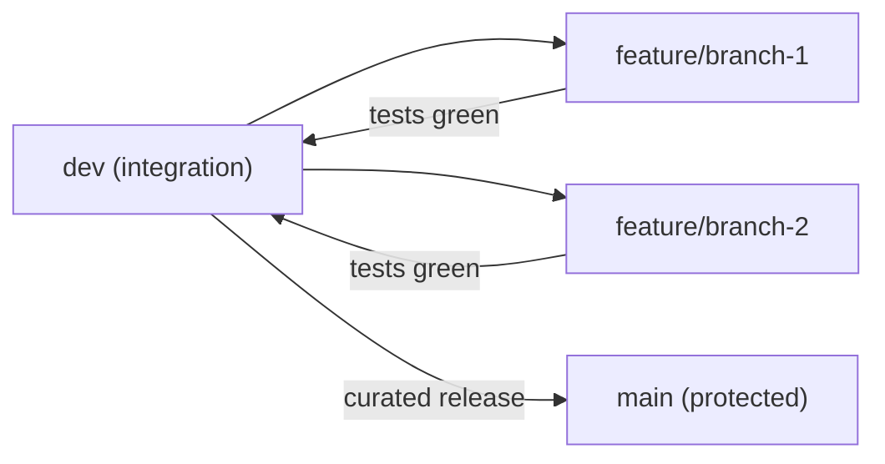
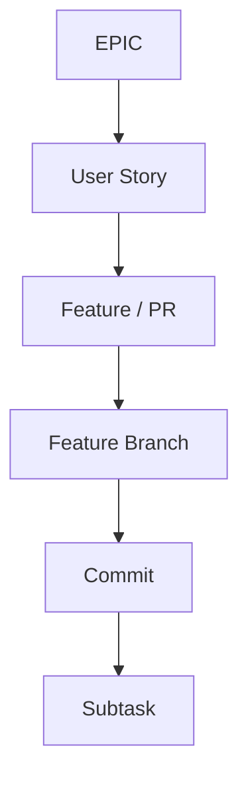
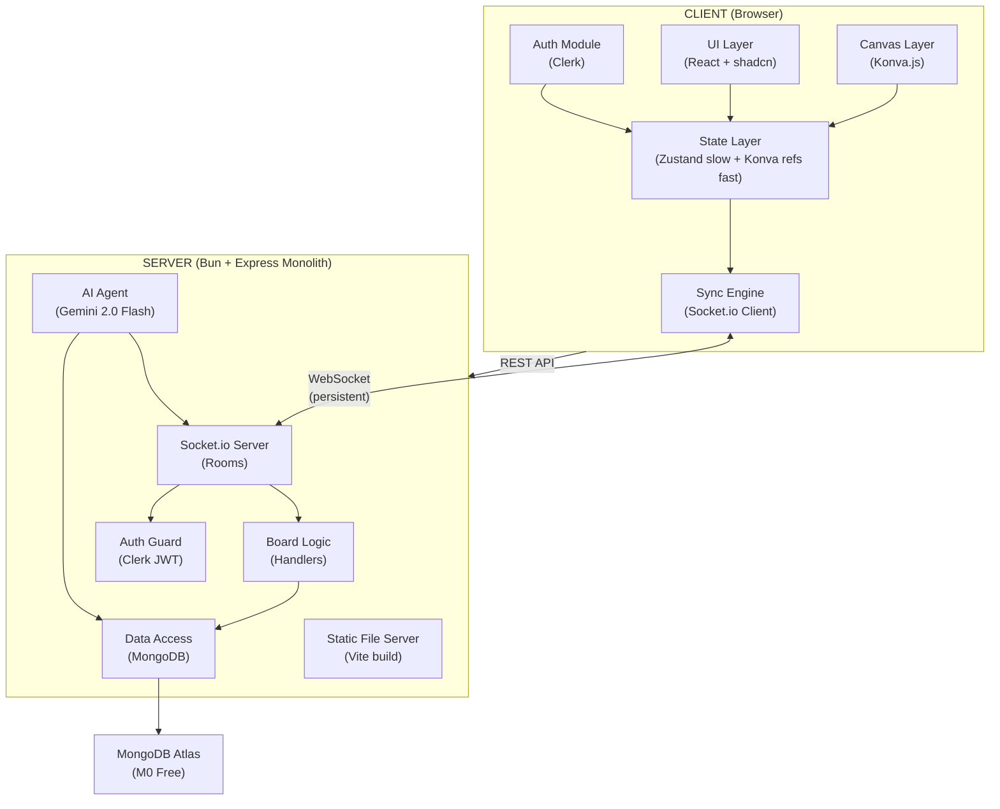
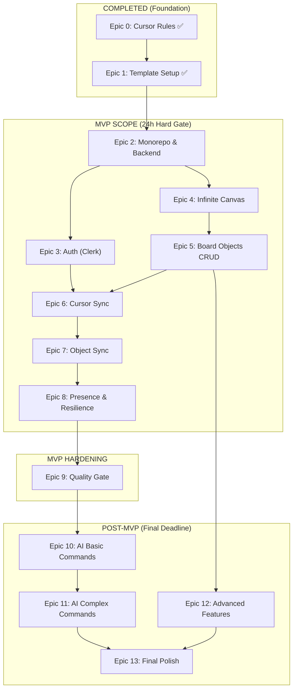
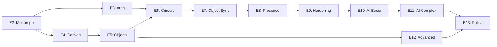
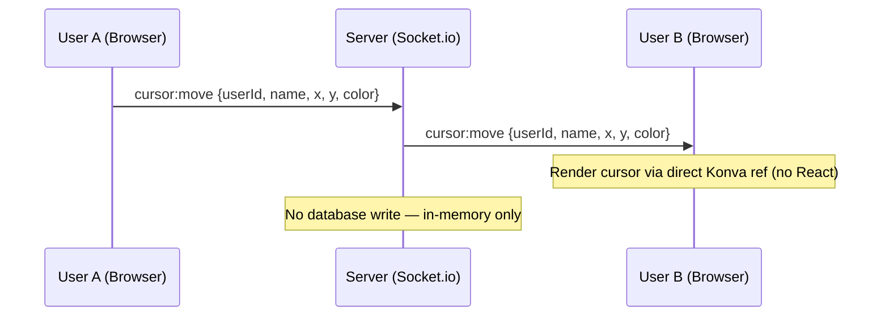
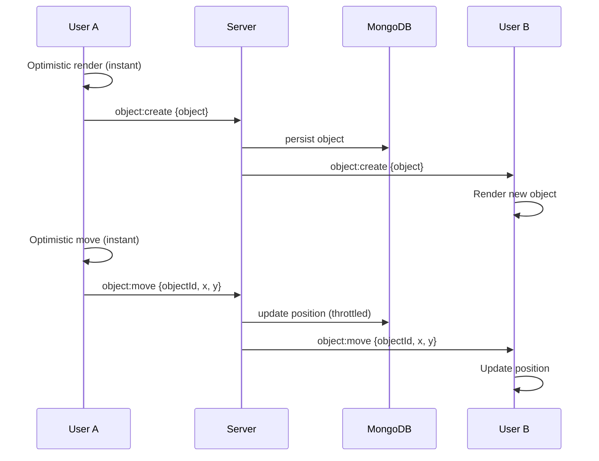
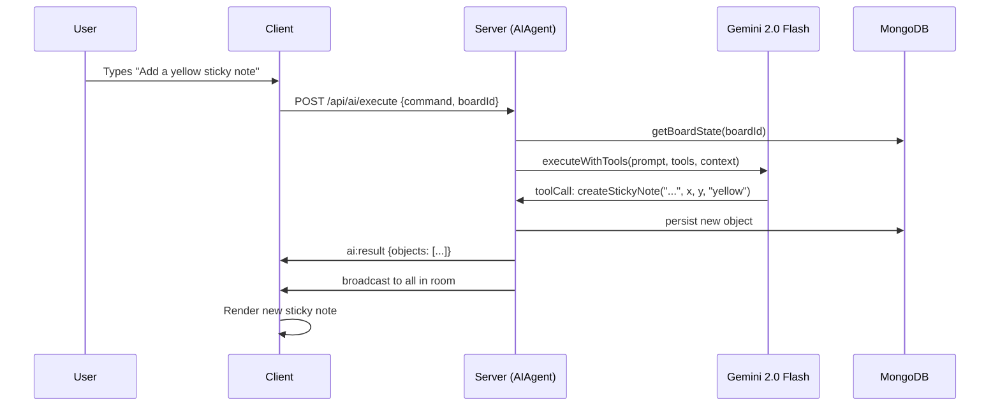

# Product Requirements Document (PRD) — V1

> **Superseded.** This file is archived. All checklists and tasks have been consolidated into [../PRD.md](../PRD.md). Use that document as the single source of truth.

## Document Metadata

| Field | Value |
| --- | --- |
| **Product** | Collab-Board — Real-Time Collaborative Whiteboard with AI Agent |
| **Status** | Draft |
| **Version** | 1.0 |
| **Date** | February 16, 2026 |
| **Primary Design Doc** | `docs/research/5-BASIC-DESIGN-DOCUMENT.md` |
| **Foundation PRD** | `PRD.md` (root — Epic 0 + Epic 1, both complete) |

---

## Executive Summary

Collab-Board is a production-scale, real-time collaborative whiteboard (Miro-like) with an AI agent that manipulates board state via natural language. This PRD covers the full build-out from monorepo restructure through multiplayer collaboration to AI-powered board manipulation.

**Core Philosophy:** A simple, solid, multiplayer whiteboard with a working AI agent beats any feature-rich board with broken collaboration.

### Timeline

| Checkpoint | Deadline | Scope |
| --- | --- | --- |
| Pre-Search | Monday (1h) | Architecture, planning |
| **MVP** | **Tuesday (24h — hard gate)** | **Collaborative whiteboard: canvas, objects, sync, auth, deployed** |
| Early Submission | Friday (4 days) | Full feature set including AI |
| Final | Sunday (7 days) | Polish, documentation, deployment |

### MVP Hard Gate Requirements

All of the following must be functional at the 24-hour mark:

- Infinite board with pan/zoom
- Sticky notes with editable text
- At least one shape type (rectangle, circle, or line)
- Create, move, and edit objects
- Real-time sync between 2+ users
- Multiplayer cursors with name labels
- Presence awareness (who is online)
- User authentication
- Deployed and publicly accessible

### Performance Targets

| Metric | Target |
| --- | --- |
| Frame rate | 60 FPS |
| Object sync latency | <100ms |
| Cursor sync latency | <50ms |
| Object capacity | 500+ objects |
| Concurrent users | 5+ |

---

## References

| Document | Path | Contents |
| --- | --- | --- |
| Foundation PRD | `PRD.md` | Epic 0 + Epic 1 (complete) |
| Design Document | `docs/research/5-BASIC-DESIGN-DOCUMENT.md` | Architecture, modules, data model, epics, user stories |
| Pre-Search Checklist | `docs/research/1-PRE-SEARCH-CHECKLIST.md` | Constraints, architecture, cost analysis |
| Tech Stack Options | `docs/research/2-TECH-STACK-OPTIONS.md` | Per-layer technology rationale |
| Identify Tradeoffs | `docs/research/3-IDENTIFY-TRADEOFFS.md` | Benefits, costs, mitigations |
| Architecture Decisions | `docs/research/4-RECORD-ARCHITECTURE-DECISIONS.md` | 12 ADRs |
| Project Requirements | `docs/G4 Week 1 - CollabBoard (1).pdf` | MVP gate, features, submission |
| Cursor Rules | `.cursor/rules/` | 11 rule files (tech-stack, code-standards, git-workflow, etc.) |
| Glossary | `docs/GLOSSARY.md` | Term definitions |

---

## Working Agreements

### Engineering Principles (SOLID + Modular)

- **Single Responsibility (SRP):** One feature branch = one feature. One commit = one cohesive change. Server handlers separated by concern (CursorHandler, ObjectHandler, PresenceHandler). AI parsing separate from AI execution.
- **Open/Closed (OCP):** New board object types added by implementing `BoardObject` interface. New AI commands added by registering tool definitions — no changes to the execution pipeline.
- **Liskov Substitution (LSP):** All board objects (StickyNote, Shape, Frame, Connector, Text) implement the `BoardObject` interface and are interchangeable in rendering, syncing, persistence, and selection.
- **Interface Segregation (ISP):** Canvas depends on `Renderable`. Sync depends on `Syncable`. AI depends on `AIManipulable`. No module depends on methods it does not use.
- **Dependency Inversion (DIP):** `SyncEngine` depends on `TransportAdapter` (not Socket.io directly). `AIAgent` depends on `LLMAdapter` (not Gemini directly). `BoardRepository` depends on `StorageAdapter` (not MongoDB directly).

### Repository Conventions

- **Bun only** — never npm, yarn, or npx. Use `bunx` instead of `npx`.
- **No default exports** — named exports everywhere.
- **No `React.FC`** — use `(): ReactElement` return type.
- **No `any`** — use proper types or `unknown` with type guards.
- **No `console.log`** — ESLint enforces `no-console: "error"`.
- **Always use braces** for if/else blocks.
- **Max 2 `useEffect`** per file — extract to custom hooks.
- **`data-testid` values must be globally unique** across the project.
- **`import type { ... }`** for type-only imports.
- **Context7 MCP** — use for latest stable docs when doing setup/config/library API work (React, TypeScript, Vite, Bun, Tailwind v4, shadcn, Vitest, RTL, Socket.io, Konva, Clerk, Zustand, Mongoose, Zod).

### Commit and PR Conventions

- **Commit granularity:** 3-8 commits per feature branch; each commit reviewable in isolation.
- **Commit prefixes:** `feat:`, `fix:`, `chore:`, `test:`, `docs:`, `refactor:`, `perf:`
- **PR expectation:** Each Feature in this PRD corresponds to one PR into `dev`.
- **No Cursor co-authorship trailers** in git commits.

---

## Git Workflow

### Branch Model

- **`main`** — protected, no direct pushes. Curated releases only.
- **`dev`** — long-lived integration branch. All feature work merges here.
- **`feature/<slug>`** — short-lived, branches from `dev`, merges back to `dev`.

### Required Workflow (repeat per feature)

1. **Branch:** Create `feature/<slug>` from `dev`
2. **Implement:** Build the feature over several small commits
3. **Test:** Write tests for the feature
4. **Run:** Execute tests (`bun run test:run`)
5. **Fix:** If tests fail, fix and rerun until green
6. **Verify:** Run `bun run validate` (format + typecheck + lint + test)
7. **Merge:** Merge feature branch into `dev`
8. **Next:** Move to the next feature



---

## Delivery Hierarchy

```
EPICs → User Stories → Features (PRs) → Feature Branch → Commits → Subtasks
```



### Checkbox Convention

- **Everything in this PRD is trackable** via checkboxes.
- **Do not check boxes until completed** — implementation + verification + merge to `dev`.

---

## System Architecture Overview

### High-Level Architecture



### Communication Patterns

| Pattern | Transport | Latency | Persisted |
| --- | --- | --- | --- |
| Cursor sync | Socket.io emit (no DB) | <50ms | No |
| Object CRUD | Socket.io → MongoDB | <100ms | Yes |
| Board load | REST GET → MongoDB | <500ms | Read-only |
| AI commands | REST POST → Gemini → Socket.io broadcast | <2s | Yes (objects) |
| Presence | Socket.io connect/disconnect | <100ms | No |

### Locked Tech Stack

| Layer | Technology |
| --- | --- |
| Runtime | Bun 1.2+ |
| Language | TypeScript 5.x (strict) |
| Frontend | React 19, Vite 7, Konva.js 10, react-konva 19 |
| Styling | Tailwind CSS v4, shadcn/ui, Lucide icons |
| State | Zustand 5 (slow) + direct Konva refs (fast) |
| Backend | Express 4, Socket.io 4 |
| Database | MongoDB Atlas M0, Mongoose 8 |
| Auth | Clerk (React + Node SDK) |
| AI | Google Gemini 2.0 Flash |
| Validation | Zod 3 |
| Testing | Vitest, Playwright, MSW, mongodb-memory-server |
| Hosting | Render (free web service) |
| API Docs | Swagger/OpenAPI |

---

## Epic Roadmap

### MVP Boundary Visualization



### Epic Dependency Graph



---

## COMPLETED: Epic 0 — Engineering Governance & Cursor Rules ✅

> **Details:** See `PRD.md` (root) for full breakdown. All 3 features (F0.1–F0.3) merged to `dev`.

- [x] F0.1: Tech stack and quality Cursor rules
- [x] F0.2: Git workflow Cursor rules
- [x] F0.3: Context7 MCP requirement

---

## COMPLETED: Epic 1 — React Template Stack Setup ✅

> **Details:** See `PRD.md` (root) for full breakdown. All 7 features (F1.1–F1.7) merged to `dev`.

- [x] F1.1: Bun runtime and package manager (US-1)
- [x] F1.2: Vite build and dev server (US-2)
- [x] F1.3: TypeScript project configuration (US-3)
- [x] F1.4: React app shell (US-4)
- [x] F1.5: Tailwind CSS v4 styling (US-5)
- [x] F1.6: ShadCN component library (US-6)
- [x] F1.7: Vitest and React Testing Library (US-7)

---

<!-- ═══════════════════════════════════════════════════ -->
<!--              MVP SCOPE (24h Hard Gate)              -->
<!-- ═══════════════════════════════════════════════════ -->

# MVP SCOPE

> Everything below through Epic 8 must be functional at the 24-hour mark.

---

## Epic 2: Monorepo Restructure & Backend Foundation

### Epic Goal

Transform the single-app React template into a Bun monorepo with `apps/client` (React + Vite), `apps/server` (Express + Socket.io), and `packages/shared-types`. Establish MongoDB connection and deploy the skeleton to Render.

### User Stories Covered

- **US-1.1:** Initialize Bun monorepo with client/server workspaces
- **US-1.2:** Deploy skeleton monolith to Render

### Definition of Done (Epic 2)

- [ ] Epic 2 complete (all features below merged to `dev`)

### Feature Map

| Feature | User Story | Branch | Summary |
| --- | --- | --- | --- |
| F2.1 | US-1.1 | `feature/monorepo-workspace-setup` | Bun workspaces with client + server + shared-types |
| F2.2 | US-1.1 | `feature/express-server-skeleton` | Express app with health check and static serving |
| F2.3 | US-1.1 | `feature/mongodb-connection-and-models` | MongoDB Atlas connection, Mongoose schemas |
| F2.4 | US-1.1 | `feature/shared-types-package` | BoardObject, socket event, AI command types |
| F2.5 | US-1.2 | `feature/render-deployment-pipeline` | Render deploy with build script and env vars |

---

### Feature F2.1: Bun Monorepo Workspace Setup

- **PR:** `Infra: Bun monorepo with client/server workspaces`
- **Branch:** `feature/monorepo-workspace-setup`
- **SOLID:** SRP — separate workspaces per concern; DIP — shared-types as abstraction boundary
- [ ] Feature F2.1 complete (merged to `dev`)

#### Acceptance Criteria

- [ ] `bun install` succeeds at root
- [ ] `apps/client/` contains the existing React + Vite app (migrated from `src/`)
- [ ] `apps/server/` contains a new Express project stub
- [ ] `packages/shared-types/` is importable from both client and server
- [ ] Root `package.json` defines Bun workspaces
- [ ] TypeScript strict mode enabled across all workspaces

#### Implementation Checklist

- [ ] Branch created from `dev`

##### Commit 1: Create workspace structure and root config

- [ ] `chore(infra): create bun monorepo workspace structure`
- [ ] Subtasks:
  - [ ] Create `apps/client/`, `apps/server/`, `packages/shared-types/` directories
  - [ ] Add root `package.json` with `workspaces: ["apps/*", "packages/*"]`
  - [ ] Add root `tsconfig.json` with project references
  - [ ] Configure root ESLint flat config extending to workspaces

##### Commit 2: Migrate existing app to apps/client

- [ ] `refactor(client): migrate react app to apps/client workspace`
- [ ] Subtasks:
  - [ ] Move `src/`, `index.html`, `vite.config.ts`, `tsconfig.json` to `apps/client/`
  - [ ] Update import paths and `@` alias to work from new location
  - [ ] Add `apps/client/package.json` with client-specific deps
  - [ ] Verify `bun run dev` still works from `apps/client/`

##### Commit 3: Scaffold apps/server workspace

- [ ] `chore(server): scaffold express server workspace`
- [ ] Subtasks:
  - [ ] Create `apps/server/package.json` with Express, Socket.io, Mongoose, Zod deps
  - [ ] Create `apps/server/tsconfig.json` extending root
  - [ ] Create `apps/server/src/server.ts` (entry point stub)
  - [ ] Create `apps/server/src/app.ts` (Express app setup)

##### Commit 4: Verify monorepo and merge

- [ ] `test(infra): verify monorepo setup and merge`
- [ ] Subtasks:
  - [ ] Run `bun install` at root (succeeds)
  - [ ] Run `bun run typecheck` across workspaces
  - [ ] Run `bun run test:run` in client workspace
  - [ ] Merge feature branch into `dev`

---

### Feature F2.2: Express Server Skeleton

- **PR:** `Backend: Express server with health check and static serving`
- **Branch:** `feature/express-server-skeleton`
- **SOLID:** SRP — server entry separate from app config separate from route definitions
- [ ] Feature F2.2 complete (merged to `dev`)

#### Acceptance Criteria

- [ ] `bun run dev` in server starts Express on configurable port
- [ ] `GET /api/health` returns `{ status: "ok" }`
- [ ] Express serves static files from client build output
- [ ] Socket.io server initializes and accepts connections
- [ ] CORS configured for development

#### Implementation Checklist

- [ ] Branch created from `dev`

##### Commit 1: Express app and health endpoint

- [ ] `feat(server): add express app with health endpoint`
- [ ] Subtasks:
  - [ ] Create `apps/server/src/app.ts` with Express middleware (json, cors, static)
  - [ ] Create `apps/server/src/routes/health.routes.ts` with `/api/health`
  - [ ] Add Zod validation middleware pattern

##### Commit 2: Socket.io server initialization

- [ ] `feat(server): initialize socket.io server`
- [ ] Subtasks:
  - [ ] Create `apps/server/src/server.ts` with HTTP + Socket.io setup
  - [ ] Configure Socket.io with CORS for development
  - [ ] Add connection logging (removable before merge)
  - [ ] Add `dev` script to `apps/server/package.json`

##### Commit 3: Static file serving and concurrent dev

- [ ] `chore(server): add static serving and concurrent dev scripts`
- [ ] Subtasks:
  - [ ] Configure Express to serve `apps/client/dist/` in production
  - [ ] Add root `dev` script that runs client + server concurrently
  - [ ] Add root `build` script that builds client then starts server

##### Commit 4: Verify server and merge

- [ ] `test(server): verify server starts and merge`
- [ ] Subtasks:
  - [ ] Verify health endpoint returns 200
  - [ ] Verify Socket.io accepts a test connection
  - [ ] Run `bun run typecheck` (green)
  - [ ] Merge feature branch into `dev`

---

### Feature F2.3: MongoDB Connection & Models

- **PR:** `Data: MongoDB Atlas connection and Mongoose models`
- **Branch:** `feature/mongodb-connection-and-models`
- **SOLID:** DIP — `StorageAdapter` interface with MongoDB implementation; SRP — models separate from repository
- [ ] Feature F2.3 complete (merged to `dev`)

#### Acceptance Criteria

- [ ] Mongoose connects to MongoDB Atlas (URI from env var)
- [ ] `Board` and `BoardObject` Mongoose schemas defined
- [ ] `BoardRepository` implements `StorageAdapter` interface
- [ ] Indexes on `objects.boardId`, `boards.ownerId`, `boards.collaborators`
- [ ] Connection error handling with graceful retry

#### Implementation Checklist

- [ ] Branch created from `dev`

##### Commit 1: StorageAdapter interface and MongoDB connection

- [ ] `feat(data): add storage adapter interface and mongodb connection`
- [ ] Subtasks:
  - [ ] Create `apps/server/src/shared/interfaces/storage-adapter.ts`
  - [ ] Create `apps/server/src/modules/board/db.ts` with Mongoose connection logic
  - [ ] Add `MONGODB_URI` to `.env.example`
  - [ ] Add dotenv or equivalent env loading

##### Commit 2: Board and BoardObject Mongoose models

- [ ] `feat(data): add board and board-object mongoose models`
- [ ] Subtasks:
  - [ ] Create `apps/server/src/modules/board/board.model.ts` (Board schema)
  - [ ] Create `apps/server/src/modules/board/object.model.ts` (BoardObject schema with discriminated `type`)
  - [ ] Add indexes: `boardId` on objects, `ownerId` and `collaborators` on boards
  - [ ] Add Zod schemas for input validation

##### Commit 3: BoardRepository implementation

- [ ] `feat(data): implement board repository with storage adapter`
- [ ] Subtasks:
  - [ ] Create `apps/server/src/modules/board/board.repo.ts` implementing `StorageAdapter`
  - [ ] Methods: `findObjectsByBoard`, `createObject`, `updateObject`, `deleteObject`
  - [ ] Add board CRUD methods: `createBoard`, `findBoardById`, `findBoardsByUser`

##### Commit 4: Verify connection and merge

- [ ] `test(data): verify mongodb connection and merge`
- [ ] Subtasks:
  - [ ] Add a startup log confirming MongoDB connection
  - [ ] Run `bun run typecheck` (green)
  - [ ] Merge feature branch into `dev`

---

### Feature F2.4: Shared Types Package

- **PR:** `Types: shared-types package for client/server`
- **Branch:** `feature/shared-types-package`
- **SOLID:** ISP — separate type files per domain; LSP — `BoardObject` base with subtypes
- [ ] Feature F2.4 complete (merged to `dev`)

#### Acceptance Criteria

- [ ] `packages/shared-types/` exports all shared interfaces
- [ ] `BoardObject` interface with discriminated union for object types
- [ ] Socket event payload types for all event categories
- [ ] AI command types for tool definitions
- [ ] Importable from both client and server via workspace reference

#### Implementation Checklist

- [ ] Branch created from `dev`

##### Commit 1: BoardObject types and discriminated unions

- [ ] `feat(types): add board object types with discriminated unions`
- [ ] Subtasks:
  - [ ] Create `packages/shared-types/src/board-object.types.ts`
  - [ ] Define `BoardObject` base interface (id, boardId, type, x, y, width, height, etc.)
  - [ ] Define subtypes: `StickyNote`, `RectangleShape`, `CircleShape`, `LineShape`, `Frame`, `Connector`, `TextElement`
  - [ ] Define `ObjectType` enum/union

##### Commit 2: Socket event and AI command types

- [ ] `feat(types): add socket event and ai command types`
- [ ] Subtasks:
  - [ ] Create `packages/shared-types/src/socket-events.types.ts` (cursor, object, presence, AI event payloads)
  - [ ] Create `packages/shared-types/src/ai-command.types.ts` (tool definitions, tool call results)
  - [ ] Create `packages/shared-types/src/index.ts` barrel export

##### Commit 3: Verify imports and merge

- [ ] `test(types): verify cross-workspace imports and merge`
- [ ] Subtasks:
  - [ ] Import shared types in a client file (verify builds)
  - [ ] Import shared types in a server file (verify builds)
  - [ ] Run `bun run typecheck` (green)
  - [ ] Merge feature branch into `dev`

---

### Feature F2.5: Render Deployment Pipeline

- **PR:** `Deploy: Render deployment with build scripts`
- **Branch:** `feature/render-deployment-pipeline`
- [ ] Feature F2.5 complete (merged to `dev`)

#### Acceptance Criteria

- [ ] Git push to `main` triggers auto-deploy on Render
- [ ] Build completes in under 60 seconds
- [ ] Static files served from Express at root URL
- [ ] Health check endpoint accessible at production URL
- [ ] Environment variables configured (MONGODB_URI, CLERK keys, PORT)

#### Implementation Checklist

- [ ] Branch created from `dev`

##### Commit 1: Production build scripts

- [ ] `chore(deploy): add production build scripts`
- [ ] Subtasks:
  - [ ] Add root `build` script: builds client (Vite) then compiles server
  - [ ] Add root `start` script: runs compiled server with static serving
  - [ ] Add `render.yaml` or configure Render dashboard settings
  - [ ] Create `.env.example` with all required env vars

##### Commit 2: Environment and deploy config

- [ ] `chore(deploy): configure render environment`
- [ ] Subtasks:
  - [ ] Document Render environment variable setup
  - [ ] Add `NODE_ENV=production` handling in server
  - [ ] Verify CORS restricts to production domain in production mode

##### Commit 3: Verify deployment and merge

- [ ] `test(deploy): verify deployment pipeline and merge`
- [ ] Subtasks:
  - [ ] Run `bun run build` locally (succeeds)
  - [ ] Run `bun run start` locally (server starts, serves static files)
  - [ ] Verify `/api/health` returns 200
  - [ ] Merge feature branch into `dev`

---

## Epic 3: Authentication & Authorization

### Epic Goal

Integrate Clerk for user authentication with Google OAuth and magic links. Secure Socket.io connections with JWT verification on handshake. Protect all routes and board access.

### User Stories Covered

- **US-1.3:** Sign in with Google OAuth or magic link
- **US-1.4:** Socket.io connections authenticated via Clerk JWT

### Definition of Done (Epic 3)

- [ ] Epic 3 complete (all features below merged to `dev`)

### Feature Map

| Feature | User Story | Branch | Summary |
| --- | --- | --- | --- |
| F3.1 | US-1.3 | `feature/clerk-react-integration` | Clerk SignIn, UserButton, auth state |
| F3.2 | US-1.4 | `feature/clerk-server-jwt-middleware` | Clerk Node SDK JWT verification |
| F3.3 | US-1.4 | `feature/socketio-jwt-handshake` | Socket.io handshake auth with Clerk JWT |
| F3.4 | US-1.3 | `feature/protected-routes-auth-guard` | Route protection and AuthGuard component |

---

### Feature F3.1: Clerk React SDK Integration

- **PR:** `Auth: Clerk React SDK with SignIn and UserButton`
- **Branch:** `feature/clerk-react-integration`
- **Context7:** Use for Clerk React SDK latest docs
- [ ] Feature F3.1 complete (merged to `dev`)

#### Acceptance Criteria

- [ ] Clerk `<ClerkProvider>` wraps the app
- [ ] Clerk `<SignIn />` renders on unauthenticated visit
- [ ] Google OAuth flow completes and redirects to the board
- [ ] Magic link email sends and completes authentication
- [ ] `<UserButton />` shows authenticated user's avatar and name

#### Implementation Checklist

- [ ] Branch created from `dev`

##### Commit 1: Install Clerk and add provider

- [ ] `feat(auth): install clerk react sdk and add provider`
- [ ] Subtasks:
  - [ ] `bun add @clerk/clerk-react` in client workspace
  - [ ] Add `<ClerkProvider publishableKey={...}>` in `main.tsx`
  - [ ] Add `VITE_CLERK_PUBLISHABLE_KEY` to `.env.example`

##### Commit 2: Add SignIn and UserButton components

- [ ] `feat(auth): add sign-in page and user button`
- [ ] Subtasks:
  - [ ] Create `apps/client/src/modules/auth/components/SignInPage.tsx`
  - [ ] Add `<UserButton />` to the app header/toolbar area
  - [ ] Configure Clerk for Google OAuth + magic link methods

##### Commit 3: Auth hooks and state

- [ ] `feat(auth): add auth hooks and zustand auth store`
- [ ] Subtasks:
  - [ ] Create `apps/client/src/modules/auth/hooks/useAuth.ts` wrapping Clerk hooks
  - [ ] Create `apps/client/src/modules/auth/hooks/useClerkToken.ts` for JWT retrieval
  - [ ] Create barrel export `apps/client/src/modules/auth/index.ts`

##### Commit 4: Verify auth flow and merge

- [ ] `test(auth): verify clerk auth flow and merge`
- [ ] Subtasks:
  - [ ] Verify sign-in flow works (Google OAuth or magic link)
  - [ ] Verify `<UserButton />` displays correctly
  - [ ] Run `bun run typecheck` (green)
  - [ ] Merge feature branch into `dev`

---

### Feature F3.2: Clerk Server JWT Middleware

- **PR:** `Auth: Clerk Node SDK JWT verification middleware`
- **Branch:** `feature/clerk-server-jwt-middleware`
- **Context7:** Use for Clerk Node SDK latest docs
- **SOLID:** SRP — auth middleware separate from route logic; DIP — verification behind interface
- [ ] Feature F3.2 complete (merged to `dev`)

#### Acceptance Criteria

- [ ] Clerk Node SDK installed in server workspace
- [ ] JWT verification middleware protects `/api/*` routes
- [ ] Invalid or missing tokens return 401
- [ ] Valid tokens attach user info to request

#### Implementation Checklist

- [ ] Branch created from `dev`

##### Commit 1: Install Clerk Node SDK and verification

- [ ] `feat(auth): add clerk node sdk jwt verification`
- [ ] Subtasks:
  - [ ] `bun add @clerk/clerk-sdk-node` in server workspace
  - [ ] Create `apps/server/src/modules/auth/clerk-verify.ts` with JWT verification function
  - [ ] Add `CLERK_SECRET_KEY` to `.env.example`

##### Commit 2: Express auth middleware

- [ ] `feat(auth): add express auth middleware`
- [ ] Subtasks:
  - [ ] Create `apps/server/src/shared/middleware/auth.middleware.ts`
  - [ ] Apply middleware to `/api/*` routes (except `/api/health`)
  - [ ] Attach decoded user ID and metadata to `req.auth`

##### Commit 3: Verify middleware and merge

- [ ] `test(auth): verify jwt middleware and merge`
- [ ] Subtasks:
  - [ ] Verify `/api/health` is accessible without auth
  - [ ] Verify protected routes return 401 without token
  - [ ] Run `bun run typecheck` (green)
  - [ ] Merge feature branch into `dev`

---

### Feature F3.3: Socket.io JWT Handshake Auth

- **PR:** `Auth: Socket.io handshake JWT authentication`
- **Branch:** `feature/socketio-jwt-handshake`
- **SOLID:** SRP — socket auth separate from socket event handlers
- [ ] Feature F3.3 complete (merged to `dev`)

#### Acceptance Criteria

- [ ] Socket.io client sends `socket.auth.token` from Clerk session
- [ ] Server verifies JWT on `connection` event using Clerk Node SDK
- [ ] Invalid or missing tokens result in connection rejection
- [ ] Valid connections proceed to room join with user context

#### Implementation Checklist

- [ ] Branch created from `dev`

##### Commit 1: Client socket auth setup

- [ ] `feat(auth): add clerk token to socket.io client auth`
- [ ] Subtasks:
  - [ ] Create `apps/client/src/modules/collaboration/hooks/useSocket.ts`
  - [ ] Attach Clerk JWT to `socket.auth.token` on connection
  - [ ] Handle auth errors and reconnection

##### Commit 2: Server socket auth middleware

- [ ] `feat(auth): add socket.io handshake jwt verification`
- [ ] Subtasks:
  - [ ] Create `apps/server/src/modules/auth/socket-auth.ts`
  - [ ] Verify Clerk JWT in Socket.io `connection` middleware
  - [ ] Reject unauthorized connections before room join
  - [ ] Attach user info to `socket.data.user`

##### Commit 3: Verify socket auth and merge

- [ ] `test(auth): verify socket auth handshake and merge`
- [ ] Subtasks:
  - [ ] Verify authenticated client connects successfully
  - [ ] Verify unauthenticated client is rejected
  - [ ] Run `bun run typecheck` (green)
  - [ ] Merge feature branch into `dev`

---

### Feature F3.4: Protected Routes & AuthGuard Component

- **PR:** `Auth: route protection and AuthGuard component`
- **Branch:** `feature/protected-routes-auth-guard`
- [ ] Feature F3.4 complete (merged to `dev`)

#### Acceptance Criteria

- [ ] Unauthenticated users cannot access board routes
- [ ] `<AuthGuard>` component redirects unauthenticated users to sign-in
- [ ] Board-level access checks collaborators array
- [ ] Auth state exposed via Zustand `authStore`

#### Implementation Checklist

- [ ] Branch created from `dev`

##### Commit 1: AuthGuard component

- [ ] `feat(auth): add auth guard component`
- [ ] Subtasks:
  - [ ] Create `apps/client/src/modules/auth/components/AuthGuard.tsx`
  - [ ] Redirect to sign-in if not authenticated
  - [ ] Show loading state while auth is initializing

##### Commit 2: Auth store and board access

- [ ] `feat(auth): add auth store and board-level access check`
- [ ] Subtasks:
  - [ ] Create Zustand `authStore` with user info and token
  - [ ] Add board access utility (owner or in collaborators array)
  - [ ] Wire `<AuthGuard>` into app routing

##### Commit 3: Verify protection and merge

- [ ] `test(auth): verify route protection and merge`
- [ ] Subtasks:
  - [ ] Verify unauthenticated access redirects to sign-in
  - [ ] Verify authenticated access proceeds to board
  - [ ] Run `bun run typecheck` and `bun run test:run` (green)
  - [ ] Merge feature branch into `dev`

---

## Epic 4: Infinite Canvas

### Epic Goal

Build the Konva.js canvas layer with pan, zoom, and background grid. This establishes the core rendering surface for all board objects. Single-user only — no multiplayer in this epic.

### User Stories Covered

- **US-2.1:** Infinite canvas with pan via click-drag
- **US-2.2:** Zoom with scroll wheel / pinch gesture
- **US-2.3:** Grid/dot background pattern for spatial orientation

### Definition of Done (Epic 4)

- [ ] Epic 4 complete (all features below merged to `dev`)

### Feature Map

| Feature | User Story | Branch | Summary |
| --- | --- | --- | --- |
| F4.1 | US-2.1 | `feature/konva-stage-viewport` | Konva Stage fullscreen rendering |
| F4.2 | US-2.1, US-2.2 | `feature/canvas-pan-and-zoom` | Pan (drag), zoom (scroll/pinch) |
| F4.3 | US-2.3 | `feature/canvas-grid-background` | Repeating grid/dot background |

---

### Feature F4.1: Konva Stage & Viewport

- **PR:** `Canvas: Konva Stage with fullscreen viewport`
- **Branch:** `feature/konva-stage-viewport`
- **Context7:** Use for Konva.js and react-konva latest docs
- [ ] Feature F4.1 complete (merged to `dev`)

#### Acceptance Criteria

- [ ] Konva Stage renders fullscreen in the browser viewport
- [ ] Stage resizes on window resize
- [ ] Layer architecture established: grid layer, objects layer, cursor layer, selection layer
- [ ] Canvas position persists during the session (no reset on re-render)

#### Implementation Checklist

- [ ] Branch created from `dev`

##### Commit 1: Install Konva and create Board component

- [ ] `feat(canvas): install konva and create board component`
- [ ] Subtasks:
  - [ ] `bun add konva react-konva` in client workspace
  - [ ] Create `apps/client/src/modules/board/components/Board.tsx` with `<Stage>` and `<Layer>` setup
  - [ ] Stage fills viewport with `window.innerWidth` / `window.innerHeight`
  - [ ] Add window resize listener to update stage dimensions

##### Commit 2: Layer architecture

- [ ] `feat(canvas): establish layer architecture`
- [ ] Subtasks:
  - [ ] Create grid layer (bottom), objects layer, cursor layer (top), selection layer
  - [ ] Use `useRef` for layer references (fast state pattern)
  - [ ] Create `apps/client/src/modules/board/components/InfiniteCanvas.tsx` wrapper

##### Commit 3: Verify canvas and merge

- [ ] `test(canvas): verify konva stage renders and merge`
- [ ] Subtasks:
  - [ ] Add unit test for Board component rendering
  - [ ] Verify canvas fills viewport visually
  - [ ] Run `bun run typecheck` and `bun run test:run` (green)
  - [ ] Merge feature branch into `dev`

---

### Feature F4.2: Pan & Zoom

- **PR:** `Canvas: pan and zoom controls`
- **Branch:** `feature/canvas-pan-and-zoom`
- [ ] Feature F4.2 complete (merged to `dev`)

#### Acceptance Criteria

- [ ] Click-and-drag on empty canvas pans the viewport
- [ ] Pan is smooth at 60fps with no visible jank
- [ ] Scroll wheel zooms toward cursor position
- [ ] Zoom range is bounded (10% to 500%)
- [ ] Zoom is smooth and does not cause flickering
- [ ] Objects scale correctly with zoom level

#### Implementation Checklist

- [ ] Branch created from `dev`

##### Commit 1: Pan implementation

- [ ] `feat(canvas): add click-drag pan`
- [ ] Subtasks:
  - [ ] Create `apps/client/src/modules/board/hooks/usePanZoom.ts`
  - [ ] Implement stage draggable behavior for pan
  - [ ] Ensure pan only activates on empty canvas (not on objects)
  - [ ] Pan at 60fps using Stage position updates

##### Commit 2: Zoom implementation

- [ ] `feat(canvas): add scroll-wheel and pinch zoom`
- [ ] Subtasks:
  - [ ] Add `wheel` event handler for zoom toward cursor
  - [ ] Calculate zoom scale with bounded range (0.1 to 5.0)
  - [ ] Adjust stage position to zoom toward pointer location
  - [ ] Handle pinch gesture for touch devices

##### Commit 3: Verify pan/zoom and merge

- [ ] `test(canvas): verify pan and zoom behavior and merge`
- [ ] Subtasks:
  - [ ] Add unit test for zoom calculation logic
  - [ ] Verify pan and zoom work smoothly (manual)
  - [ ] Run `bun run typecheck` and `bun run test:run` (green)
  - [ ] Merge feature branch into `dev`

---

### Feature F4.3: Grid Background

- **PR:** `Canvas: grid/dot background pattern`
- **Branch:** `feature/canvas-grid-background`
- [ ] Feature F4.3 complete (merged to `dev`)

#### Acceptance Criteria

- [ ] Background layer renders a repeating dot or line pattern
- [ ] Pattern scales appropriately with zoom
- [ ] Pattern does not interfere with object interaction
- [ ] Performance: grid renders without dropping below 60fps

#### Implementation Checklist

- [ ] Branch created from `dev`

##### Commit 1: Grid pattern component

- [ ] `feat(canvas): add grid background pattern`
- [ ] Subtasks:
  - [ ] Create `apps/client/src/modules/board/components/GridBackground.tsx`
  - [ ] Render dots or lines on the grid layer using Konva shapes
  - [ ] Scale pattern with zoom level for consistent visual density
  - [ ] Set `listening={false}` on grid layer for performance

##### Commit 2: Verify grid and merge

- [ ] `test(canvas): verify grid background and merge`
- [ ] Subtasks:
  - [ ] Verify grid renders and scales with zoom
  - [ ] Verify grid does not interfere with pan/zoom or object clicks
  - [ ] Run `bun run typecheck` (green)
  - [ ] Merge feature branch into `dev`

---

## Epic 5: Board Objects CRUD (Single User)

### Epic Goal

Implement the full object creation, editing, and manipulation pipeline for a single user. Toolbar for tool selection, sticky notes with inline editing, shapes, selection, move, resize, delete, and color change. All state managed in Zustand `boardStore`. No sync yet — that comes in Epics 6-7.

### User Stories Covered

- **US-3.1:** Create sticky notes from toolbar
- **US-3.2:** Edit sticky note text inline
- **US-3.3:** Change sticky note color
- **US-3.4:** Create shapes (rectangle, circle, line)
- **US-3.5:** Move objects by drag
- **US-3.6:** Resize objects with handles
- **US-3.7:** Delete with Delete/Backspace key
- **US-3.8:** Multi-select (Shift+click, selection rectangle)

### Definition of Done (Epic 5)

- [ ] Epic 5 complete (all features below merged to `dev`)

### Feature Map

| Feature | User Story | Branch | Summary |
| --- | --- | --- | --- |
| F5.1 | — | `feature/zustand-board-store` | Zustand boardStore for object state |
| F5.2 | — | `feature/toolbar-component` | Toolbar with tool selection |
| F5.3 | US-3.1, US-3.2, US-3.3 | `feature/sticky-note-crud` | Sticky notes: create, edit text, color |
| F5.4 | US-3.4 | `feature/shape-creation` | Shapes: rectangle, circle, line |
| F5.5 | US-3.5, US-3.6 | `feature/object-select-move-resize` | Selection, drag-move, resize handles |
| F5.6 | US-3.7, US-3.8 | `feature/object-delete-and-multiselect` | Delete key, Shift+click, selection rect |

---

### Feature F5.1: Zustand Board Store

- **PR:** `State: Zustand boardStore for object management`
- **Branch:** `feature/zustand-board-store`
- **Context7:** Use for Zustand latest docs
- **SOLID:** SRP — store manages object state only; ISP — granular selectors
- [ ] Feature F5.1 complete (merged to `dev`)

#### Acceptance Criteria

- [ ] Zustand `boardStore` manages array of `BoardObject`
- [ ] Actions: `addObject`, `updateObject`, `removeObject`, `setObjects`
- [ ] Granular selectors for individual objects and filtered lists
- [ ] Board metadata (title, id) stored separately from objects

#### Implementation Checklist

- [ ] Branch created from `dev`

##### Commit 1: Board store with object actions

- [ ] `feat(state): add zustand board store with object actions`
- [ ] Subtasks:
  - [ ] `bun add zustand` in client workspace
  - [ ] Create `apps/client/src/modules/board/store/boardStore.ts`
  - [ ] Define actions: `addObject`, `updateObject`, `removeObject`, `setObjects`, `clearBoard`
  - [ ] Define selectors: `useObject(id)`, `useObjectsByType(type)`, `useAllObjects()`

##### Commit 2: Board metadata and active tool state

- [ ] `feat(state): add board metadata and active tool to store`
- [ ] Subtasks:
  - [ ] Add `boardId`, `title`, `activeToolType` to store
  - [ ] Add `selectedObjectIds` set for selection tracking
  - [ ] Add `setActiveTool`, `selectObject`, `deselectAll`, `toggleSelection`

##### Commit 3: Verify store and merge

- [ ] `test(state): add board store unit tests and merge`
- [ ] Subtasks:
  - [ ] Add Vitest tests for store actions (add, update, remove, select)
  - [ ] Run `bun run test:run` (green)
  - [ ] Merge feature branch into `dev`

---

### Feature F5.2: Toolbar Component

- **PR:** `UI: Toolbar with tool selection`
- **Branch:** `feature/toolbar-component`
- [ ] Feature F5.2 complete (merged to `dev`)

#### Acceptance Criteria

- [ ] Toolbar renders at a fixed position (left side or top)
- [ ] Tools: Select (pointer), Sticky Note, Rectangle, Circle, Line
- [ ] Active tool is visually highlighted
- [ ] Tool selection updates `activeToolType` in boardStore

#### Implementation Checklist

- [ ] Branch created from `dev`

##### Commit 1: Toolbar layout and tool buttons

- [ ] `feat(toolbar): add toolbar component with tool buttons`
- [ ] Subtasks:
  - [ ] Create `apps/client/src/modules/toolbar/components/Toolbar.tsx`
  - [ ] Add tool buttons with Lucide icons (MousePointer, StickyNote, Square, Circle, Minus)
  - [ ] Style with Tailwind + shadcn Button variants
  - [ ] Wire tool selection to boardStore `setActiveTool`

##### Commit 2: Active tool indicator

- [ ] `feat(toolbar): add active tool indicator`
- [ ] Subtasks:
  - [ ] Highlight active tool button with visual state (primary variant or ring)
  - [ ] Add cursor style change based on active tool
  - [ ] Create barrel export `apps/client/src/modules/toolbar/index.ts`

##### Commit 3: Verify toolbar and merge

- [ ] `test(toolbar): verify toolbar renders and merge`
- [ ] Subtasks:
  - [ ] Add unit test for Toolbar component
  - [ ] Run `bun run test:run` (green)
  - [ ] Merge feature branch into `dev`

---

### Feature F5.3: Sticky Note CRUD

- **PR:** `Objects: sticky note creation, text editing, and color`
- **Branch:** `feature/sticky-note-crud`
- **SOLID:** OCP — sticky note implements `BoardObject` interface; SRP — rendering separate from editing
- [ ] Feature F5.3 complete (merged to `dev`)

#### Acceptance Criteria

- [ ] Clicking canvas with Sticky Note tool active creates a sticky note at click position
- [ ] Sticky note renders as colored rectangle with text
- [ ] Double-click opens inline text editor
- [ ] Clicking outside editor saves and closes
- [ ] Color picker shows at least 6 color options
- [ ] Color change immediately updates the sticky note's fill
- [ ] Sticky note added to Zustand `boardStore`

#### Implementation Checklist

- [ ] Branch created from `dev`

##### Commit 1: Sticky note Konva component

- [ ] `feat(objects): add sticky note konva component`
- [ ] Subtasks:
  - [ ] Create `apps/client/src/modules/board/objects/StickyNote.tsx`
  - [ ] Render Konva `Rect` + `Text` with configurable color, position, size
  - [ ] Register click handler for selection
  - [ ] Support drag for repositioning (basic, refined in F5.5)

##### Commit 2: Sticky note creation from toolbar

- [ ] `feat(objects): add sticky note creation on canvas click`
- [ ] Subtasks:
  - [ ] Handle canvas click when active tool is "sticky_note"
  - [ ] Create `BoardObject` of type `sticky_note` with default size, color, empty text
  - [ ] Add to `boardStore` via `addObject`
  - [ ] Position at click coordinates adjusted for pan/zoom

##### Commit 3: Inline text editing

- [ ] `feat(objects): add inline text editing for sticky notes`
- [ ] Subtasks:
  - [ ] On double-click, overlay an HTML textarea over the Konva node position
  - [ ] Sync textarea value to boardStore on blur or Escape
  - [ ] Handle textarea positioning with zoom/pan offset

##### Commit 4: Color picker

- [ ] `feat(objects): add color picker for sticky notes`
- [ ] Subtasks:
  - [ ] Create `apps/client/src/modules/toolbar/components/ColorPicker.tsx`
  - [ ] Show 6+ color options when a sticky note is selected
  - [ ] Update `boardStore` object color on pick

##### Commit 5: Verify sticky notes and merge

- [ ] `test(objects): verify sticky note crud and merge`
- [ ] Subtasks:
  - [ ] Add unit tests for sticky note creation and color change
  - [ ] Run `bun run typecheck` and `bun run test:run` (green)
  - [ ] Merge feature branch into `dev`

---

### Feature F5.4: Shape Creation

- **PR:** `Objects: rectangle, circle, and line shapes`
- **Branch:** `feature/shape-creation`
- **SOLID:** LSP — all shapes implement `BoardObject` and render interchangeably
- [ ] Feature F5.4 complete (merged to `dev`)

#### Acceptance Criteria

- [ ] Toolbar tools for rectangle, circle, and line
- [ ] Each shape type renders correctly on the canvas
- [ ] Shapes have configurable width, height (or radius), and color
- [ ] Shapes added to boardStore on creation

#### Implementation Checklist

- [ ] Branch created from `dev`

##### Commit 1: Rectangle and circle Konva components

- [ ] `feat(objects): add rectangle and circle shape components`
- [ ] Subtasks:
  - [ ] Create `apps/client/src/modules/board/objects/RectangleShape.tsx`
  - [ ] Create `apps/client/src/modules/board/objects/CircleShape.tsx`
  - [ ] Render Konva `Rect` and `Circle` with configurable props
  - [ ] Register in an object factory/renderer by type

##### Commit 2: Line component

- [ ] `feat(objects): add line shape component`
- [ ] Subtasks:
  - [ ] Create `apps/client/src/modules/board/objects/LineShape.tsx`
  - [ ] Render Konva `Line` with start/end points
  - [ ] Support configurable stroke color and width

##### Commit 3: Shape creation from toolbar

- [ ] `feat(objects): wire shape creation to toolbar actions`
- [ ] Subtasks:
  - [ ] Handle canvas click for rectangle, circle, and line tools
  - [ ] Create `BoardObject` with appropriate type and defaults
  - [ ] Add to boardStore

##### Commit 4: Verify shapes and merge

- [ ] `test(objects): verify shape creation and merge`
- [ ] Subtasks:
  - [ ] Add unit tests for shape rendering
  - [ ] Run `bun run typecheck` and `bun run test:run` (green)
  - [ ] Merge feature branch into `dev`

---

### Feature F5.5: Object Selection, Move & Resize

- **PR:** `Objects: selection, drag-move, and resize handles`
- **Branch:** `feature/object-select-move-resize`
- [ ] Feature F5.5 complete (merged to `dev`)

#### Acceptance Criteria

- [ ] Clicking an object selects it (visual indicator)
- [ ] Clicking empty canvas deselects all
- [ ] Dragging a selected object moves it (smooth at 60fps)
- [ ] Object position updates in boardStore on drag end
- [ ] Selecting an object shows resize handles (corners/edges)
- [ ] Dragging a resize handle resizes the object
- [ ] Minimum size enforced to prevent zero-dimension objects

#### Implementation Checklist

- [ ] Branch created from `dev`

##### Commit 1: Selection state and visual indicator

- [ ] `feat(objects): add object selection with visual indicator`
- [ ] Subtasks:
  - [ ] Create `apps/client/src/modules/board/hooks/useSelection.ts`
  - [ ] Click on object → `selectObject(id)` in boardStore
  - [ ] Click on empty canvas → `deselectAll()`
  - [ ] Render selection outline (stroke or bounding box) on selected objects

##### Commit 2: Drag-to-move

- [ ] `feat(objects): add drag-to-move for all objects`
- [ ] Subtasks:
  - [ ] Enable Konva `draggable` on all board objects
  - [ ] Only allow drag when Select tool is active
  - [ ] Update boardStore position on `dragend`
  - [ ] Ensure smooth 60fps drag (direct node position, batched store update)

##### Commit 3: Resize handles

- [ ] `feat(objects): add resize handles on selection`
- [ ] Subtasks:
  - [ ] Create `apps/client/src/modules/board/components/SelectionTransformer.tsx`
  - [ ] Use Konva `Transformer` for resize handles on selected objects
  - [ ] Update boardStore width/height on transform end
  - [ ] Enforce minimum size (e.g., 20x20)

##### Commit 4: Verify selection/move/resize and merge

- [ ] `test(objects): verify selection, move, resize and merge`
- [ ] Subtasks:
  - [ ] Add unit tests for selection state
  - [ ] Run `bun run typecheck` and `bun run test:run` (green)
  - [ ] Merge feature branch into `dev`

---

### Feature F5.6: Delete & Multi-Select

- **PR:** `Objects: delete key and multi-select`
- **Branch:** `feature/object-delete-and-multiselect`
- [ ] Feature F5.6 complete (merged to `dev`)

#### Acceptance Criteria

- [ ] Pressing Delete or Backspace removes all selected objects
- [ ] Shift+click toggles individual objects in/out of selection
- [ ] Click-and-drag on empty canvas draws a selection rectangle
- [ ] All objects intersecting the selection rectangle are selected on release
- [ ] Selected objects show a unified bounding box

#### Implementation Checklist

- [ ] Branch created from `dev`

##### Commit 1: Keyboard delete

- [ ] `feat(objects): add delete key handler`
- [ ] Subtasks:
  - [ ] Listen for Delete and Backspace key events
  - [ ] Remove all selected objects via `removeObject` for each ID
  - [ ] Clear selection after deletion

##### Commit 2: Multi-select (Shift+click and selection rectangle)

- [ ] `feat(objects): add shift-click and selection rectangle`
- [ ] Subtasks:
  - [ ] Shift+click toggles object in `selectedObjectIds`
  - [ ] Drag on empty canvas (with Select tool) draws a selection rectangle
  - [ ] On release, select all objects intersecting the rectangle
  - [ ] Render selection rectangle overlay during drag

##### Commit 3: Verify delete and multi-select and merge

- [ ] `test(objects): verify delete and multi-select and merge`
- [ ] Subtasks:
  - [ ] Add unit tests for delete and multi-select logic
  - [ ] Run `bun run typecheck` and `bun run test:run` (green)
  - [ ] Merge feature branch into `dev`

---

## Epic 6: Real-Time Cursor Sync

### Epic Goal

Implement the first multiplayer capability: two browsers see each other's cursors moving in real-time. Cursors are rendered on a dedicated Konva layer (bypassing React) for 60fps performance. Cursor updates are throttled to 30fps and never hit the database.

### User Stories Covered

- **US-4.1:** See other users' cursors moving in real-time (<50ms latency)
- **US-4.2:** Cursor labels with user name and unique color
- **US-4.3:** Cursors disappear when user disconnects

### Socket.io Event Flow



### Definition of Done (Epic 6)

- [ ] Epic 6 complete (all features below merged to `dev`)

### Feature Map

| Feature | User Story | Branch | Summary |
| --- | --- | --- | --- |
| F6.1 | US-4.1 | `feature/socketio-room-join` | Socket.io client connection and room join |
| F6.2 | US-4.1 | `feature/cursor-emit-and-render` | Cursor emit (30fps) + remote cursor rendering |
| F6.3 | US-4.2, US-4.3 | `feature/cursor-labels-and-cleanup` | Cursor labels, colors, and disconnect cleanup |

---

### Feature F6.1: Socket.io Room Join

- **PR:** `Sync: Socket.io client connection and room join`
- **Branch:** `feature/socketio-room-join`
- **Context7:** Use for Socket.io latest docs
- [ ] Feature F6.1 complete (merged to `dev`)

#### Acceptance Criteria

- [ ] Client connects to Socket.io server after Clerk auth
- [ ] Client joins board room (`board:${boardId}`) on connection
- [ ] Server manages rooms and broadcasts within rooms
- [ ] Disconnection removes user from room

#### Implementation Checklist

- [ ] Branch created from `dev`

##### Commit 1: Client socket connection with room join

- [ ] `feat(sync): add socket.io client connection and room join`
- [ ] Subtasks:
  - [ ] Update `apps/client/src/modules/collaboration/hooks/useSocket.ts`
  - [ ] Connect after Clerk auth, pass JWT in `socket.auth.token`
  - [ ] Emit `board:join` with `{ boardId }` on connection
  - [ ] Handle `disconnect` and `reconnect` events

##### Commit 2: Server room management

- [ ] `feat(sync): add server room management`
- [ ] Subtasks:
  - [ ] Create `apps/server/src/modules/collaboration/socket-manager.ts`
  - [ ] Handle `board:join` — join socket to `board:${boardId}` room
  - [ ] Handle `disconnect` — clean up user from room
  - [ ] Create `TransportAdapter` interface implementation

##### Commit 3: Verify room join and merge

- [ ] `test(sync): verify room join and merge`
- [ ] Subtasks:
  - [ ] Verify client connects and joins room
  - [ ] Run `bun run typecheck` (green)
  - [ ] Merge feature branch into `dev`

---

### Feature F6.2: Cursor Emit & Remote Rendering

- **PR:** `Sync: cursor position emit and remote cursor rendering`
- **Branch:** `feature/cursor-emit-and-render`
- **SOLID:** SRP — CursorHandler handles cursor events only; DIP — cursor rendering via Konva refs (not React state)
- [ ] Feature F6.2 complete (merged to `dev`)

#### Acceptance Criteria

- [ ] Local cursor position emitted via `cursor:move` at 30fps (throttled)
- [ ] Remote cursors rendered on dedicated Konva layer using direct ref updates
- [ ] Cursor movement is smooth with <50ms perceived latency
- [ ] Cursor updates bypass React reconciliation entirely

#### Implementation Checklist

- [ ] Branch created from `dev`

##### Commit 1: Cursor emit with throttle

- [ ] `feat(sync): emit cursor position at 30fps`
- [ ] Subtasks:
  - [ ] Create `apps/client/src/modules/collaboration/hooks/useCursors.ts`
  - [ ] Track mouse position on Konva Stage
  - [ ] Throttle `cursor:move` emit to 30fps (33ms interval)
  - [ ] Payload: `{ userId, name, x, y, color }`

##### Commit 2: Server cursor handler

- [ ] `feat(sync): add server cursor handler`
- [ ] Subtasks:
  - [ ] Create `apps/server/src/modules/collaboration/handlers/cursor.handler.ts`
  - [ ] On `cursor:move`, broadcast to all in room except sender
  - [ ] No database write — pure in-memory relay

##### Commit 3: Remote cursor Konva rendering

- [ ] `feat(sync): render remote cursors on konva layer`
- [ ] Subtasks:
  - [ ] Create `apps/client/src/modules/collaboration/components/CursorOverlay.tsx`
  - [ ] Use dedicated Konva layer for all remote cursors
  - [ ] Update cursor positions via direct Konva node ref updates (not setState)
  - [ ] Render cursor as arrow shape + name label

##### Commit 4: Verify cursor sync and merge

- [ ] `test(sync): verify cursor sync latency and merge`
- [ ] Subtasks:
  - [ ] Open two browser tabs, verify cursors appear on each other's screens
  - [ ] Verify smooth movement without jank
  - [ ] Run `bun run typecheck` (green)
  - [ ] Merge feature branch into `dev`

---

### Feature F6.3: Cursor Labels & Cleanup

- **PR:** `Sync: cursor labels, colors, and disconnect cleanup`
- **Branch:** `feature/cursor-labels-and-cleanup`
- [ ] Feature F6.3 complete (merged to `dev`)

#### Acceptance Criteria

- [ ] Each remote cursor displays user's name label
- [ ] Each user's cursor has a unique color
- [ ] Name label is readable at all zoom levels
- [ ] When a user disconnects, their cursor is removed within 2 seconds
- [ ] No stale cursors remain on the canvas after disconnection

#### Implementation Checklist

- [ ] Branch created from `dev`

##### Commit 1: Cursor name and color

- [ ] `feat(sync): add cursor name labels and unique colors`
- [ ] Subtasks:
  - [ ] Assign unique color per user (from predefined palette or hash)
  - [ ] Render Konva `Text` label beside each cursor arrow
  - [ ] Ensure label scales correctly with zoom

##### Commit 2: Cursor disconnect cleanup

- [ ] `feat(sync): remove cursors on user disconnect`
- [ ] Subtasks:
  - [ ] Listen for `presence:leave` event
  - [ ] Remove corresponding Konva cursor node within 2 seconds
  - [ ] Clean up cursor data from local tracking map

##### Commit 3: Verify labels and cleanup and merge

- [ ] `test(sync): verify cursor labels and cleanup and merge`
- [ ] Subtasks:
  - [ ] Verify name labels show correctly
  - [ ] Verify cursor disappears when tab is closed
  - [ ] Run `bun run typecheck` (green)
  - [ ] Merge feature branch into `dev`

---

## Epic 7: Real-Time Object Sync

### Epic Goal

Extend single-user object CRUD from Epic 5 to work across all connected clients in real-time. Object mutations use optimistic UI with server reconciliation. Board state loads from MongoDB on connection.

### User Stories Covered

- **US-5.1:** Objects created by one user appear on all clients immediately
- **US-5.2:** Object movements sync in real-time
- **US-5.3:** Text edits, color changes, and resizes sync in real-time
- **US-5.4:** Object deletions sync in real-time

### Socket.io Object Event Flow



### Definition of Done (Epic 7)

- [ ] Epic 7 complete (all features below merged to `dev`)

### Feature Map

| Feature | User Story | Branch | Summary |
| --- | --- | --- | --- |
| F7.1 | US-5.1 | `feature/object-create-sync` | object:create broadcast |
| F7.2 | US-5.2 | `feature/object-move-sync` | object:move with optimistic UI |
| F7.3 | US-5.3 | `feature/object-update-sync` | object:update broadcast (text, color, resize) |
| F7.4 | US-5.4 | `feature/object-delete-sync` | object:delete broadcast |
| F7.5 | — | `feature/board-state-load` | Board state load on connection |

---

### Feature F7.1: Object Create Sync

- **PR:** `Sync: object:create broadcast and handling`
- **Branch:** `feature/object-create-sync`
- **SOLID:** SRP — ObjectHandler handles object events only
- [ ] Feature F7.1 complete (merged to `dev`)

#### Acceptance Criteria

- [ ] Creating a sticky note or shape emits `object:create` via Socket.io
- [ ] All other clients in the room receive and render the new object
- [ ] Object appears within <100ms on remote clients
- [ ] Object is persisted to MongoDB

#### Implementation Checklist

- [ ] Branch created from `dev`

##### Commit 1: Client emit on object creation

- [ ] `feat(sync): emit object:create on object creation`
- [ ] Subtasks:
  - [ ] Hook boardStore `addObject` to also emit `object:create` via socket
  - [ ] Include full `BoardObject` in payload

##### Commit 2: Server object handler

- [ ] `feat(sync): add server object handler for create`
- [ ] Subtasks:
  - [ ] Create `apps/server/src/modules/collaboration/handlers/object.handler.ts`
  - [ ] On `object:create`: validate with Zod, persist to MongoDB, broadcast to room
  - [ ] Return created object with server-assigned `_id`

##### Commit 3: Client receive handler

- [ ] `feat(sync): handle incoming object:create on client`
- [ ] Subtasks:
  - [ ] Listen for `object:create` events from other users
  - [ ] Add received object to local boardStore
  - [ ] Render on canvas

##### Commit 4: Verify create sync and merge

- [ ] `test(sync): verify object create sync and merge`
- [ ] Subtasks:
  - [ ] Two browser tabs: create object in one, verify it appears in the other
  - [ ] Run `bun run typecheck` (green)
  - [ ] Merge feature branch into `dev`

---

### Feature F7.2: Object Move Sync

- **PR:** `Sync: object:move with optimistic UI`
- **Branch:** `feature/object-move-sync`
- [ ] Feature F7.2 complete (merged to `dev`)

#### Acceptance Criteria

- [ ] Dragging an object emits `object:move` events
- [ ] Remote clients see the object move smoothly
- [ ] Local user sees instant movement (optimistic)
- [ ] Positions are consistent across all clients

#### Implementation Checklist

- [ ] Branch created from `dev`

##### Commit 1: Emit object:move on drag

- [ ] `feat(sync): emit object:move on drag`
- [ ] Subtasks:
  - [ ] Emit `object:move { objectId, x, y }` on drag end (or throttled during drag)
  - [ ] Optimistic: local render happens immediately via Konva drag

##### Commit 2: Server and client move handlers

- [ ] `feat(sync): handle object:move on server and client`
- [ ] Subtasks:
  - [ ] Server: validate, update MongoDB position (throttled 100ms batch), broadcast
  - [ ] Client: listen for `object:move`, update boardStore position
  - [ ] Ensure no feedback loop (ignore own events)

##### Commit 3: Verify move sync and merge

- [ ] `test(sync): verify object move sync and merge`
- [ ] Subtasks:
  - [ ] Two tabs: drag object in one, verify position updates in other
  - [ ] Run `bun run typecheck` (green)
  - [ ] Merge feature branch into `dev`

---

### Feature F7.3: Object Update Sync

- **PR:** `Sync: object:update broadcast (text, color, resize)`
- **Branch:** `feature/object-update-sync`
- [ ] Feature F7.3 complete (merged to `dev`)

#### Acceptance Criteria

- [ ] `object:update` events broadcast all property changes (text, color, width, height)
- [ ] Remote clients apply updates and re-render within <100ms
- [ ] Last-write-wins conflict resolution

#### Implementation Checklist

- [ ] Branch created from `dev`

##### Commit 1: Emit object:update for property changes

- [ ] `feat(sync): emit object:update for text, color, resize changes`
- [ ] Subtasks:
  - [ ] Emit `object:update { objectId, delta: Partial<BoardObject> }` on text edit, color change, resize
  - [ ] Delta contains only changed properties

##### Commit 2: Server and client update handlers

- [ ] `feat(sync): handle object:update on server and client`
- [ ] Subtasks:
  - [ ] Server: validate, merge delta into MongoDB document, broadcast
  - [ ] Client: listen for `object:update`, merge delta into boardStore object
  - [ ] Apply last-write-wins (latest timestamp wins)

##### Commit 3: Verify update sync and merge

- [ ] `test(sync): verify object update sync and merge`
- [ ] Subtasks:
  - [ ] Two tabs: edit text in one, verify text changes in other
  - [ ] Two tabs: change color in one, verify color changes in other
  - [ ] Run `bun run typecheck` (green)
  - [ ] Merge feature branch into `dev`

---

### Feature F7.4: Object Delete Sync

- **PR:** `Sync: object:delete broadcast`
- **Branch:** `feature/object-delete-sync`
- [ ] Feature F7.4 complete (merged to `dev`)

#### Acceptance Criteria

- [ ] `object:delete` removes the object from all clients
- [ ] Deleted objects are removed from MongoDB

#### Implementation Checklist

- [ ] Branch created from `dev`

##### Commit 1: Emit and handle object:delete

- [ ] `feat(sync): emit and handle object:delete`
- [ ] Subtasks:
  - [ ] Emit `object:delete { objectId }` when user deletes an object
  - [ ] Server: remove from MongoDB, broadcast to room
  - [ ] Client: listen for `object:delete`, remove from boardStore

##### Commit 2: Verify delete sync and merge

- [ ] `test(sync): verify object delete sync and merge`
- [ ] Subtasks:
  - [ ] Two tabs: delete object in one, verify it disappears in other
  - [ ] Run `bun run typecheck` (green)
  - [ ] Merge feature branch into `dev`

---

### Feature F7.5: Board State Load on Connection

- **PR:** `Sync: board state load on connection`
- **Branch:** `feature/board-state-load`
- [ ] Feature F7.5 complete (merged to `dev`)

#### Acceptance Criteria

- [ ] On Socket.io connection, server sends all objects for the board via `board:load`
- [ ] Client renders all objects from loaded state
- [ ] Board load completes in <500ms for up to 500 objects
- [ ] Refreshing the page reloads full board state

#### Implementation Checklist

- [ ] Branch created from `dev`

##### Commit 1: Server board load handler

- [ ] `feat(sync): add board:load server handler`
- [ ] Subtasks:
  - [ ] On room join, query MongoDB for all objects with matching `boardId`
  - [ ] Emit `board:load { objects: BoardObject[] }` to connecting client
  - [ ] Include board metadata (title, collaborators)

##### Commit 2: Client board load handler

- [ ] `feat(sync): handle board:load on client`
- [ ] Subtasks:
  - [ ] Listen for `board:load` event
  - [ ] Call `boardStore.setObjects(objects)` to populate canvas
  - [ ] Show loading indicator while waiting for board state

##### Commit 3: Verify board load and merge

- [ ] `test(sync): verify board load on connection and merge`
- [ ] Subtasks:
  - [ ] Create objects, refresh page, verify all objects reload
  - [ ] Run `bun run typecheck` (green)
  - [ ] Merge feature branch into `dev`

---

## Epic 8: Presence & Connection Resilience

### Epic Goal

Complete the multiplayer experience with presence awareness (who is online), board state persistence (survive refresh), and automatic reconnection with state re-sync.

### User Stories Covered

- **US-6.1:** See a list of who is currently on the board
- **US-6.2:** Full board state loads on join
- **US-6.3:** Board survives page refresh
- **US-6.4:** Auto-reconnect on network drop

### Definition of Done (Epic 8)

- [ ] Epic 8 complete (all features below merged to `dev`)

### Feature Map

| Feature | User Story | Branch | Summary |
| --- | --- | --- | --- |
| F8.1 | US-6.1 | `feature/presence-panel` | Online users list panel |
| F8.2 | US-6.1 | `feature/presence-join-leave` | Join/leave events and notifications |
| F8.3 | US-6.3 | `feature/board-persistence` | Board state persistence (survive refresh) |
| F8.4 | US-6.4 | `feature/auto-reconnect` | Auto-reconnect with state re-sync |
| F8.5 | US-6.4 | `feature/connection-status-indicator` | Visual connection status indicator |

---

### Feature F8.1: Presence Panel

- **PR:** `Presence: online users list panel`
- **Branch:** `feature/presence-panel`
- **SOLID:** SRP — PresenceHandler handles only connect/disconnect events
- [ ] Feature F8.1 complete (merged to `dev`)

#### Acceptance Criteria

- [ ] A presence panel shows connected users' names and avatars
- [ ] Users appear when they join and disappear when they leave
- [ ] List updates within 2 seconds of join/leave event

#### Implementation Checklist

- [ ] Branch created from `dev`

##### Commit 1: Presence store and panel component

- [ ] `feat(presence): add presence store and panel component`
- [ ] Subtasks:
  - [ ] Create `apps/client/src/modules/collaboration/store/collaborationStore.ts`
  - [ ] Track `onlineUsers: Map<userId, { name, avatar, color }>`
  - [ ] Create `apps/client/src/modules/collaboration/components/PresencePanel.tsx`
  - [ ] Render user avatars and names

##### Commit 2: Verify panel and merge

- [ ] `test(presence): verify presence panel and merge`
- [ ] Subtasks:
  - [ ] Verify panel renders with mock data
  - [ ] Run `bun run typecheck` and `bun run test:run` (green)
  - [ ] Merge feature branch into `dev`

---

### Feature F8.2: Presence Join/Leave Events

- **PR:** `Presence: join/leave event handling`
- **Branch:** `feature/presence-join-leave`
- [ ] Feature F8.2 complete (merged to `dev`)

#### Acceptance Criteria

- [ ] Server emits `presence:join` when user connects to a room
- [ ] Server emits `presence:leave` when user disconnects
- [ ] Server sends `presence:list` of current users to newly connecting client
- [ ] Client updates presence store on these events

#### Implementation Checklist

- [ ] Branch created from `dev`

##### Commit 1: Server presence handler

- [ ] `feat(presence): add server presence handler`
- [ ] Subtasks:
  - [ ] Create `apps/server/src/modules/collaboration/handlers/presence.handler.ts`
  - [ ] On connection: broadcast `presence:join` to room, send `presence:list` to new client
  - [ ] On disconnect: broadcast `presence:leave` to room
  - [ ] Track active users per room in-memory

##### Commit 2: Client presence event handlers

- [ ] `feat(presence): handle presence events on client`
- [ ] Subtasks:
  - [ ] Listen for `presence:join`, `presence:leave`, `presence:list`
  - [ ] Update collaborationStore `onlineUsers` map
  - [ ] Trigger cursor cleanup on `presence:leave`

##### Commit 3: Verify presence events and merge

- [ ] `test(presence): verify join/leave events and merge`
- [ ] Subtasks:
  - [ ] Two tabs: verify user appears in presence panel when second tab opens
  - [ ] Verify user disappears when tab closes
  - [ ] Run `bun run typecheck` (green)
  - [ ] Merge feature branch into `dev`

---

### Feature F8.3: Board Persistence (Survive Refresh)

- **PR:** `Persistence: board state survives page refresh`
- **Branch:** `feature/board-persistence`
- [ ] Feature F8.3 complete (merged to `dev`)

#### Acceptance Criteria

- [ ] All objects persist in MongoDB
- [ ] Refreshing the page reconnects via Socket.io and reloads board state
- [ ] Board state after refresh matches state before refresh

#### Implementation Checklist

- [ ] Branch created from `dev`

##### Commit 1: Ensure all mutations persist

- [ ] `feat(persistence): verify all object mutations persist to mongodb`
- [ ] Subtasks:
  - [ ] Audit create, update, move, delete handlers — confirm all write to MongoDB
  - [ ] Add error handling for failed MongoDB writes
  - [ ] Verify throttled writes (100ms batch) capture final state

##### Commit 2: Verify refresh persistence and merge

- [ ] `test(persistence): verify board survives refresh and merge`
- [ ] Subtasks:
  - [ ] Create objects, refresh page, verify all objects reload with correct state
  - [ ] Modify objects, refresh, verify modifications persisted
  - [ ] Run `bun run typecheck` (green)
  - [ ] Merge feature branch into `dev`

---

### Feature F8.4: Auto-Reconnect with State Re-sync

- **PR:** `Resilience: auto-reconnect with exponential backoff`
- **Branch:** `feature/auto-reconnect`
- [ ] Feature F8.4 complete (merged to `dev`)

#### Acceptance Criteria

- [ ] Socket.io automatic reconnect with exponential backoff is enabled
- [ ] On reconnect, full board state is re-synced from server
- [ ] Buffered events during disconnect are handled on reconnect

#### Implementation Checklist

- [ ] Branch created from `dev`

##### Commit 1: Reconnect configuration and state re-sync

- [ ] `feat(resilience): configure auto-reconnect and state re-sync`
- [ ] Subtasks:
  - [ ] Configure Socket.io client with `reconnection: true` and exponential backoff
  - [ ] On `reconnect` event, re-emit `board:join` and wait for `board:load`
  - [ ] Replace local state with fresh server state on reconnect

##### Commit 2: Verify reconnect and merge

- [ ] `test(resilience): verify auto-reconnect and merge`
- [ ] Subtasks:
  - [ ] Simulate disconnect (e.g., toggle network), verify reconnection
  - [ ] Verify board state is correct after reconnect
  - [ ] Run `bun run typecheck` (green)
  - [ ] Merge feature branch into `dev`

---

### Feature F8.5: Connection Status Indicator

- **PR:** `UI: connection status indicator`
- **Branch:** `feature/connection-status-indicator`
- [ ] Feature F8.5 complete (merged to `dev`)

#### Acceptance Criteria

- [ ] Visual indicator shows connection status: connected, reconnecting, disconnected
- [ ] Indicator is visible but non-intrusive (e.g., small dot or banner)

#### Implementation Checklist

- [ ] Branch created from `dev`

##### Commit 1: Connection status component

- [ ] `feat(ui): add connection status indicator`
- [ ] Subtasks:
  - [ ] Create `apps/client/src/modules/collaboration/components/ConnectionStatus.tsx`
  - [ ] Track socket state: `connected`, `reconnecting`, `disconnected`
  - [ ] Render colored dot (green/yellow/red) or toast notification
  - [ ] Position in header/toolbar area

##### Commit 2: Verify indicator and merge

- [ ] `test(ui): verify connection status indicator and merge`
- [ ] Subtasks:
  - [ ] Verify indicator shows correct state
  - [ ] Run `bun run typecheck` (green)
  - [ ] Merge feature branch into `dev`

---

<!-- ═══════════════════════════════════════════════════ -->
<!--                 MVP HARDENING                       -->
<!-- ═══════════════════════════════════════════════════ -->

# MVP HARDENING

> This epic sits between the MVP scope and post-MVP features. Its purpose is to rigorously verify that every MVP requirement is met, tested, and production-ready before moving on to AI and advanced features. Better a bit too much verification than not enough.

---

## Epic 9: MVP Hardening & Quality Gate

### Epic Goal

Systematically verify every MVP requirement. Write unit, integration, and E2E tests for all critical paths. Audit performance against targets. Verify production deployment. Sign off on the MVP checklist before proceeding to post-MVP work.

### Definition of Done (Epic 9)

- [ ] Epic 9 complete (all features below merged to `dev`)
- [ ] All MVP hard gate requirements verified and passing
- [ ] Performance targets met (60fps, <50ms cursor, <100ms objects)
- [ ] Production deployment accessible and functional

### Feature Map

| Feature | Branch | Summary |
| --- | --- | --- |
| F9.1 | `feature/unit-tests-core-utils` | Unit tests for coordinate math, validation, store logic |
| F9.2 | `feature/integration-tests-socket-handlers` | Integration tests for Socket.io handlers |
| F9.3 | `feature/e2e-multiplayer-sync` | E2E test: two-browser multiplayer sync |
| F9.4 | `feature/performance-audit` | Performance audit against targets |
| F9.5 | `feature/production-deploy-verify` | Production deployment verification |
| F9.6 | `feature/mvp-checklist-signoff` | MVP requirements checklist sign-off |

---

### Feature F9.1: Unit Tests — Core Utilities

- **PR:** `Test: unit tests for core utilities`
- **Branch:** `feature/unit-tests-core-utils`
- [ ] Feature F9.1 complete (merged to `dev`)

#### Acceptance Criteria

- [ ] Vitest tests for coordinate math utilities (pan/zoom calculations)
- [ ] Vitest tests for Zod validation schemas
- [ ] Vitest tests for boardStore actions and selectors
- [ ] Vitest tests for AI command parsing (if applicable at MVP)
- [ ] All tests pass with `bun run test:run`

#### Implementation Checklist

- [ ] Branch created from `dev`

##### Commit 1: Coordinate math and boardStore tests

- [ ] `test(utils): add unit tests for coordinate math and board store`
- [ ] Subtasks:
  - [ ] Test zoom-toward-cursor calculation
  - [ ] Test pan offset calculations
  - [ ] Test boardStore add/update/remove/select actions
  - [ ] Test boardStore selectors

##### Commit 2: Validation schema tests

- [ ] `test(utils): add unit tests for zod validation schemas`
- [ ] Subtasks:
  - [ ] Test BoardObject Zod schema (valid and invalid inputs)
  - [ ] Test socket event payload schemas
  - [ ] Test edge cases (missing fields, wrong types)

##### Commit 3: Verify all unit tests and merge

- [ ] `test(quality): verify all unit tests pass and merge`
- [ ] Subtasks:
  - [ ] Run `bun run test:run` — all green
  - [ ] Check coverage meets 60% for utility code
  - [ ] Merge feature branch into `dev`

---

### Feature F9.2: Integration Tests — Socket.io Handlers

- **PR:** `Test: integration tests for Socket.io handlers`
- **Branch:** `feature/integration-tests-socket-handlers`
- [ ] Feature F9.2 complete (merged to `dev`)

#### Acceptance Criteria

- [ ] Tests simulate two clients connecting to a test server
- [ ] Object creation, movement, and deletion events tested
- [ ] Cursor sync events tested for correctness
- [ ] Presence join/leave events tested
- [ ] Uses socket.io-client and mongodb-memory-server

#### Implementation Checklist

- [ ] Branch created from `dev`

##### Commit 1: Test server setup with mongodb-memory-server

- [ ] `test(integration): add test server setup`
- [ ] Subtasks:
  - [ ] Create test helper that starts Express + Socket.io server with mongodb-memory-server
  - [ ] Create helper for connecting socket.io-client instances
  - [ ] Add test teardown for clean disconnection

##### Commit 2: Object handler integration tests

- [ ] `test(integration): add object handler tests`
- [ ] Subtasks:
  - [ ] Test object:create — client A creates, client B receives
  - [ ] Test object:move — client A moves, client B sees update
  - [ ] Test object:delete — client A deletes, client B sees removal
  - [ ] Test board:load — client connects, receives all objects

##### Commit 3: Cursor and presence integration tests

- [ ] `test(integration): add cursor and presence handler tests`
- [ ] Subtasks:
  - [ ] Test cursor:move — client A moves, client B receives
  - [ ] Test presence:join — client connects, others notified
  - [ ] Test presence:leave — client disconnects, others notified

##### Commit 4: Verify integration tests and merge

- [ ] `test(quality): verify all integration tests pass and merge`
- [ ] Subtasks:
  - [ ] Run all integration tests (green)
  - [ ] Merge feature branch into `dev`

---

### Feature F9.3: E2E Test — Multiplayer Sync

- **PR:** `Test: Playwright E2E multiplayer sync test`
- **Branch:** `feature/e2e-multiplayer-sync`
- [ ] Feature F9.3 complete (merged to `dev`)

#### Acceptance Criteria

- [ ] At least one Playwright test opens two browser contexts
- [ ] One context creates an object; the other asserts it appears
- [ ] Cursor sync verified across contexts
- [ ] Presence panel updates verified

#### Implementation Checklist

- [ ] Branch created from `dev`

##### Commit 1: E2E multiplayer sync test

- [ ] `test(e2e): add playwright multiplayer sync test`
- [ ] Subtasks:
  - [ ] Create `e2e/multiplayer-sync.spec.ts`
  - [ ] Open two authenticated browser contexts (mock or real Clerk)
  - [ ] Context A creates sticky note → assert appears in Context B
  - [ ] Context A moves object → assert position updates in Context B

##### Commit 2: Verify E2E and merge

- [ ] `test(e2e): verify e2e tests pass and merge`
- [ ] Subtasks:
  - [ ] Run `bun run test:e2e` (green)
  - [ ] Merge feature branch into `dev`

---

### Feature F9.4: Performance Audit

- **PR:** `Quality: performance audit against targets`
- **Branch:** `feature/performance-audit`
- [ ] Feature F9.4 complete (merged to `dev`)

#### Acceptance Criteria

- [ ] Frame rate verified at 60fps during pan, zoom, object manipulation
- [ ] Cursor sync latency measured at <50ms
- [ ] Object sync latency measured at <100ms
- [ ] Canvas handles 500+ objects without performance drops
- [ ] 5+ concurrent users tested without degradation

#### Implementation Checklist

- [ ] Branch created from `dev`

##### Commit 1: Performance measurement and documentation

- [ ] `perf(audit): measure and document performance metrics`
- [ ] Subtasks:
  - [ ] Measure frame rate during pan/zoom with Chrome DevTools
  - [ ] Measure cursor sync round-trip time (timestamp comparison)
  - [ ] Measure object sync latency
  - [ ] Create 500+ objects and verify no frame drops
  - [ ] Document results in `docs/PERFORMANCE.md` or inline

##### Commit 2: Fix performance issues (if any) and merge

- [ ] `perf(audit): address performance findings and merge`
- [ ] Subtasks:
  - [ ] Fix any issues found (e.g., missing `listening={false}`, excess re-renders)
  - [ ] Re-measure after fixes
  - [ ] Merge feature branch into `dev`

---

### Feature F9.5: Production Deployment Verification

- **PR:** `Deploy: verify production deployment`
- **Branch:** `feature/production-deploy-verify`
- [ ] Feature F9.5 complete (merged to `dev`)

#### Acceptance Criteria

- [ ] Application deployed and accessible at Render URL
- [ ] Health check endpoint returns 200
- [ ] Clerk auth works in production
- [ ] Socket.io connects in production (wss://)
- [ ] MongoDB Atlas connection works
- [ ] Two users can collaborate on the live deployment

#### Implementation Checklist

- [ ] Branch created from `dev`

##### Commit 1: Deploy and verify

- [ ] `chore(deploy): verify production deployment end-to-end`
- [ ] Subtasks:
  - [ ] Merge `dev` to `main` for deployment
  - [ ] Verify Render auto-deploy completes
  - [ ] Test auth flow on production URL
  - [ ] Test multiplayer collaboration on production
  - [ ] Document any production-specific fixes needed

##### Commit 2: Fix production issues and merge

- [ ] `fix(deploy): address production issues and merge`
- [ ] Subtasks:
  - [ ] Fix any production-specific issues (CORS, env vars, etc.)
  - [ ] Re-deploy and verify
  - [ ] Merge feature branch into `dev`

---

### Feature F9.6: MVP Requirements Checklist Sign-Off

- **PR:** `Docs: MVP requirements checklist sign-off`
- **Branch:** `feature/mvp-checklist-signoff`
- [ ] Feature F9.6 complete (merged to `dev`)

#### MVP Requirements Verification

- [ ] **Infinite board with pan/zoom** — Konva Stage, click-drag pan, scroll zoom
- [ ] **Sticky notes with editable text** — Create, double-click edit, save on blur
- [ ] **At least one shape type** — Rectangle, circle, and line all functional
- [ ] **Create, move, and edit objects** — Full CRUD pipeline working
- [ ] **Real-time sync between 2+ users** — Socket.io broadcast verified
- [ ] **Multiplayer cursors with name labels** — <50ms latency, dedicated Konva layer
- [ ] **Presence awareness** — Online users panel, join/leave events
- [ ] **User authentication** — Clerk SignIn, JWT verification
- [ ] **Deployed and publicly accessible** — Render production URL live

#### Performance Verification

- [ ] **60 FPS** during pan, zoom, and manipulation
- [ ] **<100ms** object sync latency
- [ ] **<50ms** cursor sync latency
- [ ] **500+ objects** without performance drops
- [ ] **5+ concurrent users** without degradation

#### Implementation Checklist

- [ ] Branch created from `dev`

##### Commit 1: Sign off and merge

- [ ] `docs(mvp): sign off on mvp requirements checklist`
- [ ] Subtasks:
  - [ ] Walk through every requirement above and verify
  - [ ] Update checkboxes in this PRD as verified
  - [ ] Merge feature branch into `dev`

---

<!-- ═══════════════════════════════════════════════════ -->
<!--           POST-MVP (Final Deadline)                 -->
<!-- ═══════════════════════════════════════════════════ -->

# POST-MVP SCOPE

> Everything below is for the final deadline (Sunday). Only begin post-MVP work after Epic 9 (MVP Hardening) is fully complete.

---

## Epic 10: AI Board Agent — Basic Commands

### Epic Goal

Introduce the AI agent with natural language command input, Gemini 2.0 Flash integration, and single-step creation/manipulation commands. All AI results broadcast to all connected users in real-time.

### User Stories Covered

- **US-8.1:** Command bar for natural language instructions
- **US-8.2:** Create sticky note via AI ("Add a yellow sticky note that says...")
- **US-8.3:** Create shape via AI ("Create a blue rectangle")
- **US-8.4:** Move objects via AI ("Move all pink sticky notes to the right")
- **US-8.5:** Change object color via AI
- **US-8.6:** AI results shared with all connected users

### AI Command Flow



### Definition of Done (Epic 10)

- [ ] Epic 10 complete (all features below merged to `dev`)

### Feature Map

| Feature | User Story | Branch | Summary |
| --- | --- | --- | --- |
| F10.1 | US-8.1 | `feature/ai-command-bar` | AI command bar UI (Ctrl+K) |
| F10.2 | — | `feature/ai-rest-endpoint` | REST endpoint /api/ai/execute |
| F10.3 | — | `feature/gemini-llm-adapter` | Gemini 2.0 Flash LLM adapter |
| F10.4 | — | `feature/ai-tool-schema` | 9 tool definitions |
| F10.5 | US-8.2, US-8.3 | `feature/ai-creation-commands` | Create sticky notes and shapes via AI |
| F10.6 | US-8.4, US-8.5 | `feature/ai-manipulation-commands` | Move, color change via AI |
| F10.7 | US-8.6 | `feature/ai-broadcast-results` | AI results broadcast via Socket.io |

---

### Feature F10.1: AI Command Bar UI

- **PR:** `AI: command bar with keyboard shortcut`
- **Branch:** `feature/ai-command-bar`
- [ ] Feature F10.1 complete (merged to `dev`)

#### Acceptance Criteria

- [ ] Command bar accessible via Ctrl+K keyboard shortcut
- [ ] Typing a command and pressing Enter sends it to the AI endpoint
- [ ] Loading indicator shows while AI processes
- [ ] Results appear on the board within <2 seconds for simple commands
- [ ] Error feedback displayed on failure

#### Implementation Checklist

- [ ] Branch created from `dev`

##### Commit 1: Command bar component

- [ ] `feat(ai): add ai command bar component`
- [ ] Subtasks:
  - [ ] Create `apps/client/src/modules/ai/components/AICommandBar.tsx`
  - [ ] Render as modal/overlay with text input
  - [ ] Open on Ctrl+K, close on Escape
  - [ ] Style with shadcn Dialog or custom overlay

##### Commit 2: Command submission and feedback

- [ ] `feat(ai): add command submission with loading and error states`
- [ ] Subtasks:
  - [ ] Create `apps/client/src/modules/ai/hooks/useAICommand.ts`
  - [ ] POST to `/api/ai/execute` with command and boardId
  - [ ] Show spinner during processing
  - [ ] Show error toast on failure

##### Commit 3: Verify command bar and merge

- [ ] `test(ai): verify command bar renders and merge`
- [ ] Subtasks:
  - [ ] Add unit test for AICommandBar
  - [ ] Run `bun run typecheck` and `bun run test:run` (green)
  - [ ] Merge feature branch into `dev`

---

### Feature F10.2: AI REST Endpoint

- **PR:** `AI: REST endpoint /api/ai/execute`
- **Branch:** `feature/ai-rest-endpoint`
- **SOLID:** SRP — route handler separate from AI logic; DIP — AIAgent depends on LLMAdapter interface
- [ ] Feature F10.2 complete (merged to `dev`)

#### Acceptance Criteria

- [ ] `POST /api/ai/execute` accepts `{ command, boardId }`
- [ ] Endpoint is protected by Clerk JWT middleware
- [ ] Validates input with Zod
- [ ] Returns created/modified objects in response
- [ ] Response time <2 seconds for simple commands

#### Implementation Checklist

- [ ] Branch created from `dev`

##### Commit 1: AI route and controller

- [ ] `feat(ai): add ai execution rest endpoint`
- [ ] Subtasks:
  - [ ] Create `apps/server/src/modules/ai/ai.routes.ts`
  - [ ] Zod schema for request body: `{ command: string, boardId: string }`
  - [ ] Wire to AIAgent.execute() (stub for now)
  - [ ] Return `{ success: boolean, objects: BoardObject[] }`

##### Commit 2: Verify endpoint and merge

- [ ] `test(ai): verify ai endpoint and merge`
- [ ] Subtasks:
  - [ ] Test endpoint returns 401 without auth
  - [ ] Test endpoint accepts valid request (with stubbed AI)
  - [ ] Run `bun run typecheck` (green)
  - [ ] Merge feature branch into `dev`

---

### Feature F10.3: Gemini 2.0 Flash LLM Adapter

- **PR:** `AI: Gemini 2.0 Flash LLM adapter implementation`
- **Branch:** `feature/gemini-llm-adapter`
- **Context7:** Use for Google Gemini API latest docs
- **SOLID:** DIP — LLMAdapter interface with Gemini implementation
- [ ] Feature F10.3 complete (merged to `dev`)

#### Acceptance Criteria

- [ ] `LLMAdapter` interface defined
- [ ] Gemini implementation calls Google Gemini 2.0 Flash API
- [ ] Supports function calling (tool use)
- [ ] Handles API errors gracefully
- [ ] API key loaded from `GEMINI_API_KEY` env var

#### Implementation Checklist

- [ ] Branch created from `dev`

##### Commit 1: LLM adapter interface and Gemini implementation

- [ ] `feat(ai): add llm adapter interface and gemini implementation`
- [ ] Subtasks:
  - [ ] Create `apps/server/src/shared/interfaces/llm-adapter.ts`
  - [ ] Create `apps/server/src/modules/ai/llm-adapter.ts` (Gemini implementation)
  - [ ] Install Google AI SDK: `bun add @google/generative-ai`
  - [ ] Implement `executeWithTools(prompt, tools, context)` method

##### Commit 2: Error handling and retry logic

- [ ] `feat(ai): add error handling and retry for gemini`
- [ ] Subtasks:
  - [ ] Handle rate limit errors (429) with backoff
  - [ ] Handle timeout errors
  - [ ] Log errors without exposing to client

##### Commit 3: Verify adapter and merge

- [ ] `test(ai): verify gemini adapter with mocked responses and merge`
- [ ] Subtasks:
  - [ ] Add unit test with mocked Gemini responses
  - [ ] Run `bun run typecheck` and `bun run test:run` (green)
  - [ ] Merge feature branch into `dev`

---

### Feature F10.4: AI Tool Schema

- **PR:** `AI: 9 tool definitions for board manipulation`
- **Branch:** `feature/ai-tool-schema`
- **SOLID:** OCP — new tools added by registration, no pipeline changes
- [ ] Feature F10.4 complete (merged to `dev`)

#### Acceptance Criteria

- [ ] 9 tool definitions registered with Gemini function calling schema
- [ ] Tools: createStickyNote, createShape, createFrame, createConnector, moveObject, resizeObject, updateText, changeColor, getBoardState
- [ ] Each tool has typed parameters and description

#### Implementation Checklist

- [ ] Branch created from `dev`

##### Commit 1: Tool definitions

- [ ] `feat(ai): add 9 tool definitions for gemini function calling`
- [ ] Subtasks:
  - [ ] Create `apps/server/src/modules/ai/tools/creation.tools.ts` (createStickyNote, createShape, createFrame, createConnector)
  - [ ] Create `apps/server/src/modules/ai/tools/manipulation.tools.ts` (moveObject, resizeObject, updateText, changeColor)
  - [ ] Create `apps/server/src/modules/ai/tools/context.tools.ts` (getBoardState)
  - [ ] Create barrel export `apps/server/src/modules/ai/tools/index.ts`

##### Commit 2: AICommandExecutor

- [ ] `feat(ai): add ai command executor`
- [ ] Subtasks:
  - [ ] Create `apps/server/src/modules/ai/agent.ts` (AIAgent orchestrator)
  - [ ] Execute tool calls returned by Gemini against BoardRepository
  - [ ] Collect results (created/modified objects)

##### Commit 3: Verify tools and merge

- [ ] `test(ai): verify tool schema and executor and merge`
- [ ] Subtasks:
  - [ ] Add unit tests for tool execution with mocked data
  - [ ] Run `bun run typecheck` and `bun run test:run` (green)
  - [ ] Merge feature branch into `dev`

---

### Feature F10.5: AI Creation Commands

- **PR:** `AI: create sticky notes and shapes via natural language`
- **Branch:** `feature/ai-creation-commands`
- [ ] Feature F10.5 complete (merged to `dev`)

#### Acceptance Criteria

- [ ] "Add a yellow sticky note that says 'User Research'" creates correct object
- [ ] "Create a blue rectangle" creates correct shape
- [ ] Objects positioned at sensible default locations
- [ ] Created objects sync to all connected users

#### Implementation Checklist

- [ ] Branch created from `dev`

##### Commit 1: Wire creation tools end-to-end

- [ ] `feat(ai): wire ai creation commands end-to-end`
- [ ] Subtasks:
  - [ ] Connect command bar → REST endpoint → AIAgent → Gemini → tool execution → MongoDB persist
  - [ ] Verify createStickyNote and createShape work with real Gemini calls
  - [ ] Default positioning: viewport center or near cursor

##### Commit 2: Verify creation commands and merge

- [ ] `test(ai): verify ai creation commands and merge`
- [ ] Subtasks:
  - [ ] Test: "Add a yellow sticky note" → yellow sticky appears
  - [ ] Test: "Create a blue rectangle" → blue rectangle appears
  - [ ] Run `bun run typecheck` (green)
  - [ ] Merge feature branch into `dev`

---

### Feature F10.6: AI Manipulation Commands

- **PR:** `AI: move and change color via natural language`
- **Branch:** `feature/ai-manipulation-commands`
- [ ] Feature F10.6 complete (merged to `dev`)

#### Acceptance Criteria

- [ ] "Move all pink sticky notes to the right side" repositions matching objects
- [ ] "Change the sticky note color to green" updates the target object
- [ ] AI calls `getBoardState()` to find relevant objects
- [ ] Changes sync to all connected users

#### Implementation Checklist

- [ ] Branch created from `dev`

##### Commit 1: Wire manipulation tools

- [ ] `feat(ai): wire ai manipulation commands`
- [ ] Subtasks:
  - [ ] Implement getBoardState → find matching objects → moveObject/changeColor
  - [ ] Test with real Gemini calls
  - [ ] Verify objects update in boardStore and on canvas

##### Commit 2: Verify manipulation commands and merge

- [ ] `test(ai): verify ai manipulation commands and merge`
- [ ] Subtasks:
  - [ ] Test: move command repositions objects
  - [ ] Test: color change command updates fill
  - [ ] Run `bun run typecheck` (green)
  - [ ] Merge feature branch into `dev`

---

### Feature F10.7: AI Results Broadcast

- **PR:** `AI: broadcast results via Socket.io to all users`
- **Branch:** `feature/ai-broadcast-results`
- [ ] Feature F10.7 complete (merged to `dev`)

#### Acceptance Criteria

- [ ] AI results broadcast via Socket.io `ai:result` event to all in room
- [ ] `ai:executing` event shows which user triggered the command
- [ ] All clients render AI-created or AI-modified objects
- [ ] Error responses sent only to requesting client via `ai:error`

#### Implementation Checklist

- [ ] Branch created from `dev`

##### Commit 1: AI event broadcasting

- [ ] `feat(ai): broadcast ai results via socket.io`
- [ ] Subtasks:
  - [ ] Emit `ai:executing { userId, command }` to room on command start
  - [ ] Emit `ai:result { objects: BoardObject[] }` to room on completion
  - [ ] Emit `ai:error { error }` to requesting client on failure
  - [ ] Client handles all three events

##### Commit 2: Verify broadcast and merge

- [ ] `test(ai): verify ai broadcast to all users and merge`
- [ ] Subtasks:
  - [ ] Two tabs: one sends AI command, both see results
  - [ ] Run `bun run typecheck` (green)
  - [ ] Merge feature branch into `dev`

---

## Epic 11: AI Board Agent — Complex & Layout Commands

### Epic Goal

Extend the AI agent with multi-step operations (SWOT template, user journey map, retrospective), layout commands (grid arrangement), and concurrent command support.

### User Stories Covered

- **US-9.1:** Arrange objects in a grid
- **US-9.2:** Create SWOT analysis template
- **US-9.3:** Build user journey map with 5 stages
- **US-9.4:** Set up retrospective board
- **US-9.5:** Multiple users issue AI commands simultaneously

### Definition of Done (Epic 11)

- [ ] Epic 11 complete (all features below merged to `dev`)

### Feature Map

| Feature | User Story | Branch | Summary |
| --- | --- | --- | --- |
| F11.1 | US-9.1 | `feature/ai-grid-arrangement` | Grid arrangement command |
| F11.2 | US-9.2 | `feature/ai-swot-template` | SWOT analysis template |
| F11.3 | US-9.3 | `feature/ai-journey-map` | User journey map template |
| F11.4 | US-9.4 | `feature/ai-retro-board` | Retrospective board template |
| F11.5 | US-9.5 | `feature/ai-concurrent-commands` | Concurrent AI command support |

---

### Feature F11.1: Grid Arrangement Command

- **PR:** `AI: grid arrangement command`
- **Branch:** `feature/ai-grid-arrangement`
- [ ] Feature F11.1 complete (merged to `dev`)

#### Acceptance Criteria

- [ ] "Arrange these sticky notes in a grid" repositions objects
- [ ] Grid has consistent spacing and respects object dimensions
- [ ] AI reads board state, identifies relevant objects, calculates grid positions

#### Implementation Checklist

- [ ] Branch created from `dev`

##### Commit 1: Grid arrangement logic

- [ ] `feat(ai): add grid arrangement ai command`
- [ ] Subtasks:
  - [ ] Implement `arrangeInGrid` composite operation (multiple moveObject calls)
  - [ ] Calculate grid positions based on object count and sizes
  - [ ] Test with varying numbers of objects

##### Commit 2: Verify and merge

- [ ] `test(ai): verify grid arrangement and merge`
- [ ] Subtasks:
  - [ ] Test: create 6 sticky notes, arrange in grid → 2x3 or 3x2 layout
  - [ ] Merge feature branch into `dev`

---

### Feature F11.2: SWOT Template

- **PR:** `AI: SWOT analysis template generation`
- **Branch:** `feature/ai-swot-template`
- [ ] Feature F11.2 complete (merged to `dev`)

#### Acceptance Criteria

- [ ] "Create a SWOT analysis template" produces 4 labeled quadrants
- [ ] Frames labeled: Strengths, Weaknesses, Opportunities, Threats
- [ ] Frames positioned in 2x2 grid
- [ ] Each frame contains at least one starter sticky note

#### Implementation Checklist

- [ ] Branch created from `dev`

##### Commit 1: SWOT template generation

- [ ] `feat(ai): add swot template generation`
- [ ] Subtasks:
  - [ ] Gemini generates multi-step tool calls: 4 createFrame + 4 createStickyNote
  - [ ] Frames positioned in 2x2 layout with correct labels
  - [ ] Generation completes in <5 seconds

##### Commit 2: Verify and merge

- [ ] `test(ai): verify swot template and merge`
- [ ] Subtasks:
  - [ ] Test: "Create a SWOT template" → 4 frames appear correctly
  - [ ] Merge feature branch into `dev`

---

### Feature F11.3: User Journey Map Template

- **PR:** `AI: user journey map template`
- **Branch:** `feature/ai-journey-map`
- [ ] Feature F11.3 complete (merged to `dev`)

#### Acceptance Criteria

- [ ] "Build a user journey map with 5 stages" creates 5 labeled columns
- [ ] Columns are evenly spaced horizontally
- [ ] Each column contains header and placeholder content

#### Implementation Checklist

- [ ] Branch created from `dev`

##### Commit 1: Journey map template

- [ ] `feat(ai): add user journey map template`
- [ ] Subtasks:
  - [ ] Multi-step: 5 createFrame + headers + placeholder sticky notes
  - [ ] Even horizontal spacing
  - [ ] Completes in <5 seconds

##### Commit 2: Verify and merge

- [ ] `test(ai): verify journey map template and merge`
- [ ] Subtasks:
  - [ ] Test: "Build a user journey map" → 5 columns appear
  - [ ] Merge feature branch into `dev`

---

### Feature F11.4: Retrospective Board Template

- **PR:** `AI: retrospective board template`
- **Branch:** `feature/ai-retro-board`
- [ ] Feature F11.4 complete (merged to `dev`)

#### Acceptance Criteria

- [ ] "Set up a retrospective board" creates 3 labeled columns
- [ ] Columns: "What Went Well", "What Didn't", "Action Items"
- [ ] Layout is clean and ready for collaboration

#### Implementation Checklist

- [ ] Branch created from `dev`

##### Commit 1: Retro template

- [ ] `feat(ai): add retrospective board template`
- [ ] Subtasks:
  - [ ] Multi-step: 3 createFrame + headers
  - [ ] Clean layout with even spacing

##### Commit 2: Verify and merge

- [ ] `test(ai): verify retro template and merge`
- [ ] Subtasks:
  - [ ] Test: "Set up a retro board" → 3 columns appear
  - [ ] Merge feature branch into `dev`

---

### Feature F11.5: Concurrent AI Commands

- **PR:** `AI: concurrent command support`
- **Branch:** `feature/ai-concurrent-commands`
- [ ] Feature F11.5 complete (merged to `dev`)

#### Acceptance Criteria

- [ ] Two users can submit AI commands at the same time
- [ ] Both commands execute and produce results without overwriting each other
- [ ] Results from both commands appear on all clients

#### Implementation Checklist

- [ ] Branch created from `dev`

##### Commit 1: Concurrent command handling

- [ ] `feat(ai): handle concurrent ai commands without conflict`
- [ ] Subtasks:
  - [ ] Ensure AI endpoint handles multiple simultaneous requests
  - [ ] Each command creates independent objects (no ID collisions)
  - [ ] Board state snapshot taken at command start (not shared between commands)

##### Commit 2: Verify and merge

- [ ] `test(ai): verify concurrent ai commands and merge`
- [ ] Subtasks:
  - [ ] Two tabs submit AI commands simultaneously, both results appear
  - [ ] Merge feature branch into `dev`

---

## Epic 12: Advanced Board Features

### Epic Goal

Extend the board with frames (group containers), connector lines/arrows, standalone text elements, object rotation, and copy/paste/duplicate operations.

### User Stories Covered

- **US-7.1:** Create frames that group content
- **US-7.2:** Draw connector lines/arrows between objects
- **US-7.3:** Add standalone text elements
- **US-7.4:** Rotate objects
- **US-7.5:** Duplicate selected objects (Ctrl+D)
- **US-7.6:** Copy and paste objects (Ctrl+C / Ctrl+V)

### Definition of Done (Epic 12)

- [ ] Epic 12 complete (all features below merged to `dev`)

### Feature Map

| Feature | User Story | Branch | Summary |
| --- | --- | --- | --- |
| F12.1 | US-7.1 | `feature/frame-creation` | Frame creation and group drag |
| F12.2 | US-7.2 | `feature/connector-lines` | Connector lines/arrows |
| F12.3 | US-7.3 | `feature/text-elements` | Standalone text elements |
| F12.4 | US-7.4 | `feature/object-rotation` | Object rotation handle |
| F12.5 | US-7.5, US-7.6 | `feature/duplicate-copy-paste` | Duplicate, copy, paste |

---

### Feature F12.1: Frame Creation & Group Drag

- **PR:** `Objects: frames with group drag`
- **Branch:** `feature/frame-creation`
- [ ] Feature F12.1 complete (merged to `dev`)

#### Acceptance Criteria

- [ ] Frames render as labeled rectangular regions
- [ ] Objects inside a frame move with the frame (group drag)
- [ ] Frames have a title label and customizable dimensions
- [ ] Frame type added to toolbar

#### Implementation Checklist

- [ ] Branch created from `dev`

##### Commit 1: Frame component and creation

- [ ] `feat(objects): add frame component and creation`
- [ ] Subtasks:
  - [ ] Create `apps/client/src/modules/board/objects/Frame.tsx`
  - [ ] Render labeled rectangle region with Konva
  - [ ] Add Frame tool to toolbar

##### Commit 2: Group drag for contained objects

- [ ] `feat(objects): add group drag for frame children`
- [ ] Subtasks:
  - [ ] Track `parentFrameId` on objects
  - [ ] When frame moves, move all children
  - [ ] Update boardStore for all affected objects

##### Commit 3: Verify and merge

- [ ] `test(objects): verify frames and merge`
- [ ] Subtasks:
  - [ ] Run `bun run typecheck` and `bun run test:run` (green)
  - [ ] Merge feature branch into `dev`

---

### Feature F12.2: Connector Lines & Arrows

- **PR:** `Objects: connector lines between objects`
- **Branch:** `feature/connector-lines`
- [ ] Feature F12.2 complete (merged to `dev`)

#### Acceptance Criteria

- [ ] Connectors attach to source and target objects by ID
- [ ] Moving a connected object updates the connector's path
- [ ] At least two styles: line and arrow

#### Implementation Checklist

- [ ] Branch created from `dev`

##### Commit 1: Connector component

- [ ] `feat(objects): add connector component`
- [ ] Subtasks:
  - [ ] Create `apps/client/src/modules/board/objects/Connector.tsx`
  - [ ] Render Konva Line/Arrow between two object positions
  - [ ] Update path when source or target moves
  - [ ] Support line and arrow styles

##### Commit 2: Connector creation UX

- [ ] `feat(objects): add connector creation interaction`
- [ ] Subtasks:
  - [ ] Click source object → drag to target → create connector
  - [ ] Add connector tool to toolbar

##### Commit 3: Verify and merge

- [ ] `test(objects): verify connectors and merge`
- [ ] Subtasks:
  - [ ] Run `bun run typecheck` (green)
  - [ ] Merge feature branch into `dev`

---

### Feature F12.3: Standalone Text Elements

- **PR:** `Objects: standalone text elements`
- **Branch:** `feature/text-elements`
- [ ] Feature F12.3 complete (merged to `dev`)

#### Acceptance Criteria

- [ ] Text elements render as plain text on canvas (no sticky note background)
- [ ] Double-click to edit inline
- [ ] Font size and color configurable

#### Implementation Checklist

- [ ] Branch created from `dev`

##### Commit 1: Text element component

- [ ] `feat(objects): add text element component`
- [ ] Subtasks:
  - [ ] Create `apps/client/src/modules/board/objects/TextElement.tsx`
  - [ ] Render Konva `Text` with configurable font size and color
  - [ ] Support inline editing on double-click
  - [ ] Add text tool to toolbar

##### Commit 2: Verify and merge

- [ ] `test(objects): verify text elements and merge`
- [ ] Subtasks:
  - [ ] Run `bun run typecheck` (green)
  - [ ] Merge feature branch into `dev`

---

### Feature F12.4: Object Rotation

- **PR:** `Objects: rotation handle`
- **Branch:** `feature/object-rotation`
- [ ] Feature F12.4 complete (merged to `dev`)

#### Acceptance Criteria

- [ ] A rotation handle appears on selected objects
- [ ] Dragging the handle rotates the object around its center
- [ ] Rotation angle is persisted and synced

#### Implementation Checklist

- [ ] Branch created from `dev`

##### Commit 1: Rotation support

- [ ] `feat(objects): add rotation handle to transformer`
- [ ] Subtasks:
  - [ ] Enable rotation on Konva `Transformer`
  - [ ] Update boardStore `rotation` on transform end
  - [ ] Sync rotation via object:update

##### Commit 2: Verify and merge

- [ ] `test(objects): verify rotation and merge`
- [ ] Subtasks:
  - [ ] Run `bun run typecheck` (green)
  - [ ] Merge feature branch into `dev`

---

### Feature F12.5: Duplicate, Copy & Paste

- **PR:** `Objects: duplicate and copy/paste`
- **Branch:** `feature/duplicate-copy-paste`
- [ ] Feature F12.5 complete (merged to `dev`)

#### Acceptance Criteria

- [ ] Ctrl+D duplicates selected objects (offset slightly)
- [ ] Ctrl+C copies selected objects to clipboard buffer
- [ ] Ctrl+V pastes objects at cursor or viewport center
- [ ] Duplicated/pasted objects are new objects (new IDs) and sync to all clients

#### Implementation Checklist

- [ ] Branch created from `dev`

##### Commit 1: Duplicate and copy/paste handlers

- [ ] `feat(objects): add duplicate and copy-paste handlers`
- [ ] Subtasks:
  - [ ] Listen for Ctrl+D, Ctrl+C, Ctrl+V keyboard events
  - [ ] Duplicate: clone selected objects with new IDs, offset position
  - [ ] Copy: store selected objects in memory clipboard
  - [ ] Paste: create new objects from clipboard at cursor position

##### Commit 2: Verify and merge

- [ ] `test(objects): verify duplicate and copy-paste and merge`
- [ ] Subtasks:
  - [ ] Run `bun run typecheck` and `bun run test:run` (green)
  - [ ] Merge feature branch into `dev`

---

## Epic 13: Final Testing, Documentation & Polish

### Epic Goal

Complete the submission requirements: full test coverage, API documentation, demo video, AI development log, AI cost analysis, and README finalization.

### User Stories Covered

- **US-10.1:** Unit tests for utility functions
- **US-10.2:** Integration tests for Socket.io handlers
- **US-10.3:** Playwright E2E tests for multiplayer
- **US-10.4:** Swagger API documentation at /api-docs
- **US-10.5:** 3-5 minute demo video
- **US-10.6:** AI Development Log and AI Cost Analysis

### Definition of Done (Epic 13)

- [ ] Epic 13 complete (all features below merged to `dev`)
- [ ] All submission requirements met

### Feature Map

| Feature | User Story | Branch | Summary |
| --- | --- | --- | --- |
| F13.1 | US-10.1, US-10.2, US-10.3 | `feature/full-test-coverage` | Full test suite (60% coverage target) |
| F13.2 | US-10.4 | `feature/swagger-api-docs` | Swagger UI at /api-docs |
| F13.3 | US-10.5 | `feature/demo-video` | 3-5 minute demo video |
| F13.4 | US-10.6 | `feature/ai-development-log` | AI Development Log |
| F13.5 | US-10.6 | `feature/ai-cost-analysis` | AI Cost Analysis |
| F13.6 | — | `feature/readme-finalization` | README and final documentation |

---

### Feature F13.1: Full Test Coverage

- **PR:** `Test: full test suite with 60% coverage target`
- **Branch:** `feature/full-test-coverage`
- [ ] Feature F13.1 complete (merged to `dev`)

#### Acceptance Criteria

- [ ] Unit tests cover all utility modules (80% of utils)
- [ ] Integration tests cover Socket.io handlers (60% of handlers)
- [ ] E2E tests cover critical multiplayer paths
- [ ] AI command handlers tested with mocked Gemini responses
- [ ] Overall coverage meets 60% target

#### Implementation Checklist

- [ ] Branch created from `dev`

##### Commit 1: Fill test gaps

- [ ] `test(quality): fill remaining test gaps for 60% coverage`
- [ ] Subtasks:
  - [ ] Identify untested modules via coverage report
  - [ ] Add missing unit tests for AI tool execution
  - [ ] Add E2E test for AI commands (with mocked Gemini)
  - [ ] Add E2E test for network throttling/disconnect recovery

##### Commit 2: Verify coverage and merge

- [ ] `test(quality): verify 60% coverage and merge`
- [ ] Subtasks:
  - [ ] Run `bun run test:coverage` — verify 60% met
  - [ ] Run `bun run test:e2e` — all green
  - [ ] Merge feature branch into `dev`

---

### Feature F13.2: Swagger API Documentation

- **PR:** `Docs: Swagger API docs at /api-docs`
- **Branch:** `feature/swagger-api-docs`
- [ ] Feature F13.2 complete (merged to `dev`)

#### Acceptance Criteria

- [ ] `swagger-ui-express` serves interactive docs at `/api-docs`
- [ ] All REST routes documented with request/response schemas
- [ ] AI execution endpoint documented with example payloads

#### Implementation Checklist

- [ ] Branch created from `dev`

##### Commit 1: Swagger setup and route documentation

- [ ] `docs(api): add swagger api documentation`
- [ ] Subtasks:
  - [ ] `bun add swagger-ui-express swagger-jsdoc` in server workspace
  - [ ] Create OpenAPI spec for all routes
  - [ ] Mount Swagger UI at `/api-docs`
  - [ ] Document AI execution endpoint with examples

##### Commit 2: Verify and merge

- [ ] `test(docs): verify swagger ui renders and merge`
- [ ] Subtasks:
  - [ ] Navigate to `/api-docs` — interactive docs render
  - [ ] Merge feature branch into `dev`

---

### Feature F13.3: Demo Video

- **PR:** `Docs: 3-5 minute demo video`
- **Branch:** `feature/demo-video`
- [ ] Feature F13.3 complete (merged to `dev`)

#### Acceptance Criteria

- [ ] Video demonstrates two users collaborating in real-time
- [ ] Video shows at least 3 AI commands (creation, manipulation, complex template)
- [ ] Video includes a brief architecture overview
- [ ] Video is 3-5 minutes in length

#### Implementation Checklist

- [ ] Branch created from `dev`

##### Commit 1: Record and add demo video

- [ ] `docs(demo): record and add demo video`
- [ ] Subtasks:
  - [ ] Record screen showing multiplayer collaboration
  - [ ] Record AI commands in action
  - [ ] Add brief architecture narration
  - [ ] Upload video or add link to README

---

### Feature F13.4: AI Development Log

- **PR:** `Docs: AI development log`
- **Branch:** `feature/ai-development-log`
- [ ] Feature F13.4 complete (merged to `dev`)

#### Acceptance Criteria

- [ ] 1-page document covering: tools & workflow, MCP usage, effective prompts (3-5), code analysis (% AI-generated), strengths & limitations, key learnings

#### Implementation Checklist

- [ ] Branch created from `dev`

##### Commit 1: Write AI development log

- [ ] `docs(ai): write ai development log`
- [ ] Subtasks:
  - [ ] Document AI tools used (Cursor, Claude Code)
  - [ ] Document MCP usage
  - [ ] List 3-5 most effective prompts
  - [ ] Estimate % of AI-generated code
  - [ ] Document strengths, limitations, and key learnings

---

### Feature F13.5: AI Cost Analysis

- **PR:** `Docs: AI cost analysis`
- **Branch:** `feature/ai-cost-analysis`
- [ ] Feature F13.5 complete (merged to `dev`)

#### Acceptance Criteria

- [ ] Actual development spend documented
- [ ] Production projections for 100, 1K, 10K, 100K users
- [ ] Assumptions documented

#### Implementation Checklist

- [ ] Branch created from `dev`

##### Commit 1: Write cost analysis

- [ ] `docs(ai): write ai cost analysis`
- [ ] Subtasks:
  - [ ] Document actual Gemini API spend during development
  - [ ] Project costs at 100, 1K, 10K, 100K user scale
  - [ ] Document pricing assumptions and token estimates

---

### Feature F13.6: README Finalization

- **PR:** `Docs: README finalization`
- **Branch:** `feature/readme-finalization`
- [ ] Feature F13.6 complete (merged to `dev`)

#### Acceptance Criteria

- [ ] README includes project overview, tech stack, setup instructions, architecture overview
- [ ] Links to demo video, API docs, and all supporting documentation
- [ ] Clean, professional presentation

#### Implementation Checklist

- [ ] Branch created from `dev`

##### Commit 1: Finalize README

- [ ] `docs(readme): finalize project readme`
- [ ] Subtasks:
  - [ ] Write project overview and features
  - [ ] Add tech stack table
  - [ ] Add setup instructions (bun install, env vars, dev server)
  - [ ] Add architecture diagram
  - [ ] Link to demo video and /api-docs
  - [ ] Link to all research documents

##### Commit 2: Final merge to main

- [ ] `chore(release): merge dev to main for final submission`
- [ ] Subtasks:
  - [ ] Run `bun run validate` one final time (all green)
  - [ ] Merge `dev` to `main`
  - [ ] Verify Render auto-deploy succeeds
  - [ ] Verify production site is live and functional

---

## Appendix: Feature Count Summary

| Epic | Features | Scope |
| --- | --- | --- |
| Epic 0: Cursor Rules | 3 (F0.1–F0.3) | **Complete** |
| Epic 1: Template Setup | 7 (F1.1–F1.7) | **Complete** |
| Epic 2: Monorepo & Backend | 5 (F2.1–F2.5) | MVP |
| Epic 3: Auth | 4 (F3.1–F3.4) | MVP |
| Epic 4: Canvas | 3 (F4.1–F4.3) | MVP |
| Epic 5: Objects CRUD | 6 (F5.1–F5.6) | MVP |
| Epic 6: Cursor Sync | 3 (F6.1–F6.3) | MVP |
| Epic 7: Object Sync | 5 (F7.1–F7.5) | MVP |
| Epic 8: Presence | 5 (F8.1–F8.5) | MVP |
| Epic 9: Hardening | 6 (F9.1–F9.6) | **Hardening** |
| Epic 10: AI Basic | 7 (F10.1–F10.7) | Post-MVP |
| Epic 11: AI Complex | 5 (F11.1–F11.5) | Post-MVP |
| Epic 12: Advanced | 5 (F12.1–F12.5) | Post-MVP |
| Epic 13: Polish | 6 (F13.1–F13.6) | Post-MVP |
| **Total** | **70 features** | |
