# Product Requirements Document (PRD) — V2

> **Superseded.** This file is archived. All checklists and tasks have been consolidated into [../PRD.md](../PRD.md). Use that document as the single source of truth.

## 1. Document Metadata

| Field | Value |
| --- | --- |
| **Product** | Collab-Board — Real-Time Collaborative Whiteboard with AI Agent |
| **Status** | Draft |
| **Version** | 2.0 |
| **Date** | February 16, 2026 |
| **Previous Version** | `docs/research/6-PRD-V1.md` (V1.0) |
| **Primary Design Doc** | `docs/research/5-BASIC-DESIGN-DOCUMENT.md` |
| **Foundation PRD** | `PRD.md` (root — Epic 0 + Epic 1, both complete) |

> **What's New in V2:** This version is a superset of PRD V1. All 70 features, 718+ checkboxes, and 8 existing diagrams carry forward unchanged. V2 adds 22 new architecture diagrams (30+ total), consolidated architecture reference sections (data model, auth flow, state management, testing, deployment, risk register, ADR index, cost analysis, performance budget), and per-epic technical architecture context with ADR rationale for every MVP epic.

---

## 2. Executive Summary

Collab-Board is a production-scale, real-time collaborative whiteboard (Miro-like) with an AI agent that manipulates board state via natural language. This PRD covers the full build-out from monorepo restructure through multiplayer collaboration to AI-powered board manipulation.

**Core Philosophy:** A simple, solid, multiplayer whiteboard with a working AI agent beats any feature-rich board with broken collaboration.

### Timeline

| Checkpoint | Deadline | Scope |
| --- | --- | --- |
| Pre-Search | Monday (1h) | Architecture, planning |
| **MVP** | **Tuesday (24h — hard gate)** | **Collaborative whiteboard: canvas, objects, sync, auth, deployed** |
| Early Submission | Friday (4 days) | Full feature set including AI |
| Final | Sunday (7 days) | Polish, documentation, deployment |

### MVP Hard Gate Requirements

All of the following must be functional at the 24-hour mark:

- Infinite board with pan/zoom
- Sticky notes with editable text
- At least one shape type (rectangle, circle, or line)
- Create, move, and edit objects
- Real-time sync between 2+ users
- Multiplayer cursors with name labels
- Presence awareness (who is online)
- User authentication
- Deployed and publicly accessible

### Performance Targets

| Metric | Target |
| --- | --- |
| Frame rate | 60 FPS |
| Object sync latency | <100ms |
| Cursor sync latency | <50ms |
| Object capacity | 500+ objects |
| Concurrent users | 5+ |

---

## 3. References

| Document | Path | Contents |
| --- | --- | --- |
| Foundation PRD | `PRD.md` | Epic 0 + Epic 1 (complete) |
| **PRD V1** | **`docs/research/6-PRD-V1.md`** | **V1 of this PRD — 70 features, 718 checkboxes, 8 diagrams** |
| Design Document | `docs/research/5-BASIC-DESIGN-DOCUMENT.md` | Architecture, modules, data model, epics, user stories |
| Pre-Search Checklist | `docs/research/1-PRE-SEARCH-CHECKLIST.md` | Constraints, architecture, cost analysis |
| Tech Stack Options | `docs/research/2-TECH-STACK-OPTIONS.md` | Per-layer technology rationale |
| Identify Tradeoffs | `docs/research/3-IDENTIFY-TRADEOFFS.md` | Benefits, costs, mitigations |
| Architecture Decisions | `docs/research/4-RECORD-ARCHITECTURE-DECISIONS.md` | 12 ADRs |
| Project Requirements | `docs/G4 Week 1 - CollabBoard (1).pdf` | MVP gate, features, submission |
| Cursor Rules | `.cursor/rules/` | 11 rule files (tech-stack, code-standards, git-workflow, etc.) |
| Glossary | `docs/GLOSSARY.md` | Term definitions |

---

## 4. Working Agreements

### Engineering Principles (SOLID + Modular)

- **Single Responsibility (SRP):** One feature branch = one feature. One commit = one cohesive change. Server handlers separated by concern (CursorHandler, ObjectHandler, PresenceHandler). AI parsing separate from AI execution.
- **Open/Closed (OCP):** New board object types added by implementing `BoardObject` interface. New AI commands added by registering tool definitions — no changes to the execution pipeline.
- **Liskov Substitution (LSP):** All board objects (StickyNote, Shape, Frame, Connector, Text) implement the `BoardObject` interface and are interchangeable in rendering, syncing, persistence, and selection.
- **Interface Segregation (ISP):** Canvas depends on `Renderable`. Sync depends on `Syncable`. AI depends on `AIManipulable`. No module depends on methods it does not use.
- **Dependency Inversion (DIP):** `SyncEngine` depends on `TransportAdapter` (not Socket.io directly). `AIAgent` depends on `LLMAdapter` (not Gemini directly). `BoardRepository` depends on `StorageAdapter` (not MongoDB directly).

### Repository Conventions

- **Bun only** — never npm, yarn, or npx. Use `bunx` instead of `npx`.
- **No default exports** — named exports everywhere.
- **No `React.FC`** — use `(): ReactElement` return type.
- **No `any`** — use proper types or `unknown` with type guards.
- **No `console.log`** — ESLint enforces `no-console: "error"`.
- **Always use braces** for if/else blocks.
- **Max 2 `useEffect`** per file — extract to custom hooks.
- **`data-testid` values must be globally unique** across the project.
- **`import type { ... }`** for type-only imports.
- **Context7 MCP** — use for latest stable docs when doing setup/config/library API work (React, TypeScript, Vite, Bun, Tailwind v4, shadcn, Vitest, RTL, Socket.io, Konva, Clerk, Zustand, Mongoose, Zod).

### Commit and PR Conventions

- **Commit granularity:** 3-8 commits per feature branch; each commit reviewable in isolation.
- **Commit prefixes:** `feat:`, `fix:`, `chore:`, `test:`, `docs:`, `refactor:`, `perf:`
- **PR expectation:** Each Feature in this PRD corresponds to one PR into `dev`.
- **No Cursor co-authorship trailers** in git commits.

---

## 5. Git Workflow

### Branch Model

- **`main`** — protected, no direct pushes. Curated releases only.
- **`dev`** — long-lived integration branch. All feature work merges here.
- **`feature/<slug>`** — short-lived, branches from `dev`, merges back to `dev`.

### Required Workflow (repeat per feature)

1. **Branch:** Create `feature/<slug>` from `dev`
2. **Implement:** Build the feature over several small commits
3. **Test:** Write tests for the feature
4. **Run:** Execute tests (`bun run test:run`)
5. **Fix:** If tests fail, fix and rerun until green
6. **Verify:** Run `bun run validate` (format + typecheck + lint + test)
7. **Merge:** Merge feature branch into `dev`
8. **Next:** Move to the next feature

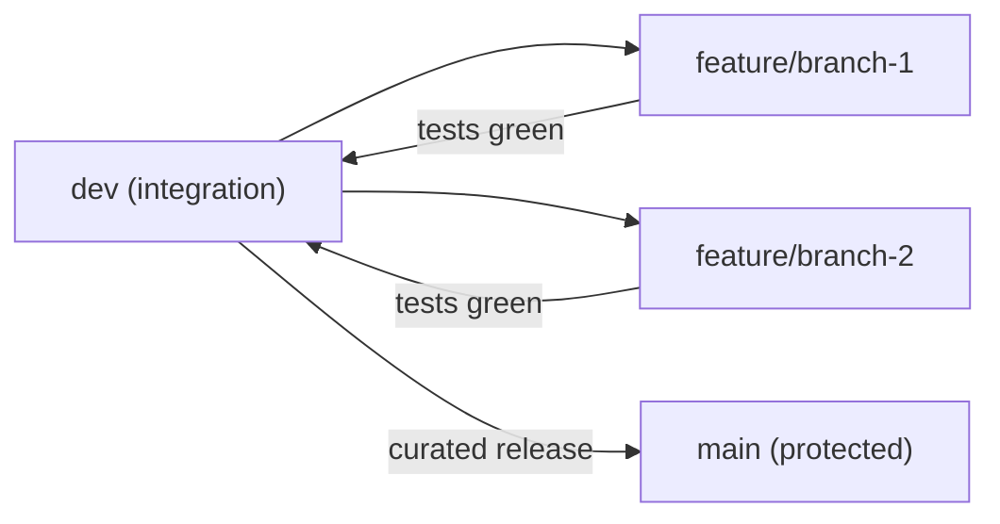

---

## 6. Delivery Hierarchy

```
EPICs → User Stories → Features (PRs) → Feature Branch → Commits → Subtasks
```

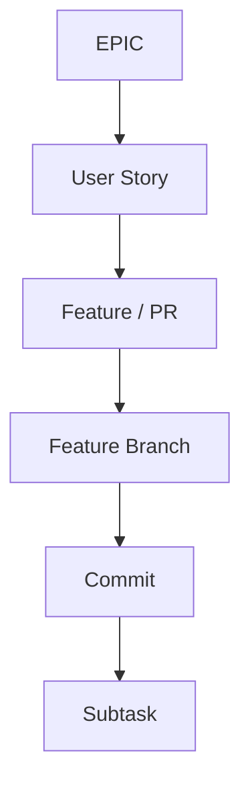

### Checkbox Convention

- **Everything in this PRD is trackable** via checkboxes.
- **Do not check boxes until completed** — implementation + verification + merge to `dev`.

---

<!-- ═══════════════════════════════════════════════════════════════ -->
<!--              ARCHITECTURE REFERENCE (NEW IN V2)                -->
<!-- ═══════════════════════════════════════════════════════════════ -->

## ARCHITECTURE REFERENCE

> The following sections consolidate technical architecture specifications from the Design Document, ADRs, Pre-Search Checklist, and Tradeoffs analysis into a single reference. Each section is linked from the relevant epic for in-context reading.

---

## 7. System Architecture Overview

### High-Level Architecture

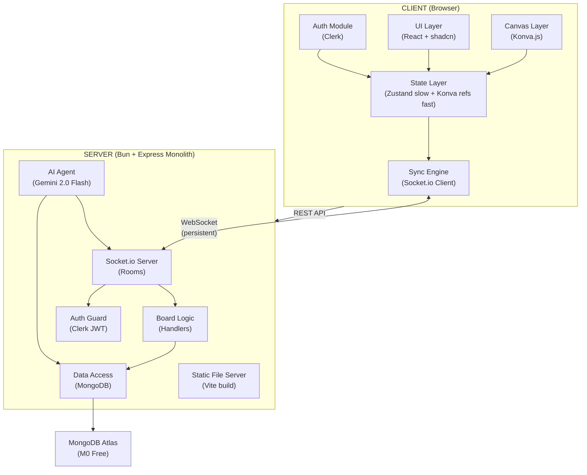

### Communication Patterns

| Pattern | Transport | Latency | Persisted |
| --- | --- | --- | --- |
| Cursor sync | Socket.io emit (no DB) | <50ms | No |
| Object CRUD | Socket.io → MongoDB | <100ms | Yes |
| Board load | REST GET → MongoDB | <500ms | Read-only |
| AI commands | REST POST → Gemini → Socket.io broadcast | <2s | Yes (objects) |
| Presence | Socket.io connect/disconnect | <100ms | No |

### Locked Tech Stack

| Layer | Technology |
| --- | --- |
| Runtime | Bun 1.2+ |
| Language | TypeScript 5.x (strict) |
| Frontend | React 19, Vite 7, Konva.js 10, react-konva 19 |
| Styling | Tailwind CSS v4, shadcn/ui, Lucide icons |
| State | Zustand 5 (slow) + direct Konva refs (fast) |
| Backend | Express 4, Socket.io 4 |
| Database | MongoDB Atlas M0, Mongoose 8 |
| Auth | Clerk (React + Node SDK) |
| AI | Google Gemini 2.0 Flash |
| Validation | Zod 3 |
| Testing | Vitest, Playwright, MSW, mongodb-memory-server |
| Hosting | Render (free web service) |
| API Docs | Swagger/OpenAPI |

---

## 8. Data Model Reference

> **Source:** Design Document §7, ADR-005 (MongoDB)

### Entity-Relationship Diagram

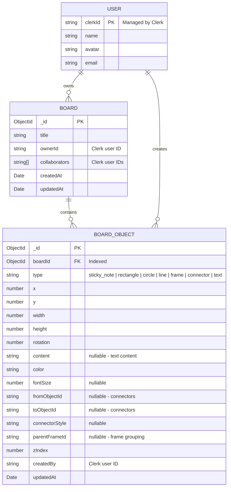

### MongoDB Indexes

| Index | Collection | Purpose |
| --- | --- | --- |
| `boardId` | `objects` | Primary read path: load all objects for a board |
| `ownerId` | `boards` | User's boards listing |
| `collaborators` | `boards` | Shared boards lookup |

### Data Flow Rules

- Cursor positions are **never** persisted to MongoDB — they exist only in Socket.io server memory and client Konva refs.
- Object mutations are persisted to MongoDB via throttled batches (100ms debounce) to reduce write load.
- Board state is loaded from MongoDB as a single query on client connection; subsequent updates come via Socket.io.

---

## 9. Konva Canvas Layer Architecture

> **Source:** Design Document §5, §11; ADR-008 (Konva.js)

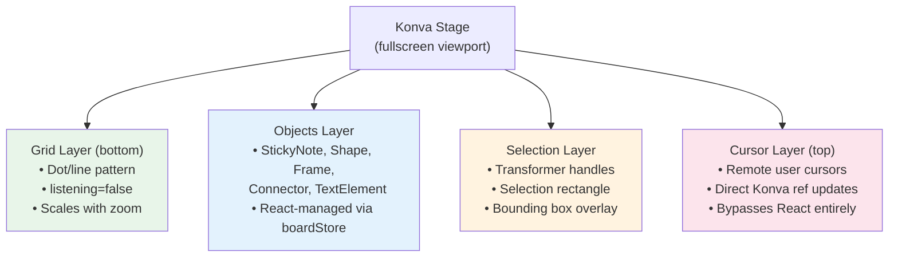

### Layer Responsibilities

| Layer | Update Strategy | React Integration | Performance Notes |
| --- | --- | --- | --- |
| Grid | Re-render on zoom change only | Minimal — `listening={false}` | No hit detection overhead |
| Objects | Zustand `boardStore` subscriptions | Full React reconciliation | Granular selectors prevent excess re-renders |
| Selection | Konva `Transformer` + custom overlay | Hybrid — Transformer is imperative | Handles resize/rotate at 60fps |
| Cursor | Direct `nodeRef.current.position()` | **Zero** React involvement | 60fps cursor rendering, no reconciliation |

---

## 10. Split State Management

> **Source:** Design Document §11.1; ADR-002 (Zustand + Konva refs)

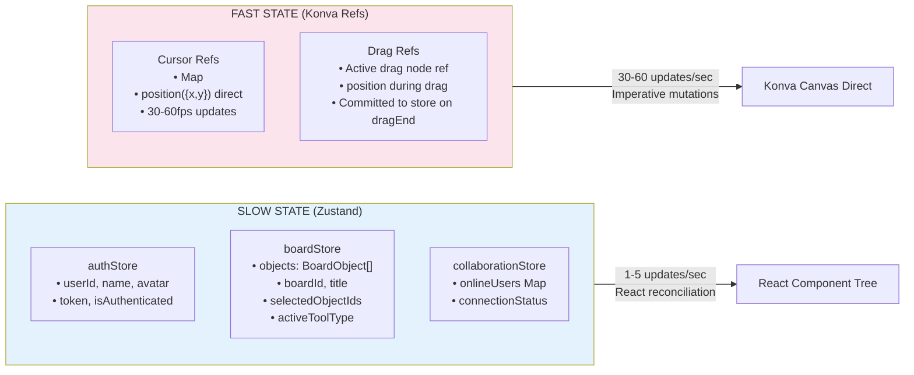

### State Boundary Rules

| State Type | Update Frequency | Storage | React Integration |
| --- | --- | --- | --- |
| Auth, board metadata | Rare (login, board switch) | Zustand `authStore` | Standard React subscriptions |
| Object list | Medium (user actions, ~1-5/sec) | Zustand `boardStore` | Granular Zustand selectors |
| Cursor positions | High (30-60fps per user) | Direct Konva node refs | Bypasses React entirely |
| Active drag position | High (60fps during drag) | Direct Konva node ref | Committed to Zustand on `dragEnd` |

**Convention:** Anything that updates more than ~5 times/second goes through Konva refs, everything else through Zustand.

---

## 11. Authentication & Authorization Flow

> **Source:** Design Document §10; ADR-006 (Clerk)

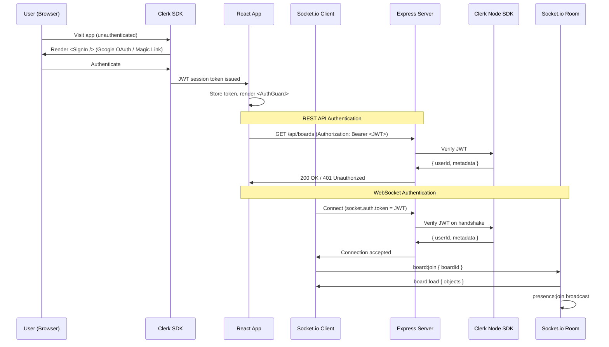

### Authorization Model

| Resource | Permission | Enforcement |
| --- | --- | --- |
| Board | Owner: full access | Application-level check in board routes |
| Board | Collaborator: edit access | `collaborators[]` array contains userId |
| Socket room | Authenticated users only | JWT verified on handshake |
| AI commands | Any authenticated board member | Board membership check before execution |

### JWT Lifecycle

1. Clerk issues JWT on successful authentication (Google OAuth or Magic Link)
2. Client stores token, attaches to REST requests (`Authorization: Bearer <token>`)
3. Client attaches to Socket.io handshake (`socket.auth.token = <token>`)
4. Server verifies JWT on every REST request (Clerk Node middleware)
5. Server verifies JWT once on Socket.io connection (handshake only)
6. Token refresh handled transparently by Clerk SDK

---

## 12. Optimistic UI Pattern

> **Source:** Design Document §8.4; ADR-009 (Optimistic UI)

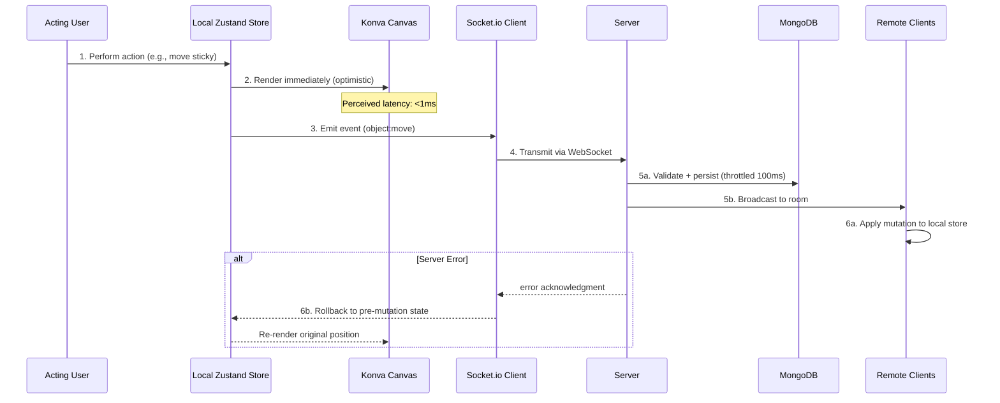

### Optimistic UI Rules

1. **Always render locally first** — never wait for server round-trip
2. **Emit immediately after local render** — Socket.io event sent in parallel
3. **Server validates and persists** — Zod validation, MongoDB write (throttled)
4. **Broadcast to room** — all other clients receive and apply
5. **Rollback on error** — revert Zustand store to pre-mutation snapshot
6. **Last-write-wins** — conflict resolution at the object level (acceptable per project requirements)

---

## 13. Object Lifecycle

> **Source:** Design Document §7, §8; ADR-009 (Optimistic UI)

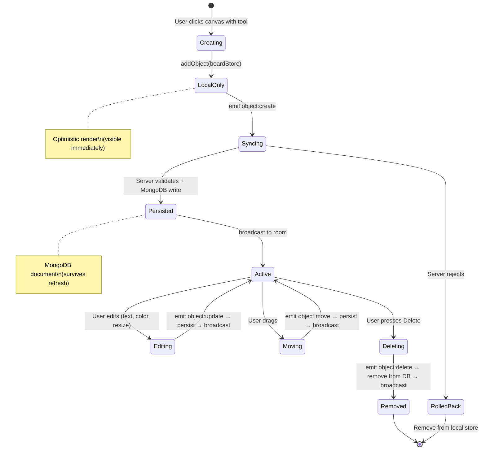

---

## 14. Presence System Flow

> **Source:** Design Document §8.1 (Presence Events)

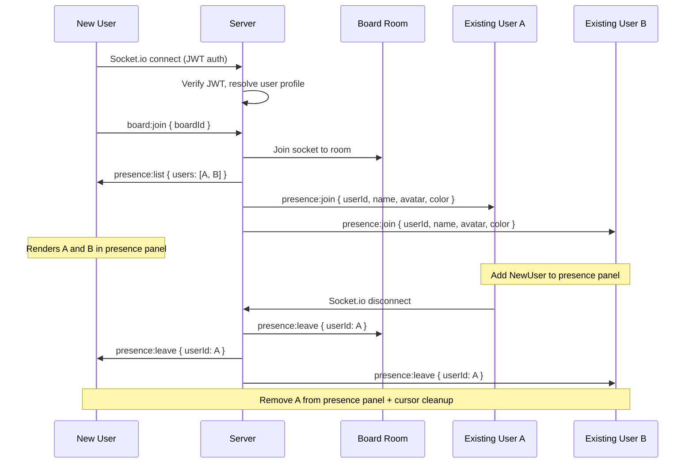

### Presence Data Structure (Server In-Memory)

```typescript
// Per-room tracking in SocketManager
type RoomPresence = Map<string, {  // key: boardId
  users: Map<string, {             // key: userId
    socketId: string;
    name: string;
    avatar: string;
    color: string;                 // Assigned from palette
    joinedAt: Date;
  }>;
}>;
```

---

## 15. Board Load & Reconnection Flow

> **Source:** Design Document §8.2, §8.3

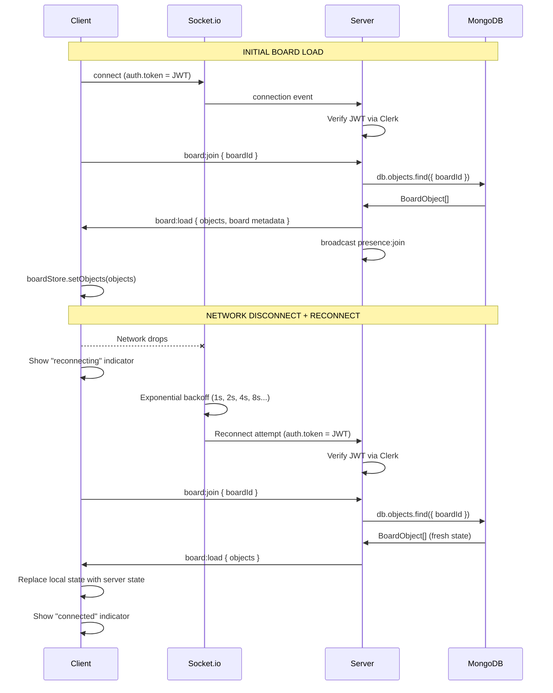

### Reconnection Configuration

| Parameter | Value | Rationale |
| --- | --- | --- |
| `reconnection` | `true` | Always attempt reconnect |
| `reconnectionAttempts` | `Infinity` | Never give up |
| `reconnectionDelay` | `1000ms` | Initial backoff delay |
| `reconnectionDelayMax` | `30000ms` | Cap at 30 seconds |
| `factor` | `2` | Exponential backoff multiplier |

---

## 16. AI Agent Internal Architecture

> **Source:** Design Document §9; ADR-003 (Gemini)

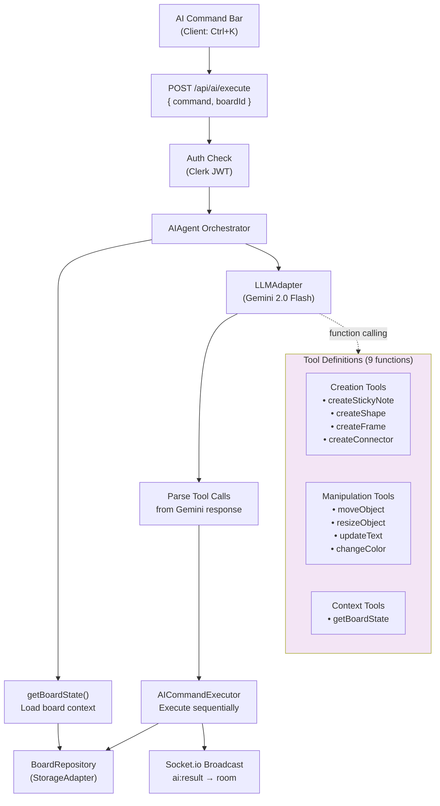

### AI Tool Schema

| Tool | Signature | Category | Description |
| --- | --- | --- | --- |
| `createStickyNote` | `(text, x, y, color)` | Creation | Creates a sticky note at position |
| `createShape` | `(type, x, y, width, height, color)` | Creation | Creates rectangle, circle, or line |
| `createFrame` | `(title, x, y, width, height)` | Creation | Creates a labeled frame container |
| `createConnector` | `(fromId, toId, style)` | Creation | Creates a connector between objects |
| `moveObject` | `(objectId, x, y)` | Manipulation | Moves an object to new position |
| `resizeObject` | `(objectId, width, height)` | Manipulation | Resizes an object |
| `updateText` | `(objectId, newText)` | Manipulation | Updates text content |
| `changeColor` | `(objectId, color)` | Manipulation | Changes object fill color |
| `getBoardState` | `()` | Context | Returns all objects on the board |

### AI Performance Targets

| Metric | Target | Measurement |
| --- | --- | --- |
| Response latency (simple) | <2 seconds | Timestamp diff: command submit → objects rendered |
| Response latency (complex) | <5 seconds | Multi-step templates (SWOT, journey map) |
| Command breadth | 6+ command types | Creation, manipulation, layout, complex templates |
| Reliability | Consistent execution | Mocked tests for known commands pass deterministically |

---

## 17. Module Dependency Graph

> **Source:** Design Document §6

### Client Module Dependencies

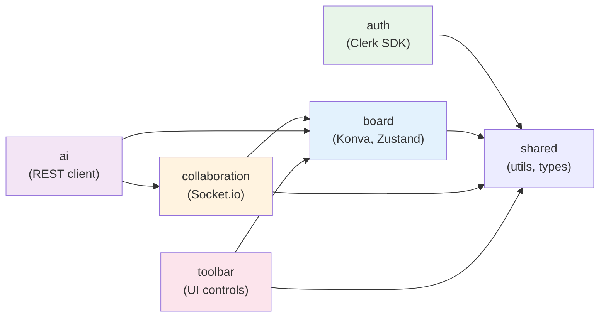

### Server Module Dependencies

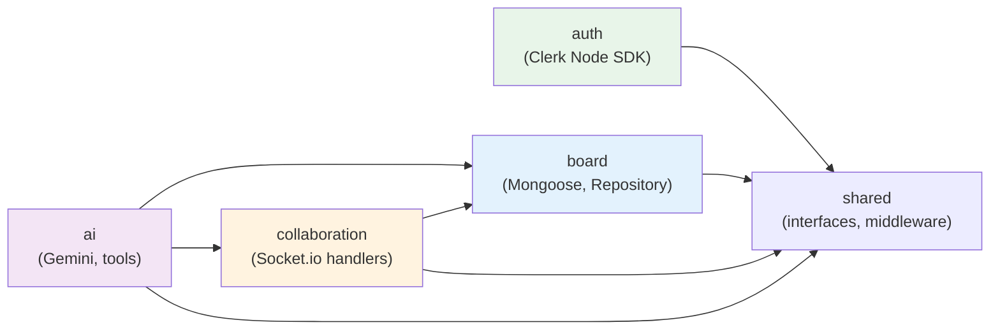

---

## 18. Monorepo Workspace Structure

> **Source:** Design Document §6.1; ADR-007 (Bun)

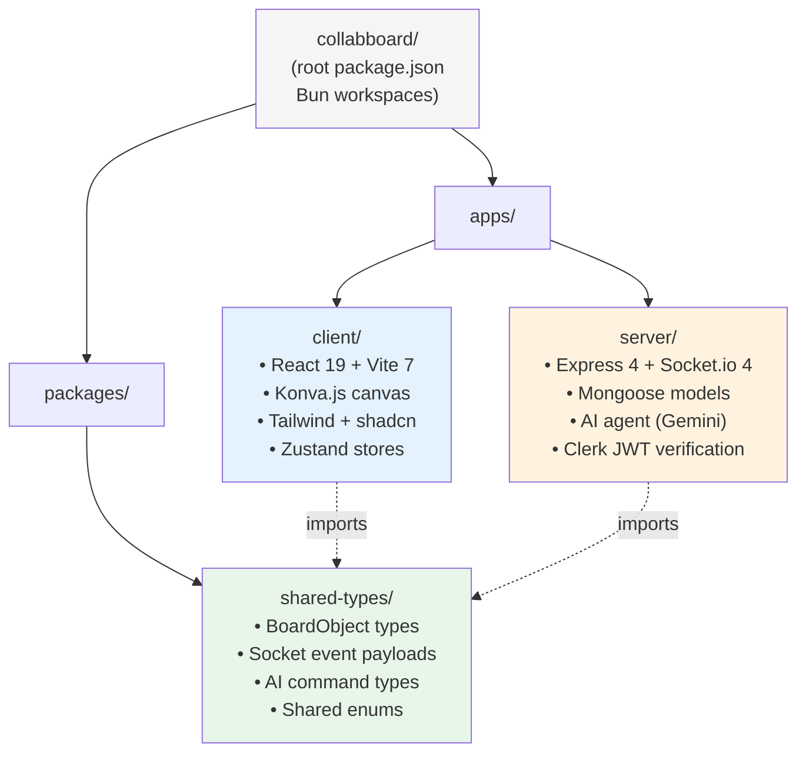

### Workspace Configuration

```json
{
  "workspaces": ["apps/*", "packages/*"]
}
```

| Workspace | Entry Point | Key Dependencies |
| --- | --- | --- |
| `apps/client` | `src/main.tsx` | react, react-konva, zustand, @clerk/clerk-react, socket.io-client |
| `apps/server` | `src/server.ts` | express, socket.io, mongoose, @clerk/clerk-sdk-node, @google/generative-ai |
| `packages/shared-types` | `src/index.ts` | (no runtime deps — types only) |

---

## 19. Testing Strategy

> **Source:** Design Document §12; ADR-011 (Vitest + Playwright)

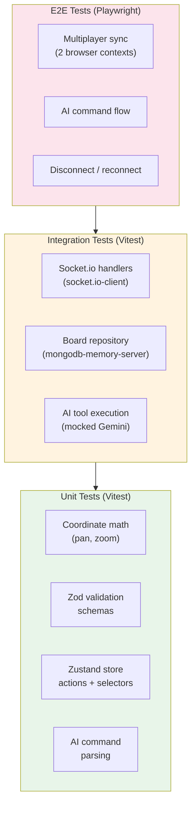

### Testing Tools & Targets

| Level | Tool | Target | Coverage Goal |
| --- | --- | --- | --- |
| Unit | Vitest | Utility functions, coordinate math, AI command parsing, Zod schemas | 80% of utils |
| Integration | Vitest + socket.io-client + mongodb-memory-server | Socket handlers, board repository, AI tool execution | 60% of handlers |
| E2E | Playwright (multi-context) | Multiplayer sync, presence, AI commands, disconnect/reconnect | Critical paths |

### Key Test Scenarios (from Project Requirements)

1. 2 users editing simultaneously in different browsers
2. One user refreshing mid-edit (state persistence check)
3. Rapid creation and movement of sticky notes and shapes (sync performance)
4. Network throttling and disconnection recovery
5. 5+ concurrent users without degradation

### Mocking Strategy

| Dependency | Mock Approach |
| --- | --- |
| Clerk auth | MSW intercepts Clerk API calls, returns mock JWTs |
| Gemini AI | Mocked responses for deterministic AI handler testing |
| MongoDB | `mongodb-memory-server` for integration tests (real queries, in-memory DB) |
| Socket.io | `socket.io-client` connects to test server instance |

---

## 20. Deployment Architecture

> **Source:** Design Document §13; ADR-004 (Monolith), ADR-010 (Render)

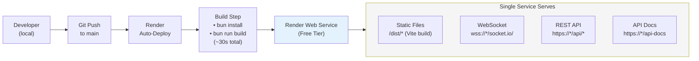

### Environment Variables

| Variable | Purpose | Source |
| --- | --- | --- |
| `CLERK_PUBLISHABLE_KEY` | Clerk frontend auth | Clerk dashboard |
| `CLERK_SECRET_KEY` | Clerk backend JWT verification | Clerk dashboard |
| `MONGODB_URI` | MongoDB Atlas connection string | Atlas dashboard |
| `GEMINI_API_KEY` | Google Gemini API access | Google AI Studio |
| `PORT` | Server listening port | Render (default: 3000) |
| `NODE_ENV` | Environment mode | Render (production) |

### Scaling Path

| Trigger | Action | Cost |
| --- | --- | --- |
| Free tier sleep annoyance | Upgrade to Render Standard | $7/month |
| >1,000 concurrent sockets | Add Socket.io Redis adapter + second instance | $14/month + Redis |
| >512MB data | Upgrade to MongoDB M10 | $60/month |
| >10k MAU | Upgrade to Clerk Pro | $25/month |

---

## 21. Risk Register

> **Source:** Design Document §15; Tradeoffs Document

| # | Risk | Likelihood | Impact | Severity | Mitigation |
| --- | --- | --- | --- | --- | --- |
| R1 | Bun compatibility issue with a dependency | Low | Medium | Moderate | Fall back to Node.js; Express/Socket.io are verified on Bun |
| R2 | Render free tier sleep during demos | Medium | Medium | Moderate | Uptime ping service; upgrade to Standard ($7/month) if needed |
| R3 | Gemini rate limits hit during testing | Low | Low | Low | Implement backoff queue; rate limits are 1,500 req/min |
| R4 | MongoDB M0 512MB fills during development | Low | Low | Low | Reset test data; production boards are small (<1MB per board) |
| R5 | Socket.io connection storm on demo day | Medium | Medium | Moderate | Test with 5+ concurrent users before demo; Render handles ~1,000 connections |
| R6 | Konva performance with 500+ objects | Low | Medium | Moderate | Verified: Konva handles 10,000+ nodes; use layer separation |
| R7 | Clerk outage during demo | Very Low | High | Moderate | Accept risk; no self-hosted auth alternative in 24h |
| R8 | AI agent produces incorrect layouts | Medium | Low | Low | Mocked tests for known commands; fallback to manual creation |

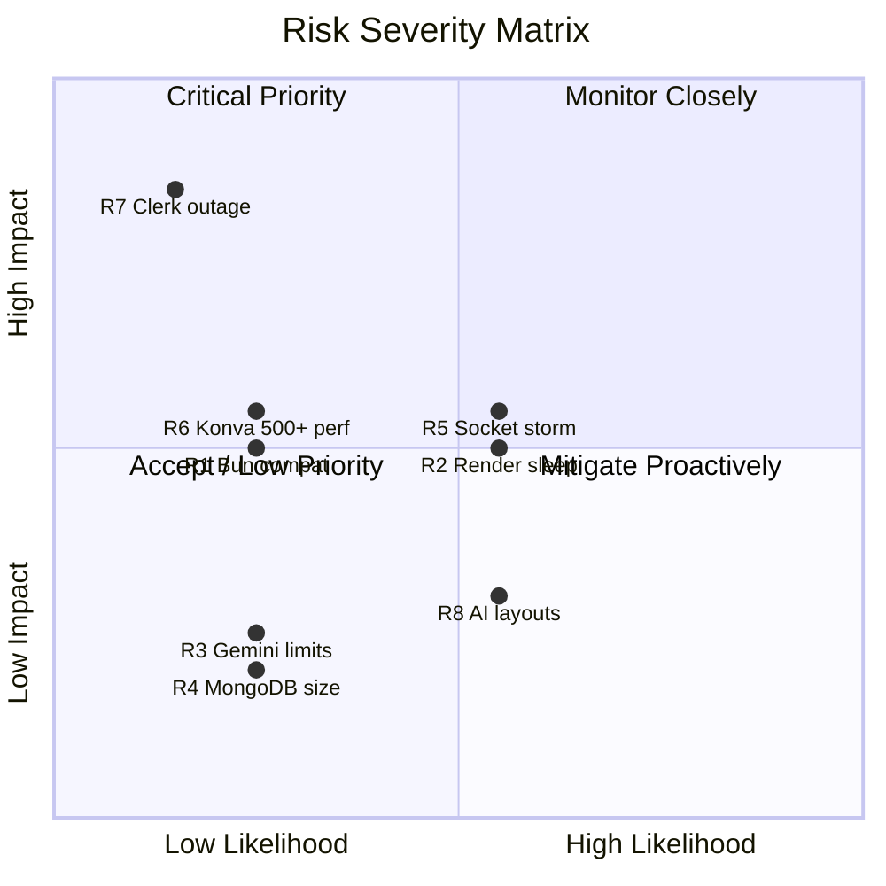

---

## 22. ADR Summary Index

> **Source:** `docs/research/4-RECORD-ARCHITECTURE-DECISIONS.md`

| ADR | Decision | Impacted Epics | Key Consequence |
| --- | --- | --- | --- |
| ADR-001 | Socket.io for real-time transport | E6, E7, E8, E10, E11 | We own WebSocket server; Redis adapter for horizontal scaling |
| ADR-002 | Zustand + Konva refs for split state | E4, E5, E6, E7 | Two mental models (declarative + imperative); documented boundary |
| ADR-003 | Gemini 2.0 Flash for AI agent | E10, E11 | ~90% cost reduction vs GPT-4; 1M token context; monitor rate limits |
| ADR-004 | Express monolith architecture | E2, E9 | Single deploy target; vertical scaling first; Socket.io + API + static in one process |
| ADR-005 | MongoDB Atlas for persistence | E2, E7, E8 | Schemaless flexibility; no migrations; Zod enforces schema discipline |
| ADR-006 | Clerk for authentication | E3 | Pre-built React components save 4-6h; vendor dependency with JWT swap path |
| ADR-007 | Bun as runtime | E2 | ~30% faster cold starts; native TypeScript; smaller ecosystem risk |
| ADR-008 | Konva.js for canvas rendering | E4, E5, E12 | Stage/Layer architecture; 10k+ node capacity; 2D canvas (no WebGL) |
| ADR-009 | Optimistic UI with reconciliation | E5, E7 | <1ms perceived latency; rollback on error; last-write-wins |
| ADR-010 | Render for hosting | E2, E9 | Free tier with WebSocket support; 15-min sleep on free tier |
| ADR-011 | Vitest + Playwright for testing | E9, E13 | Vite-native speed; multi-context E2E; 60% coverage target |
| ADR-012 | Tailwind v4 + shadcn/ui for styling | E1, E4, E5 | Utility-first speed; copy-paste components; owned and modifiable |

---

## 23. Cost Analysis

> **Source:** Pre-Search Checklist §AI Cost Analysis

### Development & Testing Costs

| Item | Model/Service | Estimated Usage | Estimated Cost |
| --- | --- | --- | --- |
| AI Development | Gemini 2.0 Flash | ~500 calls, ~800 tokens/call | ~$0.50 |
| AI Coding Tools | Cursor + Claude Code | IDE + CLI sessions | (covered by subscription) |
| Infrastructure | Render + MongoDB M0 + Clerk | Free tiers | $0 |
| **Total Development** | | | **~$0.50** |

### Production Scaling Projections

**Assumptions:** 20 AI commands per user session, 800 tokens per command, 10 sessions per user per month.

| Users | Monthly AI Cost | Monthly Infra Cost | Total Monthly |
| --- | --- | --- | --- |
| **100** | $1.50 | $0 (all free tiers) | **$1.50** |
| **1,000** | $15 | $0 (all free tiers) | **$15** |
| **10,000** | $150 | $85 (Render $7 + MongoDB M10 $60 + Clerk $25) | **$235** |
| **100,000** | $1,500 | $400 (Render Pro $25 + MongoDB M30 $300 + Clerk $75) | **$1,900** |

---

## 24. Performance Budget

> **Source:** Pre-Search Checklist §Performance Targets; Design Document §11

### Consolidated Performance Targets

| Metric | Target | How Achieved | How Measured |
| --- | --- | --- | --- |
| Frame rate | 60 FPS during pan, zoom, manipulation | Konva canvas bypasses React; `requestAnimationFrame` | Chrome DevTools Performance panel |
| Object sync latency | <100ms | Socket.io broadcast (~10-30ms) + optimistic local render | Timestamp comparison: emit → remote render |
| Cursor sync latency | <50ms | Direct Socket.io emit (no DB); Konva ref updates (no React) | Timestamp comparison: emit → remote render |
| Object capacity | 500+ objects | Konva handles 10k+ nodes; MongoDB indexes on `boardId` | Create 500 objects; measure frame rate |
| Concurrent users | 5+ without degradation | Socket.io room isolation; Render ~1k connection capacity | Playwright multi-context load test |
| Board load time | <500ms for 500 objects | Single MongoDB query by `boardId` index | Timestamp: connect → board:load rendered |
| AI response (simple) | <2 seconds | Gemini Flash sub-second; synchronous REST | Timestamp: submit → objects rendered |
| AI response (complex) | <5 seconds | Multi-step tool execution; sequential persistence | Timestamp: submit → all objects rendered |

### Network Optimization

- Cursor emit throttled to 30fps (33ms interval) — balances smoothness with bandwidth
- Object mutations debounced for MongoDB persistence (100ms batch window)
- Board state loaded once on connection; incremental updates via Socket.io
- No polling — all updates are push-based via persistent WebSocket

---

<!-- ═══════════════════════════════════════════════════════════════ -->
<!--                    EPIC ROADMAP                                -->
<!-- ═══════════════════════════════════════════════════════════════ -->

## EPIC ROADMAP

---

## 25. MVP Boundary Visualization

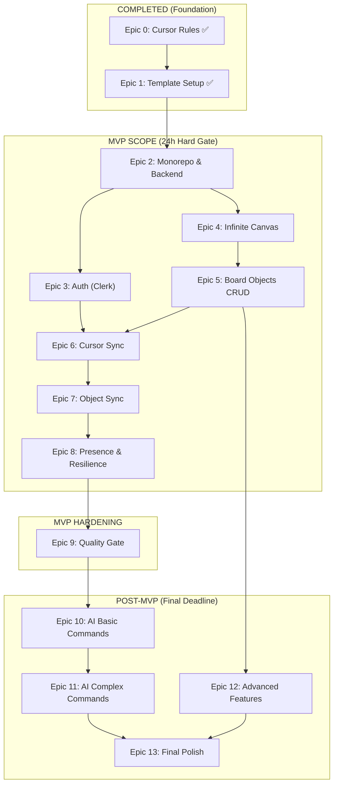

---

## 26. Epic Dependency Graph

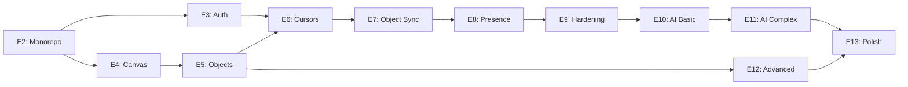

---

<!-- ═══════════════════════════════════════════════════════════════ -->
<!--                 COMPLETED EPICS                                -->
<!-- ═══════════════════════════════════════════════════════════════ -->

## COMPLETED EPICS

---

## 27. COMPLETED: Epic 0 — Engineering Governance & Cursor Rules ✅

> **Details:** See `PRD.md` (root) for full breakdown. All 3 features (F0.1–F0.3) merged to `dev`.

- [x] F0.1: Tech stack and quality Cursor rules
- [x] F0.2: Git workflow Cursor rules
- [x] F0.3: Context7 MCP requirement

---

## 28. COMPLETED: Epic 1 — React Template Stack Setup ✅

> **Details:** See `PRD.md` (root) for full breakdown. All 7 features (F1.1–F1.7) merged to `dev`.

- [x] F1.1: Bun runtime and package manager (US-1)
- [x] F1.2: Vite build and dev server (US-2)
- [x] F1.3: TypeScript project configuration (US-3)
- [x] F1.4: React app shell (US-4)
- [x] F1.5: Tailwind CSS v4 styling (US-5)
- [x] F1.6: ShadCN component library (US-6)
- [x] F1.7: Vitest and React Testing Library (US-7)

---

<!-- ═══════════════════════════════════════════════════ -->
<!--              MVP SCOPE (24h Hard Gate)              -->
<!-- ═══════════════════════════════════════════════════ -->

## MVP SCOPE

> Everything below through Epic 8 must be functional at the 24-hour mark.

---

## 29. Epic 2: Monorepo Restructure & Backend Foundation

### Epic Goal

Transform the single-app React template into a Bun monorepo with `apps/client` (React + Vite), `apps/server` (Express + Socket.io), and `packages/shared-types`. Establish MongoDB connection and deploy the skeleton to Render.

### Technical Architecture Context

> **ADR References:**
>
> - **ADR-004 (Express Monolith):** Single deploy target — Express serves static files, Socket.io, and REST API from one process. No CORS between services, no service discovery, no deployment coordination. Scaling is vertical first; Redis adapter added only when concurrent users exceed ~1,000.
> - **ADR-005 (MongoDB Atlas):** Document model fits schemaless board objects with divergent fields per type. No migrations during rapid iteration. M0 free tier (512MB) sufficient for MVP. Schema discipline enforced at the application layer via Zod, not the database.
> - **ADR-007 (Bun as Runtime):** Native TypeScript execution without `ts-node` or build step. ~30% faster cold starts on Render. Single lockfile (`bun.lockb`), faster installs. Express, Socket.io, and MongoDB driver are verified compatible.
>
> **Key Design Decisions:**
>
> - Bun workspaces (`apps/*`, `packages/*`) provide monorepo without Turborepo/Nx overhead.
> - `packages/shared-types` is the sole abstraction boundary between client and server — both import from it, neither imports from each other.
> - Express middleware stack is ordered: CORS → JSON body parser → Auth Guard → Route Handler → Error Handler. This convention is established here and extended in every subsequent epic.
> - MongoDB connection is initialized once at server startup with Mongoose, using environment variable `MONGODB_URI`. Connection errors trigger graceful retry with backoff, not process exit.

### Per-Epic Architecture Diagram

```mermaid
flowchart TB
    subgraph Before["BEFORE: Single App (Epic 1 output)"]
        SrcDir["src/\n• App.tsx\n• components/\n• lib/"]
        IndexHTML["index.html"]
        ViteConfig["vite.config.ts"]
    end

    subgraph After["AFTER: Bun Monorepo (Epic 2 output)"]
        subgraph AppsClient["apps/client/"]
            ClientSrc["src/\n• App.tsx\n• components/\n• lib/"]
            ClientIndex["index.html"]
            ClientVite["vite.config.ts"]
        end

        subgraph AppsServer["apps/server/"]
            ServerSrc["src/\n• server.ts\n• app.ts\n• routes/\n• modules/"]
            subgraph Middleware["Express Middleware Stack"]
                CORS["CORS"]
                JSON["JSON Body Parser"]
                AuthGuard["Auth Guard\n(Epic 3)"]
                RouteHandler["Route Handler"]
                ErrorHandler["Error Handler"]
                CORS --> JSON
                JSON --> AuthGuard
                AuthGuard --> RouteHandler
                RouteHandler --> ErrorHandler
            end
        end

        subgraph SharedTypes["packages/shared-types/"]
            Types["src/\n• board-object.types.ts\n• socket-events.types.ts\n• ai-command.types.ts\n• index.ts"]
        end

        AppsClient -.->|"imports"| SharedTypes
        AppsServer -.->|"imports"| SharedTypes
    end

    Before -->|"Epic 2\nMigration"| After

    style Before fill:#fce4ec
    style After fill:#e8f5e9
    style Middleware fill:#fff3e0
```

### User Stories Covered

- **US-1.1:** Initialize Bun monorepo with client/server workspaces
- **US-1.2:** Deploy skeleton monolith to Render

### Definition of Done (Epic 2)

- [ ] Epic 2 complete (all features below merged to `dev`)

### Feature Map

| Feature | User Story | Branch | Summary |
| --- | --- | --- | --- |
| F2.1 | US-1.1 | `feature/monorepo-workspace-setup` | Bun workspaces with client + server + shared-types |
| F2.2 | US-1.1 | `feature/express-server-skeleton` | Express app with health check and static serving |
| F2.3 | US-1.1 | `feature/mongodb-connection-and-models` | MongoDB Atlas connection, Mongoose schemas |
| F2.4 | US-1.1 | `feature/shared-types-package` | BoardObject, socket event, AI command types |
| F2.5 | US-1.2 | `feature/render-deployment-pipeline` | Render deploy with build script and env vars |

---

### Feature F2.1: Bun Monorepo Workspace Setup

- **PR:** `Infra: Bun monorepo with client/server workspaces`
- **Branch:** `feature/monorepo-workspace-setup`
- **SOLID:** SRP — separate workspaces per concern; DIP — shared-types as abstraction boundary
- [ ] Feature F2.1 complete (merged to `dev`)

#### Acceptance Criteria

- [ ] `bun install` succeeds at root
- [ ] `apps/client/` contains the existing React + Vite app (migrated from `src/`)
- [ ] `apps/server/` contains a new Express project stub
- [ ] `packages/shared-types/` is importable from both client and server
- [ ] Root `package.json` defines Bun workspaces
- [ ] TypeScript strict mode enabled across all workspaces

#### Implementation Checklist

- [ ] Branch created from `dev`

##### Commit 1: Create workspace structure and root config

- [ ] `chore(infra): create bun monorepo workspace structure`
- [ ] Subtasks:
  - [ ] Create `apps/client/`, `apps/server/`, `packages/shared-types/` directories
  - [ ] Add root `package.json` with `workspaces: ["apps/*", "packages/*"]`
  - [ ] Add root `tsconfig.json` with project references
  - [ ] Configure root ESLint flat config extending to workspaces

##### Commit 2: Migrate existing app to apps/client

- [ ] `refactor(client): migrate react app to apps/client workspace`
- [ ] Subtasks:
  - [ ] Move `src/`, `index.html`, `vite.config.ts`, `tsconfig.json` to `apps/client/`
  - [ ] Update import paths and `@` alias to work from new location
  - [ ] Add `apps/client/package.json` with client-specific deps
  - [ ] Verify `bun run dev` still works from `apps/client/`

##### Commit 3: Scaffold apps/server workspace

- [ ] `chore(server): scaffold express server workspace`
- [ ] Subtasks:
  - [ ] Create `apps/server/package.json` with Express, Socket.io, Mongoose, Zod deps
  - [ ] Create `apps/server/tsconfig.json` extending root
  - [ ] Create `apps/server/src/server.ts` (entry point stub)
  - [ ] Create `apps/server/src/app.ts` (Express app setup)

##### Commit 4: Verify monorepo and merge

- [ ] `test(infra): verify monorepo setup and merge`
- [ ] Subtasks:
  - [ ] Run `bun install` at root (succeeds)
  - [ ] Run `bun run typecheck` across workspaces
  - [ ] Run `bun run test:run` in client workspace
  - [ ] Merge feature branch into `dev`

---

### Feature F2.2: Express Server Skeleton

- **PR:** `Backend: Express server with health check and static serving`
- **Branch:** `feature/express-server-skeleton`
- **SOLID:** SRP — server entry separate from app config separate from route definitions
- [ ] Feature F2.2 complete (merged to `dev`)

#### Acceptance Criteria

- [ ] `bun run dev` in server starts Express on configurable port
- [ ] `GET /api/health` returns `{ status: "ok" }`
- [ ] Express serves static files from client build output
- [ ] Socket.io server initializes and accepts connections
- [ ] CORS configured for development

#### Implementation Checklist

- [ ] Branch created from `dev`

##### Commit 1: Express app and health endpoint

- [ ] `feat(server): add express app with health endpoint`
- [ ] Subtasks:
  - [ ] Create `apps/server/src/app.ts` with Express middleware (json, cors, static)
  - [ ] Create `apps/server/src/routes/health.routes.ts` with `/api/health`
  - [ ] Add Zod validation middleware pattern

##### Commit 2: Socket.io server initialization

- [ ] `feat(server): initialize socket.io server`
- [ ] Subtasks:
  - [ ] Create `apps/server/src/server.ts` with HTTP + Socket.io setup
  - [ ] Configure Socket.io with CORS for development
  - [ ] Add connection logging (removable before merge)
  - [ ] Add `dev` script to `apps/server/package.json`

##### Commit 3: Static file serving and concurrent dev

- [ ] `chore(server): add static serving and concurrent dev scripts`
- [ ] Subtasks:
  - [ ] Configure Express to serve `apps/client/dist/` in production
  - [ ] Add root `dev` script that runs client + server concurrently
  - [ ] Add root `build` script that builds client then starts server

##### Commit 4: Verify server and merge

- [ ] `test(server): verify server starts and merge`
- [ ] Subtasks:
  - [ ] Verify health endpoint returns 200
  - [ ] Verify Socket.io accepts a test connection
  - [ ] Run `bun run typecheck` (green)
  - [ ] Merge feature branch into `dev`

---

### Feature F2.3: MongoDB Connection & Models

- **PR:** `Data: MongoDB Atlas connection and Mongoose models`
- **Branch:** `feature/mongodb-connection-and-models`
- **SOLID:** DIP — `StorageAdapter` interface with MongoDB implementation; SRP — models separate from repository
- [ ] Feature F2.3 complete (merged to `dev`)

#### Acceptance Criteria

- [ ] Mongoose connects to MongoDB Atlas (URI from env var)
- [ ] `Board` and `BoardObject` Mongoose schemas defined
- [ ] `BoardRepository` implements `StorageAdapter` interface
- [ ] Indexes on `objects.boardId`, `boards.ownerId`, `boards.collaborators`
- [ ] Connection error handling with graceful retry

#### Implementation Checklist

- [ ] Branch created from `dev`

##### Commit 1: StorageAdapter interface and MongoDB connection

- [ ] `feat(data): add storage adapter interface and mongodb connection`
- [ ] Subtasks:
  - [ ] Create `apps/server/src/shared/interfaces/storage-adapter.ts`
  - [ ] Create `apps/server/src/modules/board/db.ts` with Mongoose connection logic
  - [ ] Add `MONGODB_URI` to `.env.example`
  - [ ] Add dotenv or equivalent env loading

##### Commit 2: Board and BoardObject Mongoose models

- [ ] `feat(data): add board and board-object mongoose models`
- [ ] Subtasks:
  - [ ] Create `apps/server/src/modules/board/board.model.ts` (Board schema)
  - [ ] Create `apps/server/src/modules/board/object.model.ts` (BoardObject schema with discriminated `type`)
  - [ ] Add indexes: `boardId` on objects, `ownerId` and `collaborators` on boards
  - [ ] Add Zod schemas for input validation

##### Commit 3: BoardRepository implementation

- [ ] `feat(data): implement board repository with storage adapter`
- [ ] Subtasks:
  - [ ] Create `apps/server/src/modules/board/board.repo.ts` implementing `StorageAdapter`
  - [ ] Methods: `findObjectsByBoard`, `createObject`, `updateObject`, `deleteObject`
  - [ ] Add board CRUD methods: `createBoard`, `findBoardById`, `findBoardsByUser`

##### Commit 4: Verify connection and merge

- [ ] `test(data): verify mongodb connection and merge`
- [ ] Subtasks:
  - [ ] Add a startup log confirming MongoDB connection
  - [ ] Run `bun run typecheck` (green)
  - [ ] Merge feature branch into `dev`

---

### Feature F2.4: Shared Types Package

- **PR:** `Types: shared-types package for client/server`
- **Branch:** `feature/shared-types-package`
- **SOLID:** ISP — separate type files per domain; LSP — `BoardObject` base with subtypes
- [ ] Feature F2.4 complete (merged to `dev`)

#### Acceptance Criteria

- [ ] `packages/shared-types/` exports all shared interfaces
- [ ] `BoardObject` interface with discriminated union for object types
- [ ] Socket event payload types for all event categories
- [ ] AI command types for tool definitions
- [ ] Importable from both client and server via workspace reference

#### Implementation Checklist

- [ ] Branch created from `dev`

##### Commit 1: BoardObject types and discriminated unions

- [ ] `feat(types): add board object types with discriminated unions`
- [ ] Subtasks:
  - [ ] Create `packages/shared-types/src/board-object.types.ts`
  - [ ] Define `BoardObject` base interface (id, boardId, type, x, y, width, height, etc.)
  - [ ] Define subtypes: `StickyNote`, `RectangleShape`, `CircleShape`, `LineShape`, `Frame`, `Connector`, `TextElement`
  - [ ] Define `ObjectType` enum/union

##### Commit 2: Socket event and AI command types

- [ ] `feat(types): add socket event and ai command types`
- [ ] Subtasks:
  - [ ] Create `packages/shared-types/src/socket-events.types.ts` (cursor, object, presence, AI event payloads)
  - [ ] Create `packages/shared-types/src/ai-command.types.ts` (tool definitions, tool call results)
  - [ ] Create `packages/shared-types/src/index.ts` barrel export

##### Commit 3: Verify imports and merge

- [ ] `test(types): verify cross-workspace imports and merge`
- [ ] Subtasks:
  - [ ] Import shared types in a client file (verify builds)
  - [ ] Import shared types in a server file (verify builds)
  - [ ] Run `bun run typecheck` (green)
  - [ ] Merge feature branch into `dev`

---

### Feature F2.5: Render Deployment Pipeline

- **PR:** `Deploy: Render deployment with build scripts`
- **Branch:** `feature/render-deployment-pipeline`
- [ ] Feature F2.5 complete (merged to `dev`)

#### Acceptance Criteria

- [ ] Git push to `main` triggers auto-deploy on Render
- [ ] Build completes in under 60 seconds
- [ ] Static files served from Express at root URL
- [ ] Health check endpoint accessible at production URL
- [ ] Environment variables configured (MONGODB_URI, CLERK keys, PORT)

#### Implementation Checklist

- [ ] Branch created from `dev`

##### Commit 1: Production build scripts

- [ ] `chore(deploy): add production build scripts`
- [ ] Subtasks:
  - [ ] Add root `build` script: builds client (Vite) then compiles server
  - [ ] Add root `start` script: runs compiled server with static serving
  - [ ] Add `render.yaml` or configure Render dashboard settings
  - [ ] Create `.env.example` with all required env vars

##### Commit 2: Environment and deploy config

- [ ] `chore(deploy): configure render environment`
- [ ] Subtasks:
  - [ ] Document Render environment variable setup
  - [ ] Add `NODE_ENV=production` handling in server
  - [ ] Verify CORS restricts to production domain in production mode

##### Commit 3: Verify deployment and merge

- [ ] `test(deploy): verify deployment pipeline and merge`
- [ ] Subtasks:
  - [ ] Run `bun run build` locally (succeeds)
  - [ ] Run `bun run start` locally (server starts, serves static files)
  - [ ] Verify `/api/health` returns 200
  - [ ] Merge feature branch into `dev`

---

## 30. Epic 3: Authentication & Authorization

### Epic Goal

Integrate Clerk for user authentication with Google OAuth and magic links. Secure Socket.io connections with JWT verification on handshake. Protect all routes and board access.

### Technical Architecture Context

> **ADR References:**
>
> - **ADR-006 (Clerk for Authentication):** Pre-built React components (`<SignIn />`, `<UserButton />`, `<SignedIn />`) save 4-6 hours of UI development. Magic links + Google OAuth provide passwordless UX. JWT tokens verified on Socket.io `connection` event. 10,000 MAU free tier sufficient for development and launch. Vendor dependency mitigated by standard JWT/OAuth protocols — migration path to Lucia (self-hosted) documented.
>
> **Key Design Decisions:**
>
> - **Client-side:** `<ClerkProvider>` wraps the entire React tree in `main.tsx`. `<AuthGuard>` component gates board access, rendering `<SignIn />` for unauthenticated visitors. Zustand `authStore` caches user info (userId, name, avatar) and the current JWT for Socket.io handshake.
> - **Server-side:** Two separate auth verification paths — Express middleware (`auth.middleware.ts`) for REST routes, and Socket.io middleware (`socket-auth.ts`) for WebSocket handshake. Both use Clerk Node SDK's JWT verification but are implemented as distinct middleware to respect SRP.
> - **JWT Lifecycle:** Clerk issues JWT on login. Client attaches to REST requests via `Authorization: Bearer <token>` header. Client attaches to Socket.io via `socket.auth.token`. Server verifies once per REST request and once per Socket.io connection (not per message). Token refresh handled transparently by Clerk SDK.

### Per-Epic Architecture Diagram

```mermaid
flowchart TB
    subgraph ClientComponents["CLIENT (React)"]
        ClerkProvider["ClerkProvider\n(wraps app in main.tsx)"]
        SignIn["SignIn Component\n(Google OAuth + Magic Link)"]
        UserButton["UserButton\n(avatar, name, sign-out)"]
        AuthGuardComp["AuthGuard\n(gates board access)"]
        AuthStore["Zustand authStore\n(userId, name, avatar, token)"]
        SocketClient["Socket.io Client\n(socket.auth.token = JWT)"]

        ClerkProvider --> SignIn
        ClerkProvider --> UserButton
        ClerkProvider --> AuthGuardComp
        AuthGuardComp --> AuthStore
        AuthStore --> SocketClient
    end

    subgraph ServerComponents["SERVER (Express + Socket.io)"]
        ClerkVerify["clerk-verify.ts\n(JWT verification function)"]
        AuthMiddleware["auth.middleware.ts\n(Express REST middleware)"]
        SocketAuth["socket-auth.ts\n(Socket.io handshake middleware)"]
        HealthRoute["/api/health\n(no auth required)"]
        ProtectedRoutes["/api/*\n(auth required)"]
        SocketRooms["Socket.io Rooms\n(authenticated connections only)"]

        ClerkVerify --> AuthMiddleware
        ClerkVerify --> SocketAuth
        AuthMiddleware --> ProtectedRoutes
        AuthMiddleware -.->|"skips"| HealthRoute
        SocketAuth --> SocketRooms
    end

    subgraph JWTFlow["JWT Flow"]
        direction LR
        Issue["1. Clerk issues JWT\n(on login)"]
        AttachREST["2. Attach to REST\n(Authorization header)"]
        AttachWS["3. Attach to Socket.io\n(socket.auth.token)"]
        VerifyREST["4. Verify per REST request\n(Clerk Node SDK)"]
        VerifyWS["5. Verify on WS connect\n(handshake only)"]
        Refresh["6. Clerk SDK\ntransparent refresh"]

        Issue --> AttachREST
        Issue --> AttachWS
        AttachREST --> VerifyREST
        AttachWS --> VerifyWS
        VerifyREST --> Refresh
        VerifyWS --> Refresh
    end

    SocketClient -->|"JWT in handshake"| SocketAuth
    AuthGuardComp -->|"JWT in header"| AuthMiddleware

    style ClientComponents fill:#e3f2fd
    style ServerComponents fill:#fff3e0
    style JWTFlow fill:#e8f5e9
```

### User Stories Covered

- **US-1.3:** Sign in with Google OAuth or magic link
- **US-1.4:** Socket.io connections authenticated via Clerk JWT

### Definition of Done (Epic 3)

- [ ] Epic 3 complete (all features below merged to `dev`)

### Feature Map

| Feature | User Story | Branch | Summary |
| --- | --- | --- | --- |
| F3.1 | US-1.3 | `feature/clerk-react-integration` | Clerk SignIn, UserButton, auth state |
| F3.2 | US-1.4 | `feature/clerk-server-jwt-middleware` | Clerk Node SDK JWT verification |
| F3.3 | US-1.4 | `feature/socketio-jwt-handshake` | Socket.io handshake auth with Clerk JWT |
| F3.4 | US-1.3 | `feature/protected-routes-auth-guard` | Route protection and AuthGuard component |

---

### Feature F3.1: Clerk React SDK Integration

- **PR:** `Auth: Clerk React SDK with SignIn and UserButton`
- **Branch:** `feature/clerk-react-integration`
- **Context7:** Use for Clerk React SDK latest docs
- [ ] Feature F3.1 complete (merged to `dev`)

#### Acceptance Criteria

- [ ] Clerk `<ClerkProvider>` wraps the app
- [ ] Clerk `<SignIn />` renders on unauthenticated visit
- [ ] Google OAuth flow completes and redirects to the board
- [ ] Magic link email sends and completes authentication
- [ ] `<UserButton />` shows authenticated user's avatar and name

#### Implementation Checklist

- [ ] Branch created from `dev`

##### Commit 1: Install Clerk and add provider

- [ ] `feat(auth): install clerk react sdk and add provider`
- [ ] Subtasks:
  - [ ] `bun add @clerk/clerk-react` in client workspace
  - [ ] Add `<ClerkProvider publishableKey={...}>` in `main.tsx`
  - [ ] Add `VITE_CLERK_PUBLISHABLE_KEY` to `.env.example`

##### Commit 2: Add SignIn and UserButton components

- [ ] `feat(auth): add sign-in page and user button`
- [ ] Subtasks:
  - [ ] Create `apps/client/src/modules/auth/components/SignInPage.tsx`
  - [ ] Add `<UserButton />` to the app header/toolbar area
  - [ ] Configure Clerk for Google OAuth + magic link methods

##### Commit 3: Auth hooks and state

- [ ] `feat(auth): add auth hooks and zustand auth store`
- [ ] Subtasks:
  - [ ] Create `apps/client/src/modules/auth/hooks/useAuth.ts` wrapping Clerk hooks
  - [ ] Create `apps/client/src/modules/auth/hooks/useClerkToken.ts` for JWT retrieval
  - [ ] Create barrel export `apps/client/src/modules/auth/index.ts`

##### Commit 4: Verify auth flow and merge

- [ ] `test(auth): verify clerk auth flow and merge`
- [ ] Subtasks:
  - [ ] Verify sign-in flow works (Google OAuth or magic link)
  - [ ] Verify `<UserButton />` displays correctly
  - [ ] Run `bun run typecheck` (green)
  - [ ] Merge feature branch into `dev`

---

### Feature F3.2: Clerk Server JWT Middleware

- **PR:** `Auth: Clerk Node SDK JWT verification middleware`
- **Branch:** `feature/clerk-server-jwt-middleware`
- **Context7:** Use for Clerk Node SDK latest docs
- **SOLID:** SRP — auth middleware separate from route logic; DIP — verification behind interface
- [ ] Feature F3.2 complete (merged to `dev`)

#### Acceptance Criteria

- [ ] Clerk Node SDK installed in server workspace
- [ ] JWT verification middleware protects `/api/*` routes
- [ ] Invalid or missing tokens return 401
- [ ] Valid tokens attach user info to request

#### Implementation Checklist

- [ ] Branch created from `dev`

##### Commit 1: Install Clerk Node SDK and verification

- [ ] `feat(auth): add clerk node sdk jwt verification`
- [ ] Subtasks:
  - [ ] `bun add @clerk/clerk-sdk-node` in server workspace
  - [ ] Create `apps/server/src/modules/auth/clerk-verify.ts` with JWT verification function
  - [ ] Add `CLERK_SECRET_KEY` to `.env.example`

##### Commit 2: Express auth middleware

- [ ] `feat(auth): add express auth middleware`
- [ ] Subtasks:
  - [ ] Create `apps/server/src/shared/middleware/auth.middleware.ts`
  - [ ] Apply middleware to `/api/*` routes (except `/api/health`)
  - [ ] Attach decoded user ID and metadata to `req.auth`

##### Commit 3: Verify middleware and merge

- [ ] `test(auth): verify jwt middleware and merge`
- [ ] Subtasks:
  - [ ] Verify `/api/health` is accessible without auth
  - [ ] Verify protected routes return 401 without token
  - [ ] Run `bun run typecheck` (green)
  - [ ] Merge feature branch into `dev`

---

### Feature F3.3: Socket.io JWT Handshake Auth

- **PR:** `Auth: Socket.io handshake JWT authentication`
- **Branch:** `feature/socketio-jwt-handshake`
- **SOLID:** SRP — socket auth separate from socket event handlers
- [ ] Feature F3.3 complete (merged to `dev`)

#### Acceptance Criteria

- [ ] Socket.io client sends `socket.auth.token` from Clerk session
- [ ] Server verifies JWT on `connection` event using Clerk Node SDK
- [ ] Invalid or missing tokens result in connection rejection
- [ ] Valid connections proceed to room join with user context

#### Implementation Checklist

- [ ] Branch created from `dev`

##### Commit 1: Client socket auth setup

- [ ] `feat(auth): add clerk token to socket.io client auth`
- [ ] Subtasks:
  - [ ] Create `apps/client/src/modules/collaboration/hooks/useSocket.ts`
  - [ ] Attach Clerk JWT to `socket.auth.token` on connection
  - [ ] Handle auth errors and reconnection

##### Commit 2: Server socket auth middleware

- [ ] `feat(auth): add socket.io handshake jwt verification`
- [ ] Subtasks:
  - [ ] Create `apps/server/src/modules/auth/socket-auth.ts`
  - [ ] Verify Clerk JWT in Socket.io `connection` middleware
  - [ ] Reject unauthorized connections before room join
  - [ ] Attach user info to `socket.data.user`

##### Commit 3: Verify socket auth and merge

- [ ] `test(auth): verify socket auth handshake and merge`
- [ ] Subtasks:
  - [ ] Verify authenticated client connects successfully
  - [ ] Verify unauthenticated client is rejected
  - [ ] Run `bun run typecheck` (green)
  - [ ] Merge feature branch into `dev`

---

### Feature F3.4: Protected Routes & AuthGuard Component

- **PR:** `Auth: route protection and AuthGuard component`
- **Branch:** `feature/protected-routes-auth-guard`
- [ ] Feature F3.4 complete (merged to `dev`)

#### Acceptance Criteria

- [ ] Unauthenticated users cannot access board routes
- [ ] `<AuthGuard>` component redirects unauthenticated users to sign-in
- [ ] Board-level access checks collaborators array
- [ ] Auth state exposed via Zustand `authStore`

#### Implementation Checklist

- [ ] Branch created from `dev`

##### Commit 1: AuthGuard component

- [ ] `feat(auth): add auth guard component`
- [ ] Subtasks:
  - [ ] Create `apps/client/src/modules/auth/components/AuthGuard.tsx`
  - [ ] Redirect to sign-in if not authenticated
  - [ ] Show loading state while auth is initializing

##### Commit 2: Auth store and board access

- [ ] `feat(auth): add auth store and board-level access check`
- [ ] Subtasks:
  - [ ] Create Zustand `authStore` with user info and token
  - [ ] Add board access utility (owner or in collaborators array)
  - [ ] Wire `<AuthGuard>` into app routing

##### Commit 3: Verify protection and merge

- [ ] `test(auth): verify route protection and merge`
- [ ] Subtasks:
  - [ ] Verify unauthenticated access redirects to sign-in
  - [ ] Verify authenticated access proceeds to board
  - [ ] Run `bun run typecheck` and `bun run test:run` (green)
  - [ ] Merge feature branch into `dev`

---

## 31. Epic 4: Infinite Canvas

### Epic Goal

Build the Konva.js canvas layer with pan, zoom, and background grid. This establishes the core rendering surface for all board objects. Single-user only — no multiplayer in this epic.

### Technical Architecture Context

> **ADR References:**
>
> - **ADR-008 (Konva.js for Canvas Rendering):** Stage/Layer architecture maps directly to the whiteboard model. Built-in pan/zoom (Stage `draggable` + `scaleX`/`scaleY`), transformer nodes for resize/rotate, and hit-region event handling. Konva handles 10,000+ nodes — well beyond the 500-object target. 2D canvas context (no WebGL) is sufficient and simpler to debug.
> - **ADR-002 (Zustand + Konva Refs for Split State):** This epic establishes the layer architecture that enables the split state pattern. The grid layer and future cursor layer use direct Konva refs (fast state). The objects layer uses Zustand subscriptions (slow state). The boundary is set here even though objects and cursors arrive in later epics.
>
> **Key Design Decisions:**
>
> - **Four-layer architecture:** Grid (bottom) → Objects → Selection → Cursor (top). Each layer has a distinct update strategy and React integration level. Epic 4 creates the Grid layer and the empty scaffolding for the other three.
> - **Pan/zoom coordinate math:** Zoom-toward-cursor requires computing the new stage position relative to the pointer. Formula: `newPos = pointer - (pointer - oldPos) * (newScale / oldScale)`. This is a pure math function, easily unit-tested.
> - **Zoom bounds:** 10% (0.1) to 500% (5.0) — prevents accidental zoom to invisible or giant scale.
> - **Grid layer performance:** `listening={false}` disables hit detection on the grid layer, eliminating per-frame event overhead for a layer that never needs interaction.

### Per-Epic Architecture Diagram

```mermaid
flowchart TB
    Stage["Konva Stage\n(fullscreen viewport)\nPan: Stage.draggable()\nZoom: wheel → scaleX/scaleY"]

    Stage --> GridLayer["Grid Layer (bottom)\n• Dot/line pattern\n• listening=false\n• Scales with zoom\n• RE-RENDERS on zoom only\n\n>>> BUILT IN EPIC 4 <<<"]
    Stage --> ObjectsLayer["Objects Layer\n• StickyNote, Shape, Frame,\n  Connector, TextElement\n• React-managed via boardStore\n\n>>> BUILT IN EPIC 5 <<<"]
    Stage --> SelectionLayer["Selection Layer\n• Transformer handles\n• Selection rectangle\n• Bounding box overlay\n\n>>> BUILT IN EPIC 5 <<<"]
    Stage --> CursorLayer["Cursor Layer (top)\n• Remote user cursors\n• Direct Konva ref updates\n• Bypasses React entirely\n\n>>> BUILT IN EPIC 6 <<<"]

    subgraph ZoomMath["Pan/Zoom Coordinate Math"]
        direction LR
        Pointer["pointer = Stage.getPointerPosition()"]
        OldPos["oldPos = Stage.position()"]
        OldScale["oldScale = Stage.scaleX()"]
        NewScale["newScale = clamp(oldScale * factor, 0.1, 5.0)"]
        NewPos["newPos = pointer - (pointer - oldPos) * (newScale / oldScale)"]
        Pointer --> NewPos
        OldPos --> NewPos
        OldScale --> NewScale
        NewScale --> NewPos
    end

    style GridLayer fill:#e8f5e9
    style ObjectsLayer fill:#e3f2fd
    style SelectionLayer fill:#fff3e0
    style CursorLayer fill:#fce4ec
    style ZoomMath fill:#f5f5f5
```

### User Stories Covered

- **US-2.1:** Infinite canvas with pan via click-drag
- **US-2.2:** Zoom with scroll wheel / pinch gesture
- **US-2.3:** Grid/dot background pattern for spatial orientation

### Definition of Done (Epic 4)

- [ ] Epic 4 complete (all features below merged to `dev`)

### Feature Map

| Feature | User Story | Branch | Summary |
| --- | --- | --- | --- |
| F4.1 | US-2.1 | `feature/konva-stage-viewport` | Konva Stage fullscreen rendering |
| F4.2 | US-2.1, US-2.2 | `feature/canvas-pan-and-zoom` | Pan (drag), zoom (scroll/pinch) |
| F4.3 | US-2.3 | `feature/canvas-grid-background` | Repeating grid/dot background |

---

### Feature F4.1: Konva Stage & Viewport

- **PR:** `Canvas: Konva Stage with fullscreen viewport`
- **Branch:** `feature/konva-stage-viewport`
- **Context7:** Use for Konva.js and react-konva latest docs
- [ ] Feature F4.1 complete (merged to `dev`)

#### Acceptance Criteria

- [ ] Konva Stage renders fullscreen in the browser viewport
- [ ] Stage resizes on window resize
- [ ] Layer architecture established: grid layer, objects layer, cursor layer, selection layer
- [ ] Canvas position persists during the session (no reset on re-render)

#### Implementation Checklist

- [ ] Branch created from `dev`

##### Commit 1: Install Konva and create Board component

- [ ] `feat(canvas): install konva and create board component`
- [ ] Subtasks:
  - [ ] `bun add konva react-konva` in client workspace
  - [ ] Create `apps/client/src/modules/board/components/Board.tsx` with `<Stage>` and `<Layer>` setup
  - [ ] Stage fills viewport with `window.innerWidth` / `window.innerHeight`
  - [ ] Add window resize listener to update stage dimensions

##### Commit 2: Layer architecture

- [ ] `feat(canvas): establish layer architecture`
- [ ] Subtasks:
  - [ ] Create grid layer (bottom), objects layer, cursor layer (top), selection layer
  - [ ] Use `useRef` for layer references (fast state pattern)
  - [ ] Create `apps/client/src/modules/board/components/InfiniteCanvas.tsx` wrapper

##### Commit 3: Verify canvas and merge

- [ ] `test(canvas): verify konva stage renders and merge`
- [ ] Subtasks:
  - [ ] Add unit test for Board component rendering
  - [ ] Verify canvas fills viewport visually
  - [ ] Run `bun run typecheck` and `bun run test:run` (green)
  - [ ] Merge feature branch into `dev`

---

### Feature F4.2: Pan & Zoom

- **PR:** `Canvas: pan and zoom controls`
- **Branch:** `feature/canvas-pan-and-zoom`
- [ ] Feature F4.2 complete (merged to `dev`)

#### Acceptance Criteria

- [ ] Click-and-drag on empty canvas pans the viewport
- [ ] Pan is smooth at 60fps with no visible jank
- [ ] Scroll wheel zooms toward cursor position
- [ ] Zoom range is bounded (10% to 500%)
- [ ] Zoom is smooth and does not cause flickering
- [ ] Objects scale correctly with zoom level

#### Implementation Checklist

- [ ] Branch created from `dev`

##### Commit 1: Pan implementation

- [ ] `feat(canvas): add click-drag pan`
- [ ] Subtasks:
  - [ ] Create `apps/client/src/modules/board/hooks/usePanZoom.ts`
  - [ ] Implement stage draggable behavior for pan
  - [ ] Ensure pan only activates on empty canvas (not on objects)
  - [ ] Pan at 60fps using Stage position updates

##### Commit 2: Zoom implementation

- [ ] `feat(canvas): add scroll-wheel and pinch zoom`
- [ ] Subtasks:
  - [ ] Add `wheel` event handler for zoom toward cursor
  - [ ] Calculate zoom scale with bounded range (0.1 to 5.0)
  - [ ] Adjust stage position to zoom toward pointer location
  - [ ] Handle pinch gesture for touch devices

##### Commit 3: Verify pan/zoom and merge

- [ ] `test(canvas): verify pan and zoom behavior and merge`
- [ ] Subtasks:
  - [ ] Add unit test for zoom calculation logic
  - [ ] Verify pan and zoom work smoothly (manual)
  - [ ] Run `bun run typecheck` and `bun run test:run` (green)
  - [ ] Merge feature branch into `dev`

---

### Feature F4.3: Grid Background

- **PR:** `Canvas: grid/dot background pattern`
- **Branch:** `feature/canvas-grid-background`
- [ ] Feature F4.3 complete (merged to `dev`)

#### Acceptance Criteria

- [ ] Background layer renders a repeating dot or line pattern
- [ ] Pattern scales appropriately with zoom
- [ ] Pattern does not interfere with object interaction
- [ ] Performance: grid renders without dropping below 60fps

#### Implementation Checklist

- [ ] Branch created from `dev`

##### Commit 1: Grid pattern component

- [ ] `feat(canvas): add grid background pattern`
- [ ] Subtasks:
  - [ ] Create `apps/client/src/modules/board/components/GridBackground.tsx`
  - [ ] Render dots or lines on the grid layer using Konva shapes
  - [ ] Scale pattern with zoom level for consistent visual density
  - [ ] Set `listening={false}` on grid layer for performance

##### Commit 2: Verify grid and merge

- [ ] `test(canvas): verify grid background and merge`
- [ ] Subtasks:
  - [ ] Verify grid renders and scales with zoom
  - [ ] Verify grid does not interfere with pan/zoom or object clicks
  - [ ] Run `bun run typecheck` (green)
  - [ ] Merge feature branch into `dev`

---
